# GDB 二进制格式图解教程

本文档用图 + 代码链接的方式，直观展示 ESRI File Geodatabase 二进制格式的核心数据结构。

> **前置知识**：建议先阅读 [00_项目全景与架构概览.md](00_项目全景与架构概览.md) 了解项目整体结构。

---

## 目录

1. [GDB 目录结构概览](#1-gdb-目录结构概览)
2. [GDB 目录标识（magic）](#2-gdb-目录标识magic)
3. [.gdbtable 文件格式](#3-gdbtable-文件格式)
4. [字段类型与值编码](#4-字段类型与值编码)
5. [.gdbtablx 偏移索引](#5-gdbtablx-偏移索引)
6. [.spx 空间索引 B+ 树](#6-spx-空间索引-b-树)
7. [坐标编码与几何解码](#7-坐标编码与几何解码)
8. [完整查询链路](#8-完整查询链路)

---

## 1. GDB 目录结构概览

### 1.1 文件组成

一个 `.gdb` 目录中包含以下文件：

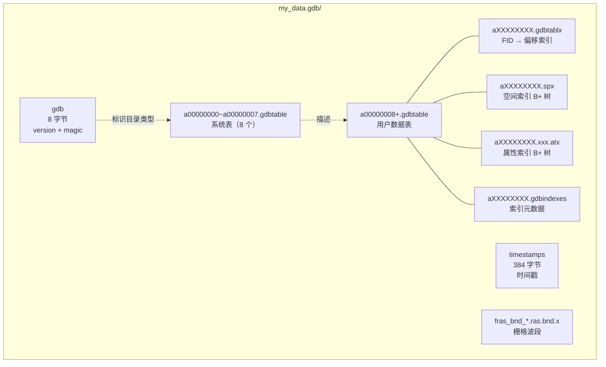

### 1.2 系统表清单

系统表固定占用 a00000000~a00000007，用户数据从 a00000008 开始分配：

| ID | 表名 | 用途 |
|----|------|------|
| 0 | GDB_SystemCatalog | 目录注册表 |
| 1 | GDB_ItemTypes | 项目类型定义 |
| 2 | GDB_Datasets | 数据集注册 |
| 3 | GDB_ItemRelationshipTypes | 关系类型定义 |
| 4 | GDB_Items | 项目元数据 |
| 5 | GDB_ItemRelationships | 关系实例 |
| 6 | GDB_DatasetRelationships | 数据集关系 |
| 7 | GDB_SpatialRefs | 空间参考定义 |

**源代码**：目录扫描逻辑 → [`src/edgar/explorgdb/reader/gdb_catalog.cpp`](../src/edgar/explorgdb/reader/gdb_catalog.cpp#L26) `GdbCatalog::scan()`

---

## 2. GDB 目录标识（magic）

### 2.1 gdb 文件 — 8 字节目录标识

每个 `.gdb` 目录的根目录下有一个 `gdb` 文件（无扩展名），仅 8 字节：

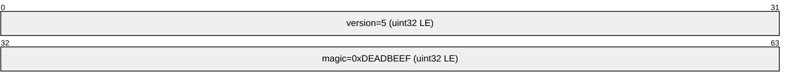

- `version` 总是 5
- `magic` 固定为 `0xDEADBEEF`

**源代码**：magic 校验 → `GdbCatalog::read_magic()` 在 [`src/edgar/explorgdb/reader/gdb_catalog.cpp`](../src/edgar/explorgdb/reader/gdb_catalog.cpp)

### 2.2 timestamps 文件

384 字节，原始时间戳数据，目前未完全解析。

---

## 3. .gdbtable 文件格式

这是 GDB 格式的核心，存储所有数据。文件整体布局如下：

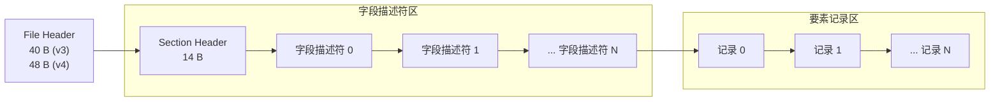

### 3.1 File Header

**v3 格式（40 字节，FGDB 9.x 时代）**：

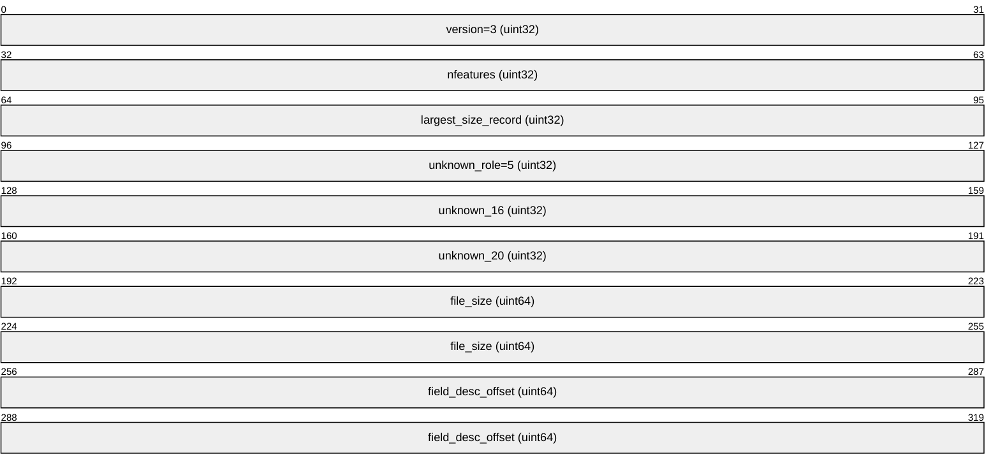

**v4 格式（48 字节，FGDB 10.x / ArcGIS Pro）**：

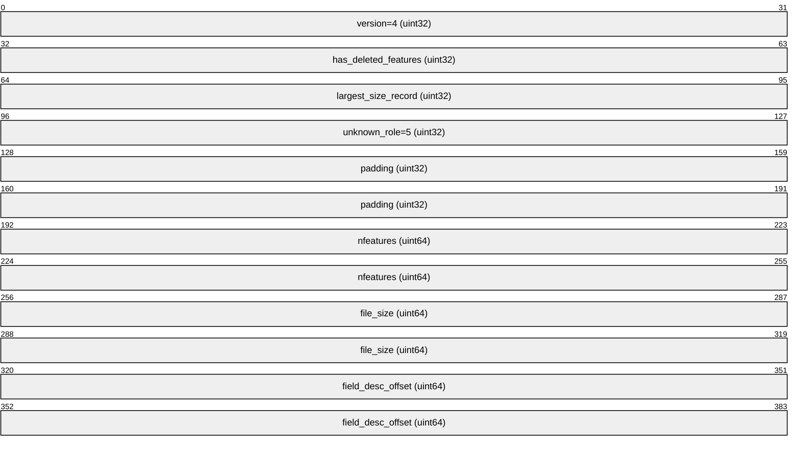

**源代码**：header 解析 → [`src/edgar/explorgdb/reader/gdb_table.cpp`](../src/edgar/explorgdb/reader/gdb_table.cpp#L244) `GdbTableParser::parse_header()`

### 3.2 Section Header

位于 `field_desc_offset` 处，14 字节：

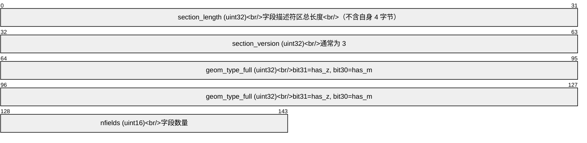

**图层 Z/M 能力**：`geom_type_full >> 24` 的 bit7=has_z, bit6=has_m。这决定了字段描述符中 bbox 尾部是否有 zmin/zmax/mmin/mmax（见下文 Geometry 字段描述符）。

### 3.3 字段描述符结构

每个字段描述符的通用前缀：


**源代码**：字段描述符解析 → [`src/edgar/explorgdb/reader/gdb_table.cpp`](../src/edgar/explorgdb/reader/gdb_table.cpp#L341) `GdbTableParser::parse_field_descriptor()`，被 [`parse_fields()`](../src/edgar/explorgdb/reader/gdb_table.cpp#L290) 循环调用。

### 3.4 Geometry 字段描述符（最复杂）


**注意**：`geom_flags`（来自几何字段描述符）和 `layer_has_z/has_m`（来自 Section Header 的 `geom_type_full >> 24`）是两个不同的概念。`geom_flags` 决定 morig/mscale/zorig/zscale 是否存在，`layer_has_z/has_m` 决定 bbox 尾部是否有 zmin/zmax/mmin/mmax。两者不一定一致。

### 3.5 要素记录格式

所有记录连续存储，按 FID 递增顺序排列：


**注意**：字段顺序完全按字段描述符的顺序，不是固定「几何在前」或「几何在后」。FileGDB SDK 创建表时 Geometry 总是第一个字段描述符，所以实际中几何在记录中排第一位。ObjectId 不存储（隐式 = FID+1）。

**记录之间没有预留空间** — 格式为 `[blob_len][data][blob_len][next data]...`，连续存储（[`filegdbtable.cpp:540`](../../../../../../code/gdal/ogr/ogrsf_frmts/openfilegdb/filegdbtable.cpp#L540) `GuessFeatureLocations()`）。

**源代码**：记录解析 → [`src/edgar/explorgdb/reader/gdb_table.cpp`](../src/edgar/explorgdb/reader/gdb_table.cpp#L507) `GdbTableParser::read_record_by_fid()`

### 3.6 记录大小变化时的处理

由于记录连续存储、没有预留空间，当一条记录需要变大时（几何从 10 点变为 100 万点），GDAL 的 `UpdateFeature` 处理逻辑如下：

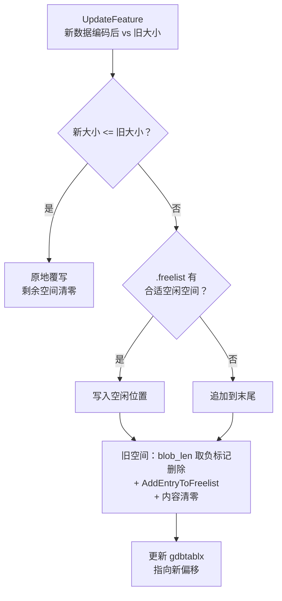

| 条件 | 行为 | 位置 |
|------|------|------|
| 新大小 <= 旧大小 | **原地覆写**，剩余空间清零 | [`filegdbtable_write.cpp:1926`](../../../../../../code/gdal/ogr/ogrsf_frmts/openfilegdb/filegdbtable_write.cpp#L1926) |
| 新大小 > 旧大小 + 有空闲 | **写空闲位置**，旧空间废弃 | [`filegdbtable_write.cpp:1960`](../../../../../../code/gdal/ogr/ogrsf_frmts/openfilegdb/filegdbtable_write.cpp#L1960) |
| 新大小 > 旧大小 + 无空闲 | **追加到末尾**，旧空间废弃 | 同上 |

即使只是修改几何从 10 个点到 100 万个点，如果新 blob 装不进旧位置，就废弃旧位置写到别处。`gdbtablx` 中的偏移更新为新位置。旧空间以后可能被其他大小匹配的要素复用。

**FID 不变**：UpdateFeature 只改 `.gdbtablx` 中该 FID 对应的偏移值，FID 本身不变。用户侧始终通过 FID 引用这条要素，不受数据位置变化的影响。

### 3.7 新增字段时记录的变化

新增字段时，现有记录的 blob 不一定会被重写，取决于具体场景：

| 场景 | 是否重写记录 | 原因 |
|------|-------------|------|
| 表为空 | ❌ 不重写 | 没有记录需要处理 |
| 已有记录 + 新字段 nullable + bitmap 字节未满 | ❌ 不重写 | 现有 bitmap 自然延伸，新字段自动视为 null |
| 已有记录 + 新字段 nullable + bitmap 字节已满 | ✅ **重写全部** | 需要扩展 bitmap 字节 |
| 已有记录 + 新字段非 nullable + 有默认值 | ✅ **重写全部** | 需要追加默认值 |
| 已有记录 + 新字段非 nullable + 无默认值 | ❌ **报错** | GDAL 不允许 |

**不重写时**：仅更新字段描述符区。新记录使用完整字段列表编码，旧记录解析时 bitmap 多出的 bit 自动解释为新字段 = null。

**重写时**（`RewriteTableToAddLastAddedField()` → [`filegdbtable_write_fields.cpp:166`](../../../../../../code/gdal/ogr/ogrsf_frmts/openfilegdb/filegdbtable_write_fields.cpp#L166)）：

1. 读取每条旧记录
2. 在 nullable_bitmap 后追加 1 字节 `0xFF`（表示新字段为 null，如果 nullable）
3. 或追加默认值字节（如果非 nullable）
4. 写入新文件 + 重写 `.gdbtablx`（偏移已变）
5. 新文件替换旧文件

**FID 不变**：重写全部记录时，逐条读取旧记录 → 写入新文件，但 FID 顺序保持不变。`.gdbtablx` 中 FID 对应的偏移更新为新文件中的位置。用户查询 FID=X 仍然得到同一条要素。

---

## 4. 字段类型与值编码

### 4.1 17 种字段类型

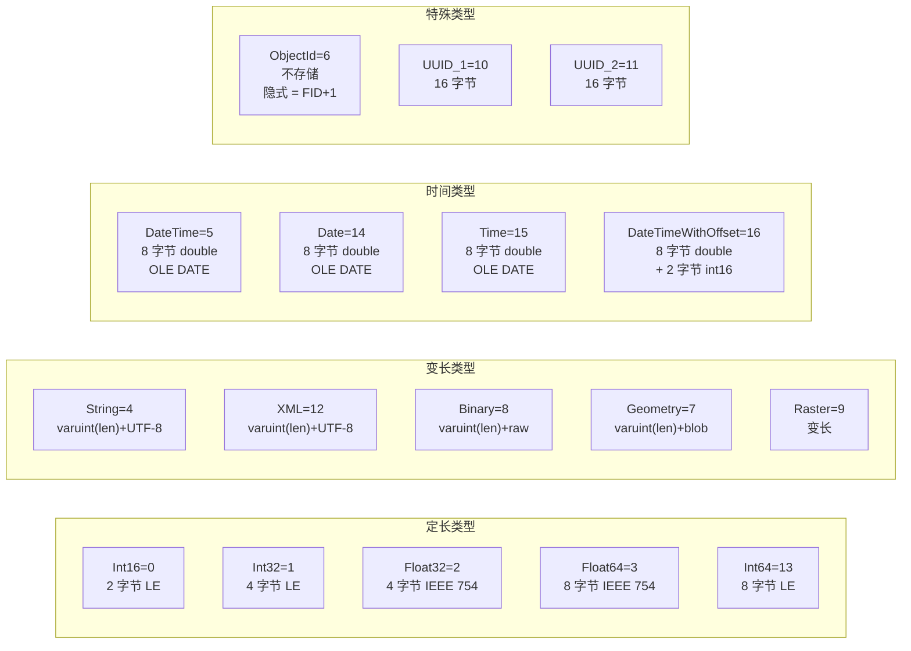

**源代码**：字段类型枚举 → [`src/edgar/explorgdb/common/explorgdb_types.h`](../src/edgar/explorgdb/common/explorgdb_types.h#L33) `FieldType`

### 4.2 nullable_bitmap 布局

nullable_bitmap 中，每个标记为 nullable 的字段占用 1 bit。0 = NULL，1 = 非 NULL。

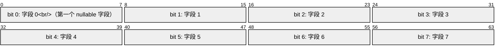

如果字段 0 的 bit 为 0，则该字段在记录中不占用空间（跳过）。

### 4.3 字段值编码方式汇总

| 类型 | 存储方式 | 示例 |
|------|----------|------|
| Int16 | 2 字节 LE | `0x2A 0x00` → 42 |
| Int32 | 4 字节 LE | `0x2A 0x00 0x00 0x00` → 42 |
| Float32 | 4 字节 IEEE 754 | |
| Float64 | 8 字节 IEEE 754 | |
| Int64 | 8 字节 LE | |
| String | varuint(len) + UTF-8 字节 | `0x05 "Hello"` |
| DateTime | 8 字节 double (OLE DATE) | 44205.5 → 2021-01-05 12:00:00 |
| Geometry | varuint(len) + 几何 blob | 见第 7 节 |
| ObjectId | 不存储 | 隐式 = FID + 1 |

---

## 5. .gdbtablx 偏移索引

.gdbtablx 将 FID 映射到 .gdbtable 中的文件偏移，是实现按 FID 随机访问的关键。

### 5.1 文件结构

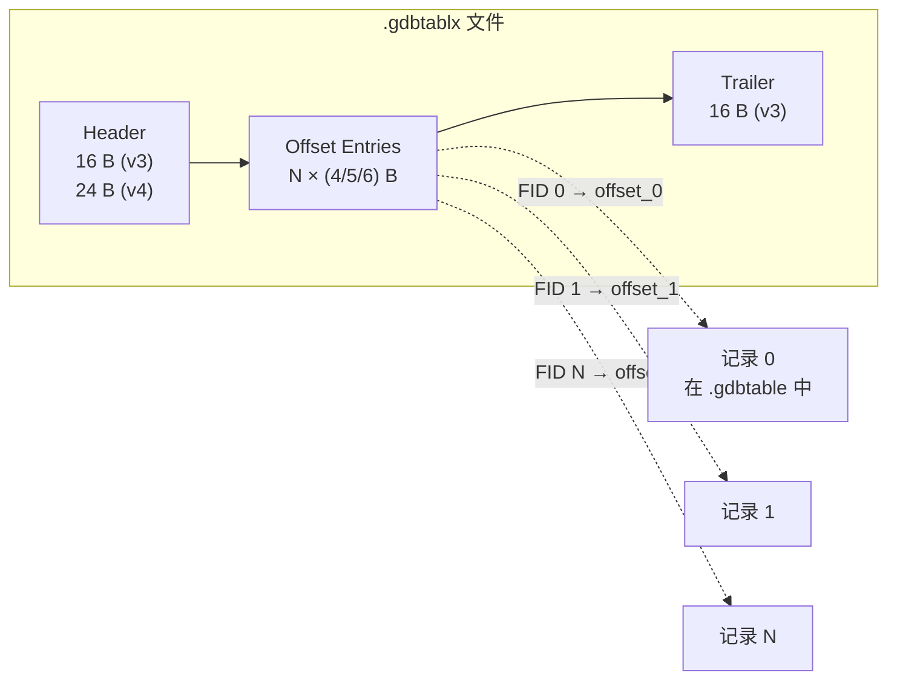

### 5.2 v3 Header（16 字节）

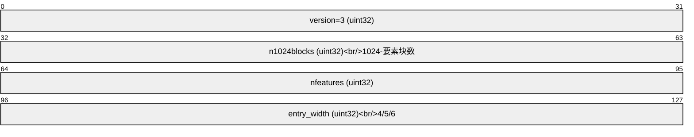

### 5.3 偏移编码的三种宽度

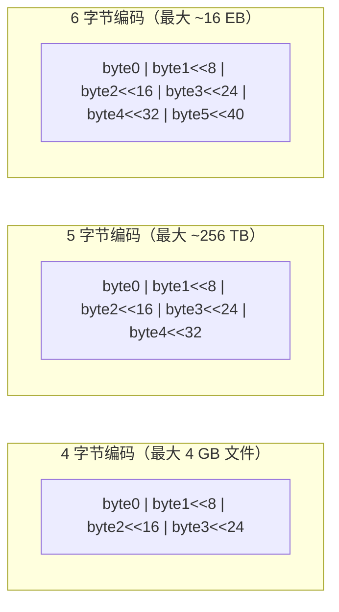

**源代码**：偏移表解析 → [`src/edgar/explorgdb/reader/gdb_tablx.cpp`](../src/edgar/explorgdb/reader/gdb_tablx.cpp#L39) `GdbTablxParser::parse()`

### 5.4 删除与新增时的行为

offset=0 在删除和新增加载时的含义不同，且不可逆（读取端无法区分「从未创建」和「已删除」）。

#### 删除要素

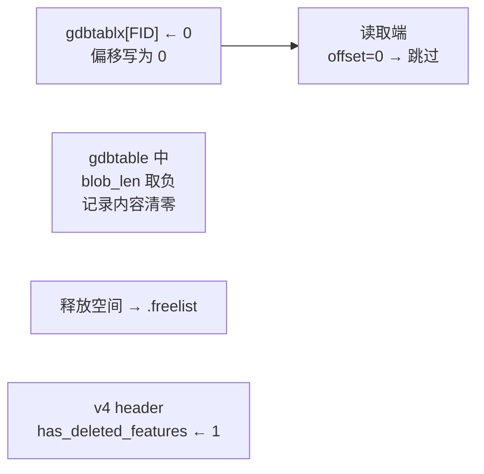

**GDAL DeleteFeature 执行步骤**（[`filegdbtable_write.cpp:2046`](../../../../../../code/gdal/ogr/ogrsf_frmts/openfilegdb/filegdbtable_write.cpp#L2046)）：

| 步骤 | 操作 | 位置 |
|------|------|------|
| 1 | .gdbtablx 中偏移值写 0 | `:2060` |
| 2 | .gdbtable 中 blob_len 取负（旧格式兼容） | `:2065` |
| 3 | 记录内容清零 | `:2080` |
| 4 | 释放空间加入 .freelist | `:2078` |
| 5 | v4 header has_deleted_features 置位 | 自动 |

**增量变化**：`totalRecordCount` 不变，`validRecordCount` 减 1。

#### 删除后新增（自动分配 FID）

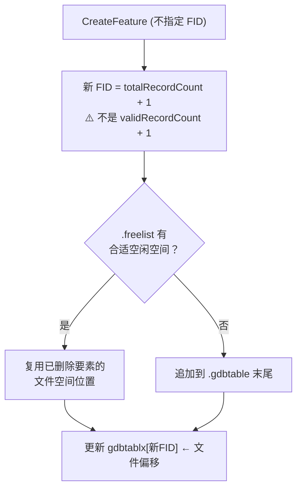

**GDAL CreateFeature 关键逻辑**（[`filegdbtable_write.cpp:1790`](../../../../../../code/gdal/ogr/ogrsf_frmts/openfilegdb/filegdbtable_write.cpp#L1790)）：

- 自动分配：**新 FID = totalRecordCount + 1**（不是 validRecordCount + 1）
- **已删除的 FID 不会被自动复用**
- 空间可复用（通过 .freelist），但 FID 不用旧的
- 显式指定已删除的 FID 时（`pnFID=50` 且 `GetOffsetInTableForRow(49)==0` ），可以手动复用

#### 完整示例：删除再新增

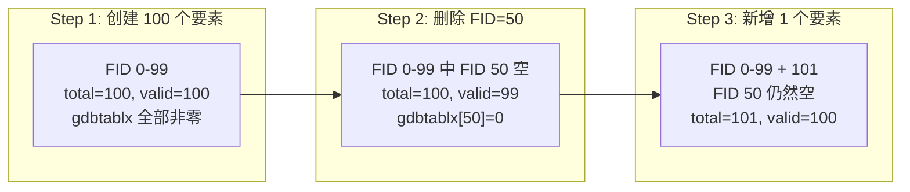

**为什么？** FID 分配器只做了一个单调递增的计数器 `m_nTotalRecordCount`。复用文件空间靠 `.freelist`（空间复用 ≠ FID 复用），复用 FID 靠显式指定。自动路径下简单递增，不回头查找空缺。

#### 读取端视角

explorgdb 中所有读取路径统一处理 offset=0：

| 读取方式 | offset=0 时的行为 | 位置 |
|----------|-------------------|------|
| `parse_records()` | `continue` 跳过 | [`gdb_table.cpp:492`](../src/edgar/explorgdb/reader/gdb_table.cpp#L492) |
| `read_record_by_fid()` | 返回 `false` | [`gdb_table.cpp:516`](../src/edgar/explorgdb/reader/gdb_table.cpp#L516) |
| `sequential_scan()` | `continue` 跳过 | [`gdb_table.cpp:1161`](../src/edgar/explorgdb/reader/gdb_table.cpp#L1161) |
| `peek_geometry_blob()` | 返回 `false` | [`gdb_table.cpp:712`](../src/edgar/explorgdb/reader/gdb_table.cpp#L712) |

无论要素是「从未创建」还是「已删除」，读取端看到的都是 offset=0，无从区分。

#### FID 不变性一览

**核心结论**：FID 是用户侧引用要素的唯一标识，`.gdbtablx` 是 FID → 文件偏移的映射层。任何操作都只改映射，不改 FID：

| 操作 | FID 变吗？ | 偏移变吗？ | 数据位置 | 说明 |
|------|-----------|-----------|----------|------|
| **UpdateFeature**（原地覆写） | ❌ 不变 | ❌ 不变 | 原地 | 新 <= 旧，直接覆写 |
| **UpdateFeature**（废弃旧空间） | ❌ **不变** | ✅ 指向新偏移 | 新位置 | 新 > 旧，旧空间作废 |
| **DeleteFeature** | ❌ 不变（偏移=0） | ✅ 写为 0 | 旧空间清零→freelist | 标记删除 |
| **CreateFeature**（自动分配） | ✅ **新 FID**（total+1） | ✅ 新偏移 | 末尾或 freelist | 不复用旧 FID |
| **AddField**（不重写） | ❌ 不变 | ❌ 不变 | 原地 | 仅更新字段描述符 |
| **AddField**（重写全部） | ❌ **不变** | ✅ 指向新文件偏移 | 新文件 | 逐条重写后替换文件 |

#### 空间复用的限制

.gdbtable 中一条记录是**属性和几何数据连续存储**的单个 blob，按**字段描述符顺序**排列（Geometry 通常排第一位）：

```
[record_size(uint32)] [nullable_bitmap] [geometry_blob] [field_0] ... [field_n]
```
            ↑ 几何排在第一位（按字段描述符顺序）

Geometry 编码后直接嵌入到同一 `m_abyBuffer` 中，**没有独立的几何存储文件**。这意味着空间复用受记录大小匹配度的限制。

**GDAL 的 Best-Fit 空间分配算法**（[`filegdbtable_freelist.cpp:329`](../../../../../../code/gdal/ogr/ogrsf_frmts/openfilegdb/filegdbtable_freelist.cpp#L329)）：

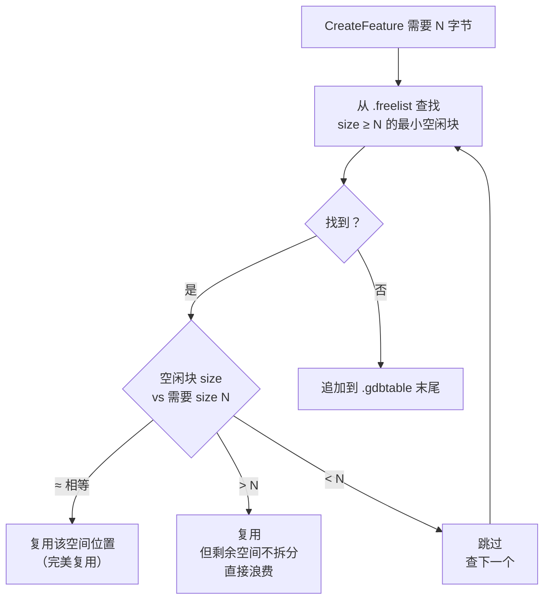

**注意**：不仅是 DeleteFeature 会产生空闲空间，**UpdateFeature** 在几何变大的时候也会废弃旧空间（旧位置加入 freelist），这也会产生碎片：

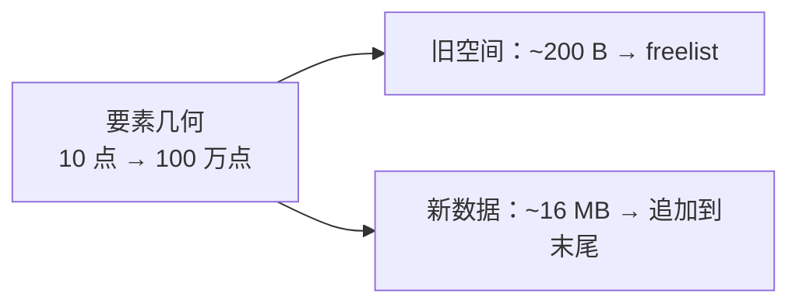

**三种场景的实际效果**：

| 场景 | 结果 | 原因 |
|------|------|------|
| 删除 100 个同类型要素 → 新增 100 个同类型要素 | ✅ **大概率复用** | 大小相近，best-fit 命中率高 |
| 删除 1 个 Point (~100 B) → 新增 1 个 Polygon (~5000 B) | ❌ **追加末尾** | freemlist 中只有 100 B 块，不够 |
| 反复编辑几何变大缩小 → 碎片化 | ❌ **追加末尾** | 多个小块各自太小，无法合并 |

**关键结论**：空间复用成功与否取决于**记录大小的匹配度**。即使空间复用了，FID 也**不会**复用旧值（用的是 totalRecordCount + 1）。

---

## 6. .spx 空间索引 B+ 树

### 6.1 B+ 树整体结构

.spx 文件包含 N 个 4096 字节页面 + 22 字节 trailer：

```mermaid
graph TB
    subgraph "B+ 树根节点（depth=3）"
        RP["Root Page<br/>4096 B<br/>分支页面"]
    end

    subgraph "中间节点（depth=2）"
        IP1["Internal Page 1<br/>分支页面"]
        IP2["Internal Page 2<br/>分支页面"]
    end

    subgraph "叶子节点（depth=1）"
        LP1["Leaf Page 1<br/>FID 数组 + 值数组"]
        LP2["Leaf Page 2"]
        LP3["Leaf Page 3"]
        LP4["Leaf Page 4"]
    end

    subgraph "Trailer"
        TL["22 B<br/>value_size, depth,<br/>total_value_count"]
    end

    RP --> IP1
    RP --> IP2
    IP1 --> LP1
    IP1 --> LP2
    IP2 --> LP3
    IP2 --> LP4
    LP4 --> TL
```

### 6.2 Trailer（22 字节）

```mermaid
packet-beta
  0-7: "value_size=8 (uint8)<br/>索引值字节数"
  8-15: "flags (uint8)<br/>bit5=is_string<br/>bit6=is_numeric"
  16-47: "magic1=1 (uint32)"
  48-79: "tree_depth (uint32)<br/>1~4"
  80-111: "total_value_count (uint32)"
```

**源代码**：trailer 结构定义 → [`src/edgar/explorgdb/common/explorgdb_types.h`](../src/edgar/explorgdb/common/explorgdb_types.h#L274) `BPlusTreeTrailer`

### 6.3 分支页面布局（4096 字节）

```mermaid
packet-beta
  0-31: "next_page_id (uint32)<br/>同级下一个页面"
  32-63: "entry_count (uint32)<br/>本页条目数"
  64-?: "child_page_id[0..N]<br/>(N+1) × 4 字节"
  after: "entry[0..N-1]<br/>N × 8 字节<br/>64-bit 空间编码值"
```

### 6.4 叶子页面布局（4096 字节）

```mermaid
packet-beta
  0-31: "next_page_id (uint32)<br/>同级下一个页面"
  32-63: "entry_count (uint32)"
  64-95: "UNUSED (uint32)"
  96-?: "fid[0..N-1]<br/>N × 4 字节"
  after: "entry[0..N-1]<br/>N × 8 字节<br/>64-bit 空间编码值"
```

### 6.5 64-bit 空间索引值编码

```mermaid
packet-beta
  0-1: "grid_level (2 bit)<br/>0=最细格网<br/>1=中<br/>2=最粗"
  2-32: "cell_x (31 bit)"
  33-63: "cell_y (31 bit)"
```

**源代码**：编码实现 → [`src/edgar/explorgdb/reader/gdb_spatial_index.cpp`](../src/edgar/explorgdb/reader/gdb_spatial_index.cpp#L315) `query_bbox()` 中的 `start_raw` 构造

### 6.6 B+ 树导航算法

```mermaid
flowchart TD
    START(["query_bbox(xmin, ymin, xmax, ymax)"]) --> CONV["坐标 → 格网 cell<br/>cx_min, cx_max, cy_min, cy_max"]
    CONV --> ENC["编码 64-bit raw_value<br/>level=0, cell_x, cell_y"]
    ENC --> NAV["collect_fids_btree()<br/>递归遍历 B+ 树"]

    NAV --> CHECK{"当前页面是<br/>叶子页面？"}
    CHECK -->|"是"| LEAF["叶子页面：FindMinMaxIdx<br/>64-bit 完整二分查找<br/>筛选 cell_x/cell_y 范围"]
    CHECK -->|"否"| BRANCH["分支页面：<br/>找 entry.cx > q_max_cx → iLast<br/>找 entry.cx >= q_min_cx → iFirst<br/>递归遍历 child[iFirst..iLast]"]

    LEAF --> FIDS["收集 FID 列表"]
    BRANCH --> NAV

    FIDS --> DEDUP["去重 + 排序<br/>bitset 或 sort+unique"]
    DEDUP --> DONE(["返回 FID[]"])
```

**分支页面匹配规则**：

- `entry[i]` 是分隔符，表示 `child[i]` 范围的上界
- `child[i]` 的 cell_x 范围：`[entry[i-1].cx+1, entry[i].cx]`
- `child[0]` 的范围：`[-inf, entry[0].cx]`

**源代码**：B+ 树遍历 → [`src/edgar/explorgdb/reader/gdb_spatial_index.cpp`](../src/edgar/explorgdb/reader/gdb_spatial_index.cpp#L201) `GdbSpatialIndexParser::collect_fids_btree()`

**源代码**：二分查找 → [`src/edgar/explorgdb/reader/gdb_spatial_index.cpp`](../src/edgar/explorgdb/reader/gdb_spatial_index.cpp#L147) `GdbSpatialIndexParser::find_minmax_idx()`

### 6.7 LRU 页面缓存

```mermaid
graph TB
    subgraph "LRU Cache（16 slot）"
        L0["depth=0<br/>4 slot（根节点）"]
        L1["depth=1<br/>4 slot"]
        L2["depth=2<br/>4 slot"]
        L3["depth=3<br/>4 slot"]
    end

    REQ["请求页面 (page_id, depth)"] --> HIT{"命中缓存？"}
    HIT -->|"是"| USE["直接使用<br/>更新 LRU 时间戳"]
    HIT -->|"否"| LOAD["mmap 读取页面<br/>驱逐最旧 entry"]
    LOAD --> STORE["存入缓存"]
    STORE --> USE
```

**实现细节**：递归遍历时先提取 child IDs 再递归，避免递归过程中 LRU 驱逐父页面。

**源代码**：LRU 缓存读页面 → [`src/edgar/explorgdb/reader/gdb_spatial_index.cpp`](../src/edgar/explorgdb/reader/gdb_spatial_index.cpp#L84) `GdbSpatialIndexParser::read_page()`

---

## 7. 坐标编码与几何解码

### 7.1 坐标编码/解码流程

```mermaid
flowchart LR
    subgraph "写入（编码）"
        R["真实坐标<br/>double"]
        C2I["coord_to_int()<br/>round((real - origin) × scale)"]
        I["整数坐标<br/>int64"]
    end

    subgraph "读取（解码）"
        I2["整数坐标<br/>int64"]
        D2R["decode_coord()<br/>cumulative / scale + origin"]
        R2["真实坐标<br/>double"]
    end

    R --> C2I --> I
    I2 --> D2R --> R2
```

**源代码**：编码 → [`src/edgar/explorgdb/writer/geometry_serializer.h`](../src/edgar/explorgdb/writer/geometry_serializer.h#L452) `coord_to_int()`

**源代码**：解码 → [`src/edgar/explorgdb/reader/gdb_geometry.cpp`](../src/edgar/explorgdb/reader/gdb_geometry.cpp#L69) `GdbGeomDecoder::decode_coord()`

### 7.2 三种不同的坐标解码方式

```mermaid
flowchart TD
    subgraph "Point"
        P["raw_x, raw_y (varuint)"]
        P1["real = (raw - 1) / scale + origin<br/>（raw=0 表示 NULL/EMPTY）"]
    end

    subgraph "Array (Polyline/Polygon/MultiPoint)"
        A["delta_x[], delta_y[] (svarint)"]
        A1["cumulative += delta<br/>real = cumulative / scale + origin"]
    end

    subgraph "Bbox（几何字段描述符中）"
        B["raw_xmin, raw_ymin, ..."]
        B1["real = raw / scale + origin<br/>（无 -1 偏移）"]
    end

    P --> P1
    A --> A1
    B --> B1
```

**关键区别**：

- **Point**：`(raw - 1) / scale + origin`，因为 raw=0 保留给 NULL/EMPTY
- **Array**：累积 delta 编码，`cumulative / scale + origin`，无偏移
- **Bbox**：`raw / scale + origin`，无偏移

### 7.3 几何类型码

```mermaid
graph LR
    subgraph "基本类型"
        P1["Point=1"]
        P3["Polyline=3"]
        P5["Polygon=5"]
        P8["MultiPoint=8"]
        P31["MultiPatch=31"]
    end

    subgraph "带 Z/M 变体"
        P9["PointZ=9"]
        P10["PolylineZ=10"]
        P11["PointZM=11"]
        P13["PolylineZM=13"]
        P15["PolygonZM=15"]
    end

    subgraph "General 类型 (50-54)"
        G["GeneralPolyline=50<br/>GeneralPolygon=51<br/>GeneralPoint=52<br/>GeneralMultiPoint=53<br/>GeneralMultiPatch=54"]
    end
```

**General 类型**：Z/M 标志从 geom_type 高 32 位获取（bit31=has_z, bit30=has_m），而非 base_type。

### 7.4 几何解码流程

```mermaid
flowchart TD
    START(["decode(blob)"]) --> GT["读 varuint geom_type"]
    GT --> SWITCH{"基本类型？"}

    SWITCH -->|"Point"| PT["读 x_raw, y_raw<br/>[+ z_raw] [+ m_raw]<br/>→ POINT WKT"]
    SWITCH -->|"MultiPoint"| MP["读 nPoints + BBox<br/>+ XY delta 数组<br/>[+ Z] [+ M]<br/>→ MULTIPOINT WKT"]
    SWITCH -->|"Polyline"| PL["读 nPoints + nParts<br/>+ BBox + part_sizes<br/>+ XY delta 数组<br/>[+ Z] [+ M]<br/>→ MULTILINESTRING WKT"]
    SWITCH -->|"Polygon"| PG["同 Polyline<br/>但环自动闭合<br/>→ MULTIPOLYGON WKT"]
    SWITCH -->|"MultiPatch"| MPCH["同 Polygon<br/>但输出不同 WKT"]

    PT --> DONE["返回 GdbGeometry<br/>{wkt, type, has_z, has_m}"]
    MP --> DONE
    PL --> DONE
    PG --> DONE
    MPCH --> DONE
```

**源代码**：主解码入口 → [`src/edgar/explorgdb/reader/gdb_geometry.cpp`](../src/edgar/explorgdb/reader/gdb_geometry.cpp#L558) `GdbGeomDecoder::decode()`

### 7.5 轻量 Bbox Peek

不解码全部坐标，只读几何 blob 头部中的 bbox，用于快速空间过滤：

```mermaid
flowchart LR
    subgraph "peek_bbox()"
        GT2["读 geom_type varuint"]
        HEAD["读 nPoints, nParts, BBox varuints"]
        COORDS["跳过坐标数据<br/>（不解码）"]
        RET["返回 GdbBbox<br/>{xmin, ymin, xmax, ymax}"]
    end

    GT2 --> HEAD --> COORDS --> RET
    COORDS -.->|"O(1) varint 操作<br/>不读取全部坐标"| NOTE
```

**源代码**：peek_bbox → [`src/edgar/explorgdb/reader/gdb_geometry.cpp`](../src/edgar/explorgdb/reader/gdb_geometry.cpp#L640) `GdbGeomDecoder::peek_bbox()`

---

## 8. 完整查询链路

### 8.1 空间查询流程

```mermaid
flowchart TD
    START(["用户指定查询矩形<br/>xmin, ymin, xmax, ymax"])

    START --> SPX["GdbSpatialIndexParser<br/>query_bbox()<br/>.spx B+ 树<br/>64-bit 空间编码匹配"]

    SPX -->|"FID 候选集"| TABLX["GdbTablxParser<br/>FID → 文件偏移<br/>.gdbtablx 偏移表"]

    TABLX -->|"文件偏移"| PEEK["GdbGeomDecoder<br/>peek_bbox()<br/>轻量 bbox 过滤"]

    PEEK -->|"通过"| TABLE["GdbTableParser<br/>read_record_by_fid()<br/>.gdbtable 记录解析"]

    TABLE -->|"字段值"| GEOM["GdbGeomDecoder<br/>decode()<br/>完整几何解码 → WKT"]

    PEEK -->|"不重叠"| SKIP["跳过"]
    GEOM --> DONE["返回完整要素"]
    SKIP --> DONE

    DONE --> NEXT{"还有更多 FID？"}
    NEXT -->|"是"| TABLX
    NEXT -->|"否"| ENDD(["返回结果列表"])
```

**对应的源代码文件**：

| 步骤 | 文件 |
|------|------|
| B+ 树空间索引查询 | [`src/edgar/explorgdb/reader/gdb_spatial_index.cpp`](../src/edgar/explorgdb/reader/gdb_spatial_index.cpp#L272) `query_bbox()` |
| FID → 文件偏移 | [`src/edgar/explorgdb/reader/gdb_tablx.cpp`](../src/edgar/explorgdb/reader/gdb_tablx.cpp#L39) `GdbTablxParser::parse()` |
| 轻量 bbox 过滤 | [`src/edgar/explorgdb/reader/gdb_geometry.cpp`](../src/edgar/explorgdb/reader/gdb_geometry.cpp#L640) `peek_bbox()` |
| 按 FID 读取记录 | [`src/edgar/explorgdb/reader/gdb_table.cpp`](../src/edgar/explorgdb/reader/gdb_table.cpp#L507) `read_record_by_fid()` |
| 完整几何解码 | [`src/edgar/explorgdb/reader/gdb_geometry.cpp`](../src/edgar/explorgdb/reader/gdb_geometry.cpp#L558) `decode()` |

### 8.2 属性查询流程

```mermaid
flowchart TD
    START(["用户指定条件<br/>population > 1000000"])

    START --> ATX["GdbAttributeIndexParser<br/>query_double() or query_string()<br/>.atx B+ 树<br/>线性扫描匹配"]

    ATX -->|"FID 候选集"| TABLX2["GdbTablxParser<br/>FID → 文件偏移<br/>.gdbtablx 偏移表"]

    TABLX2 -->|"文件偏移"| TABLE2["GdbTableParser<br/>read_record_by_fid()<br/>.gdbtable 记录解析"]

    TABLE2 --> DONE2["返回完整要素"]

    DONE2 --> NEXT2{"还有更多 FID？"}
    NEXT2 -->|"是"| TABLX2
    NEXT2 -->|"否"| END2(["返回结果列表"])
```

**源代码**：属性索引查询 → [`src/edgar/explorgdb/reader/gdb_attribute_index.cpp`](../src/edgar/explorgdb/reader/gdb_attribute_index.cpp) `GdbAttributeIndexParser::query_double()`

### 8.3 按需读取流程（不索引，直接读取）

```mermaid
flowchart TD
    START(["GdbCatalog::scan(gdb_path)"])

    START --> SCAN["遍历目录<br/>正则匹配 aXXXXXXXX.*<br/>按 numeric_id 排序"]

    SCAN --> GDB["读 gdb 文件<br/>校验 version=5, magic=0xDEADBEEF"]

    GDB --> OPEN["GdbTableParser::open()<br/>mmap 映射文件<br/>madvise(MADV_SEQUENTIAL)<br/>读 header + fields 字段描述符"]

    OPEN --> TABLX["GdbTablxParser::parse()<br/>加载 .gdbtablx 偏移表<br/>FID → 文件偏移"]

    TABLX --> READ["GdbTableParser::read_record_by_fid(fid)<br/>定位 blob → 解码字段值"]

    READ --> GEO["需几何？→ GdbGeomDecoder::decode()<br/>需 bbox 过滤？→ peek_bbox()"]
    GEO --> GEOM_DONE["返回字段值 + 几何 WKT"]
```

**三读取模式对比**：

| 模式 | 入口 | 加载 | 适用场景 |
|------|------|------|----------|
| 按需读取 | `open()` | 仅 header + fields | 频繁查询少数要素 |
| 按 FID 读取 | `read_record_by_fid()` | 通过 tablx 偏移定位 | 随机访问 |
| 零拷贝扫描 | `sequential_scan()` | mmap 回调，FieldRef 指向 mmap | 全表扫描（最快） |

**源代码**：按需读取入口 → [`src/edgar/explorgdb/reader/gdb_table.cpp`](../src/edgar/explorgdb/reader/gdb_table.cpp#L41) `GdbTableParser::open()`

**源代码**：零拷贝顺序扫描 → [`src/edgar/explorgdb/reader/gdb_table.cpp`](../src/edgar/explorgdb/reader/gdb_table.cpp#L1144) `GdbTableParser::sequential_scan()`

---

## 附录：关键文件索引

| 组件 | 文件路径 | 说明 |
|------|----------|------|
| 类型定义 | `src/edgar/explorgdb/common/explorgdb_types.h` | FieldType, FieldDescriptor, BPlusTreeTrailer 等 |
| BinaryReader | `src/edgar/explorgdb/common/binary_reader.h` | 二进制光标读取器 |
| VarInt | `src/edgar/explorgdb/common/varint.h` | varuint/varint 编解码 |
| 目录扫描 | `src/edgar/explorgdb/reader/gdb_catalog.cpp` | GdbCatalog::scan() |
| 表解析 | `src/edgar/explorgdb/reader/gdb_table.cpp` | GdbTableParser（核心） |
| 偏移索引 | `src/edgar/explorgdb/reader/gdb_tablx.cpp` | GdbTablxParser::parse() |
| 索引元数据 | `src/edgar/explorgdb/reader/gdb_indexes.cpp` | GdbIndexesParser |
| 空间索引 | `src/edgar/explorgdb/reader/gdb_spatial_index.cpp` | B+ 树导航 + LRU 缓存 |
| 属性索引 | `src/edgar/explorgdb/reader/gdb_attribute_index.cpp` | 属性查询 |
| 几何解码 | `src/edgar/explorgdb/reader/gdb_geometry.cpp` | GdbGeomDecoder |
| 几何序列化 | `src/edgar/explorgdb/writer/geometry_serializer.h` | coord_to_int() |
| 二进制写入 | `src/edgar/explorgdb/writer/gdb_table_writer.cpp` | GdbTableWriter |
| 行缓冲区 | `src/edgar/explorgdb/writer/row_buffer.h` | RowBuffer（零分配） |
| 查询流程 | `src/edgar/explorgdb/reader/QUERY_FLOW.md` | 索引查询流程图 |
| CLI 入口 | `src/edgar/explorgdb/reader/explorgdb_cli.cpp` | CLI 工具 |