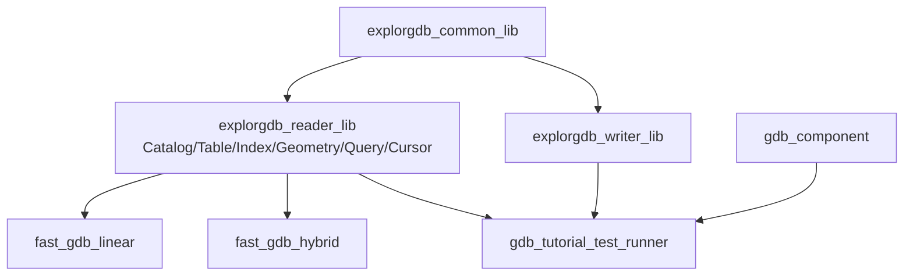

# fast-gdb 项目介绍与当前状态

**面向读者**：需要理解项目目标、代码结构、性能依据和验收边界的开发人员
**最后更新**：2026-07-18
**当前基线**：`main@6274f00`
**当前结论**：`codex/spatial-attribute-query` 分支已完成合并。空间属性联合查询、
FeatureCursor 流式迭代、融合扫描优化和 WKB-first 完整对象读取已进入 `main`。
性能超越 GDAL：100K 全要素基准 Cursor 0.567ms vs GDAL 1.083ms（1.91× 快），
联合查询 FID 匹配 0.314ms vs GDAL 0.700ms（2.23× 快）。详见[综合汇报](02_fast-gdb项目综合汇报.md)。

## 1. 项目目标

fast-gdb 是围绕 ESRI File Geodatabase 的 C++17 项目：

- 解析 `.gdbtable`、`.gdbtablx`、`.gdbindexes`、`.spx`、`.atx`；
- 提供纯 C++ Reader/Writer 和 GDAL 高层组件；
- 统一 GeometryModel、ISO WKB-first 和精确空间判断；
- 提供 FID、顺序、bbox、属性、WHERE 和 bbox+WHERE 查询；
- 提供逐条完整 Feature cursor；
- 用合成数据、真实 FileGDB 和 GDAL 对照建立证据。

当前不承诺完整 SQL/JOIN/聚合、Raster 像素、Annotation/Dimension 或完整 MultiPatch
表面拓扑。

## 2. 产品形态与边界

| 组件/产物 | 用途 | 当前状态 |
|---|---|---|
| `fast_gdb_linear` | 无 GDAL Reader、几何和查询 | 既有范围已完成历史验收 |
| `fast_gdb_hybrid` | fast-gdb 主路径 + 显式 GDAL 回退 | 既有范围已完成历史验收 |
| `usegdal` | GDAL Datasource/Dataset/Recordset | 既定阶段已实现 |
| `explorgdb reader` | 二进制解析、索引、查询、完整对象 | 查询、游标、WKB 已合入 `main` |
| `explorgdb writer` | Writer 专项 | 本报告不展开 |

`Local review passed` 表示本地提交门禁通过；`Formal acceptance blocked` 表示跨平台和发布证据未齐。

## 3. Reader 能力

### FID-only

```cpp
QueryResult result = engine.query(request);
```

- 保持既有 API；
- `SpatialWhere` 返回精确空间与完整 WHERE 的最终 FID；
- `.spx/.atx` 都只提供候选。

### Full-feature cursor

```cpp
auto cursor = engine.open_cursor(request);
QueryFeature feature;
while (cursor.next(feature)) {
    consume(feature.fid,
            feature.record.field_values,
            feature.geometry.wkb);
}
if (!cursor.done()) report(cursor.error());
```

- 返回 FID、全部 Reader 字段和 GeometryValue；
- SequentialScan 不物化全表 FID；
- 候选查询只保存最终 FID vector；
- 正常 EOF 和读取失败明确区分；
- 同一 engine 同时只允许一个活动 cursor。

### FID 定位

```cpp
cursor.move_to(500);
```

下一次 `next()` 返回当前查询结果中第一个 `FID >= 500` 的对象。支持向前、向后、
rewind 和跳跃，并跳过删除槽或不满足过滤的 FID。

## 4. 总体架构



主要源码：

- `query_engine.h/.cpp`：公开查询和 engine 状态；
- `feature_cursor.cpp`：cursor PImpl、状态机和 `move_to`；
- `query_engine_combined.cpp`：空间属性联合查询；
- `query_engine_geometry.cpp`：既有自适应空间 planner；
- `gdb_table*.cpp`：完整记录和 GeometryValue；
- `query_where_internal.*`：WHERE 内部模块。

## 5. 当前验证边界

已完成代码：

- 全部 QueryKind cursor 入口；
- 顺序流和候选模式；
- 完整字段、NULL、Binary 和 ISO WKB；
- 无几何、NULL geometry、ObjectID-only 行；
- `move_to`、move ownership、reopen/reacquire；
- GDAL 完整对象对照测试代码；
- 100K full-feature benchmark runner；
- 联合查询和 cursor 三轮静态自检。

本地已完成 GDAL ON/OFF Release、310/310 与 653/653 并行 CTest、两套 package consumer、
GDAL 完整对象对等和 100K full-feature。尚未形成正式证据：

- Windows/Linux 和真实数据 release contract；
- 10M full-feature；
- peak RSS；
- current/main 和 5% 门禁；
- 正式 artifact。

上述能力已合入 `main`，通过本地 479 测试验证。综合性能数据见[项目综合汇报](02_fast-gdb项目综合汇报.md)。
