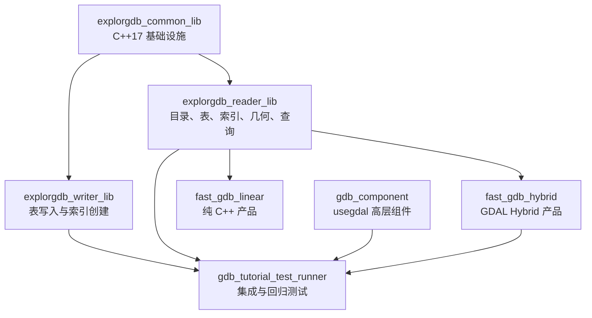

# fast-gdb 项目介绍与当前状态

**面向读者**：需要理解项目目标、代码结构、性能依据和验收边界的开发人员

**最后更新**：2026-07-17

**当前实现基线**：`main@42d8f76620a8c39eeb8523a0f84fcde0eb719f01`

**当前结论**：fast-gdb 已在声明的支持范围内完成纯 C++ Reader、Hybrid、统一几何模型、索引查询和既有发布验收；M18 Writer 的 Append、Update、Delete、Transaction 和 Recovery 已进入 `main`，但缺少当前 macOS GitHub Actions artifacts，正式判定保持 **Code accepted / Formal acceptance blocked**。MultiPatch 完整表面拓扑、原生 curve WKB/写入、未知未来编码和跨平台 Writer 仍不在当前正式支持范围。

> 本文是项目总入口。详细实现、实验数据和验收证据保留在专题文档中，本文通过链接组织它们，不重复维护同一份细节。

## 1. 项目在做什么

fast-gdb 是一个围绕 ESRI File Geodatabase（`.gdb`）的 C++ 项目，目标是理解并实现 FileGDB 的目录、表、索引、属性和几何数据处理能力。

项目同时承担三类工作：

- **格式研究**：通过二进制解析、源码和测试还原 `.gdbtable`、`.gdbtablx`、`.spx`、`.atx` 等文件结构。
- **组件实现**：提供纯 C++17 的 `explorgdb` Reader/Writer，以及基于 GDAL 的 `usegdal` 高层组件。
- **性能与兼容性验证**：对比 GDAL 与 fast-gdb 的批量读取、空间查询、属性查询和写入表现，并用合成数据和真实 FileGDB 分开验收。

当前重点是：普通几何走纯 C++ 主路径，正式输出采用 ISO WKB-first，不能可靠表达的几何返回明确状态或按显式策略回退 GDAL。

当前不在 Reader 目标内的能力包括完整 SQL/JOIN/聚合/重投影、Raster 像素处理、Annotation/Dimension，以及完整 MultiPatch 表面拓扑。

## 2. 产品形态与能力边界

| 组件/产物 | 依赖 | 主要用途 | 当前状态 |
|---|---|---|---|
| `fast_gdb_linear` | 无 GDAL 运行时依赖 | 轻量部署、批量读取、纯 C++ 几何处理 | 支持范围内已完成发布验收 |
| `fast_gdb_hybrid` | GDAL | fast-gdb 主路径 + 曲线/复杂拓扑回退 | 支持范围内已完成发布验收 |
| `usegdal` | GDAL | Datasource/Dataset/Recordset 高层 API 和教程组件 | 已完成既定 Phase 1A-3 |
| `explorgdb reader` | C++17 | FileGDB 二进制解析、索引、查询和几何输出 | 支持范围内已完成验收；新增类型需单独补证据 |
| `explorgdb writer` | C++17；高级编辑/索引助手依赖 GDAL | 空 schema、Append、Update、Delete、Transaction/Recovery | 实现已进入 `main`；仅单 Writer、单源 GDB、单图层事务，正式 macOS artifact 仍阻塞 |

### 能力状态说明

- **已完成**：已有实现和对应自动化/本地证据支持。
- **支持范围内已完成**：最终验收报告已覆盖该能力声明的范围。
- **代码完成/正式阻塞**：实现和本地专项结论成立，但正式 CI artifact 尚未闭环。
- **待验收**：需要真实数据、跨平台环境或专项性能数据，不能用合成断言替代。
- **暂不支持**：当前明确不提供，调用方应使用其他路径或调整范围。

当前详细能力矩阵见：[项目状态与规划](../planning/01_项目状态与规划.md)、[M18 Writer main 验收记录](../evidence/M18-writer-main-acceptance-2026-07-17.md) 和 [GDAL 功能对比矩阵](../planning/02_GDAL功能对比矩阵.md)。

## 3. 总体架构

### 3.1 构建目标关系



主要源码入口：

- `src/edgar/explorgdb/common/`：二进制读取、VarInt、UTF-16、公共类型。
- `src/edgar/explorgdb/reader/`：Catalog、Table、Tablx、空间/属性索引、几何和 QueryEngine。
- `src/edgar/explorgdb/curve_gdal/`：可选 GDAL 曲线和拓扑回退。
- `src/edgar/explorgdb/writer/`：表写入器、几何序列化、Append/Update/Delete、事务和恢复。
- `src/edgar/usegdal/`：GDAL 高层组件库。

### 3.2 FileGDB 查询链路


`.spx` 和 `.atx` 只负责候选筛选；精确空间判断必须复用同一个几何模型。更完整的空间/属性索引过程见 [查询流程图](../../src/edgar/explorgdb/reader/QUERY_FLOW.md) 和 [GDB 二进制格式图解](../technical/04_GDB二进制格式图解教程.md)。

### 3.3 几何处理链路

```text
FileGDB Geometry Blob
    -> GeometryModel（整数网格 XY + Z/M）
    -> PolygonTopologyBuilder / BuiltinCurveBackend
    -> ISO WKB（正式输出）
       WKT（兼容/调试输出）
       SpatialPredicate（精确空间过滤）
```

普通 Point、MultiPoint、Polyline、Polygon 和 Z/M/ZM 共享该路径。支持范围内的 CircularArc、Cubic Bezier、EllipticArc（含已验收 M 曲线）可由纯 C++ 读取并线性化为标准 ISO WKB；2026-07-13 的两个真实曲线契约均通过，M 曲线为 2/2 命中、0 次 Hybrid fallback。原生 curve WKB、未知/未来描述符仍不提供；曲线或拓扑无法可靠处理时，Hybrid 可按策略回退 GDAL。MultiPatch 目前保留有限坐标/WKT 兼容，但不提供完整表面拓扑。

## 4. 当前实现成果

已形成的核心能力包括：

- `.gdbtable` / `.gdbtablx`、`.gdbindexes`、`.spx`、`.atx` 解析。
- 17 类字段类型、nullable bitmap、日期时间和 `DateTimeWithOffset` 物理读取。
- FID 查询、顺序扫描、bbox 查询、属性索引查询和 WHERE 子集。
- Point、MultiPoint、Polyline、Polygon、General 几何及 Z/M/ZM。
- Polygon 外环、洞、多面、岛中岛，以及自交、重复、退化、相切等明确状态。
- ISO WKB-first API；原有 WKT API 作为兼容/调试接口保留。
- CircularArc、Cubic Bezier、EllipticArc、完整圆/椭圆和混合 part 的内置折线化。
- GDAL Hybrid 的缓存式回退和可观测的后端、状态、诊断信息。
- Writer 空 schema、Append、Update、Delete、Transaction 和显式 Recovery 实现。
- Writer 稳定/legacy 安装面和结构化 `WriterErrorCode`。

相关 API 和迁移方式见：[组件库设计与使用](../usage/01_组件库设计与使用.md)、[几何 WKB/曲线迁移指南](../usage/02_几何WKB曲线支持与迁移.md) 和 [Writer 稳定 API 与迁移](../usage/06_Writer稳定API与迁移.md)。

## 5. 当前性能基线

### 5.1 2026-06-16 受控合成基线

性能数据来自 **2026-06-16、macOS Apple Silicon、GDAL 3.9.3 OpenFileGDB 驱动**，数据模型为 Polygon + 4 个属性字段，规模覆盖 1K、10K、100K、1M 和 10M。以下数字是历史受控基线，不代表所有机器或生产数据集的保证值；其中 10M 写入未在本轮复测，因为复测仅复用已有读取数据，不能反推出写入耗时。

| 场景 | 当前结果 | 说明 |
|---|---:|---|
| 100K 顺序扫描 | 10.5 ms | explorgdb seq scan，相比 GDAL 124 ms 约快 12 倍 |
| 10M 顺序扫描 | 1,042 ms | explorgdb seq scan，相比 GDAL 9,258 ms 约快 9 倍 |
| 100K 空间查询，1% 覆盖 | 0.97 ms | 相比 GDAL 15.61 ms，约快 16 倍 |
| 100K 属性查询 | 0.85–2.33 ms | 相比 GDAL 11.27–48.53 ms，约快 13–21 倍 |
| 10M 空间查询，0.1% 覆盖 | 0.86 ms | 相比 GDAL 1,529 ms，约快 1,778 倍 |
| 100K 全索引创建 | 约 891 ms | 空间索引约 265 ms，3 个属性索引约 627 ms |

性能优势主要来自 mmap、顺序访问、零拷贝 `FieldRef`/`string_view`、预分配、B+ 树按需导航、缓存和 FID 去重策略。上述数字是合成/受控基准，不是 35GB 或 5 亿级生产数据的承诺；完整表格、优化历程、失败实验和运行方法见 [性能基准与优化](../technical/01_性能基准与优化.md)。

### 5.2 2026-07-13 真实曲线受控读取基线

最终验收报告在同一真实数据快照上记录了以下顺序读取结果：

| 图层 | fast-gdb | GDAL | 用途 |
|---|---:|---:|---|
| `Perf_Point_100k` | 25.03 ms | 12.29 ms | 100K 点读取回归 |
| `Perf_Point_1M` | 241.68 ms | 121.83 ms | 1M 点读取回归 |
| `Perf_Polyline_10k` | 3.72 ms | 2.33 ms | 线几何读取回归 |
| `Perf_Polygon_10k` | 3.76 ms | 3.32 ms | 面几何读取回归 |

这组数据用于真实 FileGDB 回归和趋势观察，不是跨机器性能承诺。35GB/5 亿级数据的读取、过滤重写、追加、索引构建和资源使用仍需单独建立生产基线。完整来源见 [最终等价与发布验收报告](../evidence/13_fast-gdb最终等价与发布验收报告.md)。

### 5.3 2026-07-13 本轮复测

本轮使用干净构建（macOS 26.4、Apple Clang 21.0.0、GDAL 3.13.0），1K–1M 合成夹具从 `/tmp` 运行，避免改写仓库数据；26 项通过，5 项会新建 10M 数据的夹具按预期 `SKIPPED`。100K 零拷贝顺序扫描为 35.40 ms，而 GDAL `GdbRecordset` 为 47.39 ms（约 1.34 倍）；属性索引的四个已对齐条件为 0.86–2.36 ms，对应 GDAL 5.62–21.37 ms。

复用了仓库 `test_data/large_10m/large_10m_test.gdb`（约 1.9 GB）仅作读取/空间查询。该夹具在 Large 窗口返回 8,172,990 个候选，fast-gdb 总耗时 40,881.4 ms，GDAL component 为 3,842.5 ms；在此数据集、实现路径和热缓存条件下 GDAL component 更快。该结果不能与 2026-06-16 的 0.1% 合成查询数字直接比较，也不能用来推断 10M 写入。完整命令、分阶段耗时和限制见 [性能基准与优化](../technical/01_性能基准与优化.md)。

### 5.4 2026-07-14 空间查询当前状态

Release/profile-off 的 Point、MultiPoint、Polyline、Polygon 在 1K–10M 的 steady-state 覆盖率矩阵均通过完整 FID 对照和分档性能门槛。Polygon 的 10M fresh-open 缓存全矩阵也已通过。Point、MultiPoint、Polyline 的 macOS 10M fresh-open 已补齐：完整 FID 集合一致且无非法几何，但低/中覆盖率存在性能门禁失败，因此不能声明 fresh-open 全矩阵优于 GDAL。大数据集存放于 `test_data/spatial_matrix/` 并按 manifest 复用，不应在日常复测中重复生成。历史 Polygon 结果见 [空间查询公平基准验收记录](../evidence/spatial-query-baseline-2026-07-14.md)，新矩阵见 [macOS fresh-open 验收记录](../evidence/reader-fresh-open-macos-2026-07-15.md)。

## 6. 测试与验收体系

| 层级 | 覆盖内容 | 证据/入口 |
|---|---|---|
| 单元测试 | 二进制、VarInt、UTF-16、字段、表、Tablx、Catalog、索引、几何和拓扑 | `tests/edgar/explorgdb/` |
| 集成测试 | QueryEngine、读写器、CLI、WKB、Hybrid 和真实数据契约 | `tests/edgar/explorgdb/reader/`、`tests/edgar/explorgdb/writer/` |
| 性能测试 | 写入、顺序读取、空间/属性查询、索引收益、磁盘占用 | `tests/benchmark_full_performance.cpp` |
| 真实数据 | 普通 FileGDB、`testcurve.gdb`、参数化曲线数据和 GDAL 对照 | `test_data/gdb/`、环境变量门控测试 |
| 平台/安全 | Windows/Linux/macOS、Linux Hybrid、ASan/UBSan/LSan | CI 配置和实施报告 |

### 推荐验证命令

```bash
# 纯 C++ 构建与测试
cmake -S . -B build-linear \
  -DFAST_GDB_WITH_GDAL=OFF \
  -DFAST_GDB_CURVE_BACKEND=BUILTIN \
  -DFAST_GDB_GEOMETRY_OUTPUT=STANDARD_WKB \
  -DBUILD_TESTING=ON
cmake --build build-linear --parallel
ctest --test-dir build-linear --output-on-failure

# 常规性能测试
./build-linear/bin/gdb_tutorial_test_runner \
  --gtest_filter='PerformanceBenchmarkFixture.*'

# 复用既有 10M 数据的只读/空间查询复测（不重建 perf_10m.gdb）
FAST_GDB_RUN_10M_BENCHMARKS=1 ./build-linear/bin/gdb_tutorial_test_runner \
  --gtest_filter='Large10mDataBenchmarkFixture.LARGE_DATA_10M_Query'
```

真实数据测试需要显式设置 `FAST_GDB_REAL_DATASET`、`FAST_GDB_CURVE_DATASET` 等环境变量。没有数据时出现 `SKIPPED` 表示验证条件缺失，不表示通过。

## 7. 当前验收状态

| 验收项 | 状态 | 当前结论 |
|---|:---:|---|
| macOS 纯 C++ / Hybrid 本地 CTest | 已完成 | 最终验收报告记录支持范围内的完整通过结果 |
| ASan/UBSan/LSan 和跨平台产品门禁 | 已完成 | 最终验收报告记录支持范围内的通过结果 |
| 普通真实 FileGDB | 已完成 | release contract 已通过 |
| 两份真实曲线数据 | 支持范围内已完成 | 结构、曲线状态、WKB-first 和 GDAL 对照已通过 |
| ArcGIS/GDAL 全量未知类型等价性 | 不适用 | 当前发布只声明最终报告列出的支持范围 |
| 非空 MultiPatch | 降级支持 | 完整 part type 和表面拓扑不在当前范围 |
| 真实大规模性能基线 | 未完成 | 现有数据为受控基准，35GB/5 亿级场景需单独实测 |
| M18 Writer 代码与本地专项 | 代码完成 | Append、Update、Delete、Transaction 和 Recovery 已进入 `main` |
| M18 Writer 正式 macOS 验收 | Blocked | 缺 GDAL ON/OFF、完整 CTest、合同/consumer 当前证据和六个绑定当前 SHA 的 artifacts；Issue #12 保持 Open |

既有 Reader/Hybrid 版本在声明范围内可以发布；M18 Writer 的正式结论以 [M18 Writer main 验收记录](../evidence/M18-writer-main-acceptance-2026-07-17.md) 为准，不得由代码合入自动推导为正式全面验收完成。

## 8. 后续路线

1. **M18 正式收口**：补齐 GDAL ON/OFF Release、完整 CTest、五套功能合同各三次、性能合同、三类 package consumer、六个 macOS artifacts 和故障注入证据；证据齐全才标记 `Accepted`。
2. **Reader 性能专项**：M18 收口独立完成后，在后续分支处理 Point、MultiPoint、Polyline 10M fresh-open 性能失败档。
3. **跨平台与规模**：Linux/Windows Writer、50M、35GB/5 亿级生产数据继续 Deferred。
4. **专项能力**：MultiPatch 完整拓扑、原生曲线写入、并发 Writer、跨 GDB、嵌套事务和 savepoint 需独立立项。
5. **长期**：根据实际使用需求评估 SQL、Raster 或其他 OGR 兼容能力，不在当前 Reader 范围内提前承诺。

## 9. 文档维护规则

- 修改能力、性能或验收状态时，同步更新本文顶部的日期和“当前结论”。
- 新增性能数字必须记录数据集、机器/依赖版本、命令、原始结果和适用限制。
- 新增验收结论必须记录数据来源、预期行为、通过证据和未覆盖范围。
- `SKIPPED`、推算值和合成数据必须与真实数据 `PASSED` 分开表述。
- 本地门禁和 GitHub Actions 正式 artifact 必须分别表述。
- 本文只保留当前有效结论；详细过程、失败实验和历史状态放在专题或 `planning/archive/`。
- 若本文与其他文档冲突，以 [规划文档状态索引](../planning/00_规划文档状态索引.md)、[M18 Writer main 验收记录](../evidence/M18-writer-main-acceptance-2026-07-17.md) 和对应最终验收报告为准。

## 10. 继续阅读

- [项目全景与架构概览](00_项目全景与架构概览.md)
- [项目状态与规划](../planning/01_项目状态与规划.md)
- [M18 Writer main 验收记录](../evidence/M18-writer-main-acceptance-2026-07-17.md)
- [M18 正式收口与 Reader 性能优化计划](../planning/19_M18正式收口与Reader性能优化计划.md)
- [组件库设计与使用](../usage/01_组件库设计与使用.md)
- [几何 WKB/曲线支持与迁移](../usage/02_几何WKB曲线支持与迁移.md)
- [性能基准与优化](../technical/01_性能基准与优化.md)
- [索引构建方案](../technical/02_索引构建方案.md)
- [GDB 二进制格式图解教程](../technical/04_GDB二进制格式图解教程.md)
- [规划文档状态索引](../planning/00_规划文档状态索引.md)