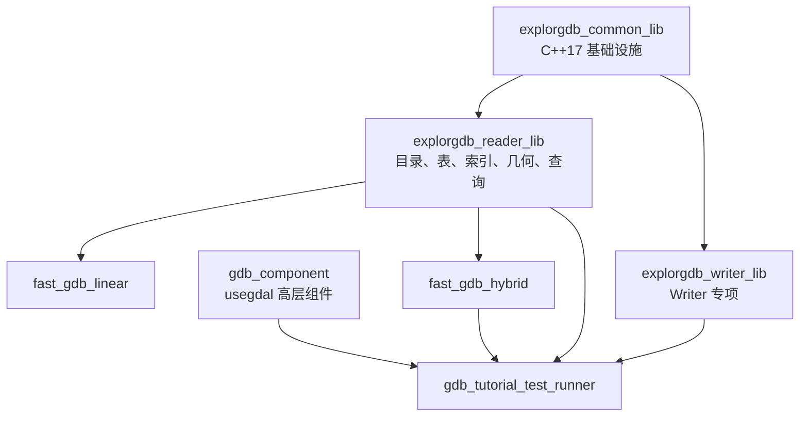
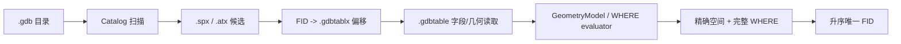

# fast-gdb 项目介绍与当前状态

**面向读者**：需要理解项目目标、代码结构、性能依据和验收边界的开发人员
**最后更新**：2026-07-17
**当前分支**：`codex/spatial-attribute-query`
**分支基线**：`main@d8784e7`

**当前结论**：既有 fast-gdb Reader/Hybrid 发布范围保持不变。当前分支新增空间与属性联合查询，已完成实现、测试代码、三轮静态自审和文档一致性自检，状态为 **Code review ready / Formal acceptance blocked**。该能力尚未进入 `main`，也没有 GDAL ON/OFF、完整 CTest、consumer 或性能门禁的实际证据，不能作为正式发布能力声明。

> 本文是当前分支项目总览。联合查询审核以 [规划状态索引](../planning/00_规划文档状态索引.md)、[实现计划](../planning/21_空间属性联合查询实现计划.md) 和 [代码审核指南](../usage/10_空间属性联合查询代码审核指南.md) 为准。

## 1. 项目目标

fast-gdb 是围绕 ESRI File Geodatabase（`.gdb`）的 C++17 项目，主要包括：

- **格式研究**：解析 `.gdbtable`、`.gdbtablx`、`.gdbindexes`、`.spx`、`.atx`；
- **组件实现**：提供纯 C++ Reader/Writer，以及基于 GDAL 的高层组件；
- **几何处理**：统一 `GeometryModel`、ISO WKB-first、精确空间判断和可选 Hybrid 回退；
- **查询实现**：FID、顺序扫描、bbox、属性索引、WHERE 子集和当前分支的 bbox+WHERE 联合查询；
- **性能与兼容验证**：用合成数据、真实 FileGDB 和 GDAL 对照分别建立证据。

当前 Reader 不承诺完整 SQL/JOIN/聚合/重投影、Raster 像素处理、Annotation/Dimension 或完整 MultiPatch 表面拓扑。

## 2. 产品形态与能力边界

| 组件/产物 | 依赖 | 主要用途 | 当前状态 |
|---|---|---|---|
| `fast_gdb_linear` | 无 GDAL 运行时依赖 | 轻量部署、批量读取、纯 C++ 几何和查询 | 既有支持范围内已完成发布验收 |
| `fast_gdb_hybrid` | GDAL | fast-gdb 主路径 + 曲线/复杂拓扑回退 | 既有支持范围内已完成发布验收 |
| `usegdal` | GDAL | Datasource/Dataset/Recordset 高层 API | 既定 Phase 1A–3 已实现 |
| `explorgdb reader` | C++17 | FileGDB 二进制解析、索引、查询和几何输出 | 既有能力已验收；`SpatialWhere` 为当前分支待审能力 |
| `explorgdb writer` | C++17；部分能力依赖 GDAL | Writer 专项能力 | 本分支不修改 Writer，状态由 Writer 专项文档决定 |

能力状态：

- **已完成/已验收**：有实现和对应正式或历史证据；
- **Code review ready**：实现、测试代码和静态自审完成，可开始独立审核；
- **Formal acceptance blocked**：缺少实际构建、测试、consumer、平台或性能证据；
- **Boundary**：当前明确不支持或只提供降级行为。

## 3. 总体架构



主要源码入口：

- `src/edgar/explorgdb/common/`：二进制读取、VarInt、UTF-16、公共类型；
- `src/edgar/explorgdb/reader/`：Catalog、Table、Tablx、索引、几何和 QueryEngine；
- `src/edgar/explorgdb/curve_gdal/`：可选 GDAL 曲线和拓扑回退；
- `src/edgar/explorgdb/writer/`：Writer 专项；
- `src/edgar/usegdal/`：GDAL 高层组件。

## 4. Reader 查询链路



关键原则：

- `.spx` 只提供空间候选，必须进行精确几何判断；
- `.atx` 只提供属性候选，联合查询必须进行完整 WHERE 复核；
- 损坏索引必须 fail closed，不能被解释为合法零命中；
- fast-gdb 行 FID 为零基，GDAL 对照需明确一基到零基转换；
- 详细执行链见 [Reader QUERY_FLOW](../../src/edgar/explorgdb/reader/QUERY_FLOW.md)。

## 5. 当前分支：空间与属性联合查询

### 5.1 公开入口

```cpp
explorgdb::QueryRequest request;
request.kind = explorgdb::QueryKind::SpatialWhere;
request.xmin = 0.0;
request.ymin = 0.0;
request.xmax = 10.0;
request.ymax = 10.0;
request.where_clause = "population >= 1000 AND category = 'A'";

explorgdb::QueryResult result = engine.query(request);
```

执行路径：

- `spatial-where:spx+atx`；
- `spatial-where:spatial-candidates`；
- `spatial-where:sequential`；
- `spatial-where:invalid`。

### 5.2 已完成实现

- WHERE tokenizer/parser/evaluator 模块化；
- 字段通过 `.gdbindexes` 映射 `.atx`，不猜测索引名；
- 裸字段和函数索引表达式分类；
- `.spx + .atx` 候选 FID 排序、去重和线性交集；
- 所有索引候选后的完整 WHERE 复核；
- 稀疏候选字段扫描和 canonical 按 FID 回退；
- `.atx` 文件长度、页面、页链、条目数和 FID 的 fail-closed 校验；
- 联合指标 `CombinedQueryMetrics`。

### 5.3 安全回退

以下情况不使用当前 `.atx` 快速路径：

- 复合 WHERE；
- 缺失或损坏 `.atx`；
- `LOWER(field)` 或未知函数索引；
- 非 BMP 字符串；
- `!=`；
- 无法由当前元数据证明物理语义的数值编码。

这些情况在精确空间命中行上执行完整 WHERE，不允许漏 FID。

## 6. 测试与审核状态

### 已有测试代码

- GDAL OFF：WHERE 单元、索引表达式分类、`.atx` fail-closed 合成测试；
- GDAL ON：数值/字符串、复合 WHERE、Polyline、Polygon 含洞、MultiPoint、Z/M/ZM、NULL、Unicode、函数索引、索引缺失和损坏；
- package consumer：安装后的 `<query_engine.h>`、`SpatialWhere` 和 `CombinedQueryMetrics`；
- benchmark：100K schema-v2，逐 FID 对照联合入口、旧式双查询和 GDAL。

### 已完成审核

- 三轮静态代码自审：P0 2 项、P1 6 项、P2 1 项，均已修复；
- 文档一致性自检：入口、计划、矩阵、流程、测试索引和 Changelog 已同步；
- 分支未提交 fixture、构建目录或 benchmark 原始结果。

### 尚未形成实际证据

- GDAL ON/OFF Release；
- 完整 CTest；
- `ctest -j`；
- package consumer；
- 100K 完整性能矩阵；
- 10M Point/MultiPoint/Polyline；
- current/main 与 5% 性能门禁；
- `git diff --check main...HEAD`。

因此当前只能声明：

```text
Code review ready
Formal acceptance blocked
```

## 7. 既有几何和性能结论

既有 Point、MultiPoint、Polyline、Polygon、Z/M/ZM、ISO WKB-first、内置曲线线性化和 Hybrid 回退结论仍以发布验收报告为准。本分支不重写这些历史证据。

受控历史性能数字必须绑定数据、平台、GDAL 版本和缓存状态，不能外推到 35GB/5 亿级生产数据。Point、MultiPoint、Polyline 的 macOS 10M fresh-open 历史性能失败档仍是独立问题，不因联合查询实现自动解决。

## 8. 代码审核入口

建议顺序：

1. [规划文档状态索引](../planning/00_规划文档状态索引.md)；
2. [空间与属性联合查询实现计划](../planning/21_空间属性联合查询实现计划.md)；
3. [空间属性联合查询代码审核指南](../usage/10_空间属性联合查询代码审核指南.md)；
4. [三轮自我代码审核](../evidence/spatial-attribute-query-self-review-2026-07-17.md)；
5. [文档一致性自检](../evidence/spatial-attribute-query-document-audit-2026-07-17.md)；
6. [功能与基准测试覆盖矩阵](../usage/04_功能与基准测试覆盖矩阵.md)；
7. [Reader QUERY_FLOW](../../src/edgar/explorgdb/reader/QUERY_FLOW.md)。

代码审核应按 P0/P1/P2 报告，并单列预存问题和未覆盖项。

## 9. 文档维护规则

- 分支状态不得写成已经进入 `main`；
- 测试代码存在不得写成测试通过；
- `SKIPPED` 不计为通过；
- 新增性能结论必须绑定数据、平台、缓存、命令和当前 SHA；
- 本地结果与 GitHub Actions artifact 分开表述；
- 发布级 README 和 v0.1.0 证据保持既有范围，不自动吸收本分支能力；
- 后续代码审核发现问题时，同步更新计划、审核指南、覆盖矩阵和证据记录。
