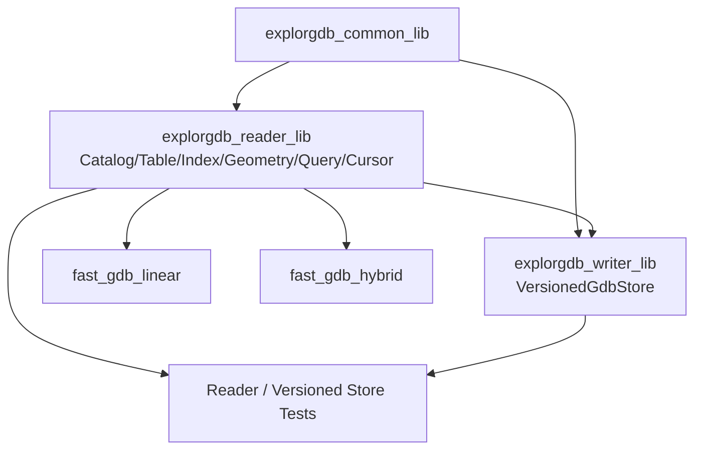

# fast-gdb 项目介绍与当前状态

**面向读者**：需要理解项目目标、产品形态、架构和验收边界的开发人员  
**最后更新**：2026-07-22  
**Writer 开发分支**：`agent/versioned-gdb-store`

## 1. 项目目标

fast-gdb 是围绕 ESRI File Geodatabase 的 C++17 项目：

- 解析 `.gdbtable`、`.gdbtablx`、`.gdbindexes`、`.spx`、`.atx`；
- 提供纯 C++ Reader 和可选 GDAL Hybrid；
- 统一 GeometryModel、ISO WKB-first 和精确空间判断；
- 提供 FID、顺序、bbox、属性、WHERE、bbox+WHERE 和完整 Feature cursor；
- 通过不可变 generation 向同进程并发 Reader 发布完整 FileGDB；
- 用合成数据、真实 FileGDB 和 GDAL 对照建立证据。

当前不承诺完整 SQL/JOIN/聚合、Raster 像素、Annotation/Dimension、完整 MultiPatch 表面拓扑或字段级公共 Writer DSL。

## 2. 产品形态

| 安装目标 | 用途 | 当前状态 |
|---|---|---|
| `fast_gdb::linear` | 无 GDAL Reader、几何和查询 | 既有范围已有历史验收 |
| `fast_gdb::hybrid` | fast-gdb 主路径 + 显式 GDAL 回退 | 既有范围已有历史验收 |
| `fast_gdb::writer` | VersionedGdbStore 不可变 generation 发布 | 已实现、本地自检完成、正式验收受阻 |

Writer 安装面只包含 VersionedGdbStore。旧 Writer、legacy target、独立 Append/Update/Delete/Transaction 和直接 source 发布均已删除，不提供兼容期。

## 3. Reader 能力

### FID-only

```cpp
QueryResult result = engine.query(request);
```

- `SpatialWhere` 组合精确 bbox 与 WHERE；
- `.spx/.atx` 只提供候选；
- 最终结果执行完整几何/WHERE 复核。

### Full-feature cursor

```cpp
auto cursor = engine.open_cursor(request);
QueryFeature feature;
while (cursor.next(feature)) {
    consume(feature.fid,
            feature.record.field_values,
            feature.geometry.wkb);
}
if (!cursor.done()) report(cursor.error());
```

- 返回 FID、全部字段和 GeometryValue；
- SequentialScan 不物化全表 FID；
- 候选模式保存最终 FID vector；
- EOF 与读取失败明确区分；
- 同一 engine 同时只允许一个活动 cursor。

## 4. Writer Store 能力

### 仓库结构

```text
store/
├── CURRENT
├── generations/gen-*.gdb/
└── work/work-gen-*.gdb/
```

### 对象模型

```text
VersionedGdbStore
  ├─ acquire_reader() → GdbReaderSnapshot
  ├─ begin_write() → GdbWriteTransaction
  ├─ initialize_from()
  └─ recover()
```

### 语义

- Reader snapshot 固定不可变 generation；
- Writer 独占一个私有 working generation；
- macOS/Linux 优先 CoW，不支持时完整复制；
- 发布前强制 Reader 重开校验；
- `CURRENT` 原子切换；
- 旧 Reader 继续旧版，新 Reader 获取新版；
- 无租约旧 generation 自动回收；
- 不确定持久化状态保留新旧版并要求 recover。

### 公共边界

安装包只提供：

```cpp
#include <versioned_gdb_store.h>
#include <versioned_gdb_validator.h>
```

调用方使用业务编辑器或 GDAL 修改 `working_path()`。fast-gdb 不再提供旧字段级 Writer API。

## 5. 总体架构



主要 Writer 源码：

- `include/fast_gdb/writer/versioned_gdb_store.h`：唯一 store API；
- `include/fast_gdb/writer/versioned_gdb_validator.h`：发布校验配置；
- `versioned_gdb_store*.cpp`：状态、clone、平台持久化、recovery 和 transaction；
- `versioned_gdb_store_internal.h`：私有共享状态。

## 6. Writer 当前验证边界

已完成：

- 三轮代码自检；
- C++17 严格语法检查；
- 初始化、发布、refresh 和旧代次回收 smoke；
- 多线程旧/新 Reader 可见性；
- 路径别名 Writer 门禁；
- ASan/UBSan；
- latest-only 安装面和 package consumer 配置；
- 专用三平台 workflow 定义。

尚未形成正式证据：

- 完整 CMake/CTest；
- macOS `clonefile`；
- Linux reflink/非 reflink；
- Windows full-copy 与 `MoveFileExW`；
- ENOSPC 和 crash-phase 故障注入；
- 真实 FileGDB validator；
- 可审计 GitHub Actions logs/artifacts。

因此 Writer 当前结论为 **Implemented / Formal acceptance blocked**。

## 7. 明确不支持

- 旧 Writer API 和兼容 target；
- 内建字段级 Append/Update/Delete；
- schema migration；
- 原生曲线/MultiPatch 写入；
- FID 空洞复用；
- 跨进程 Reader 租约或 Writer 锁；
- 多 Writer；
- savepoint、嵌套、跨 GDB 或分布式事务；
- S3、对象存储和不可靠网络文件系统；
- 自动空间预留或配额管理。
