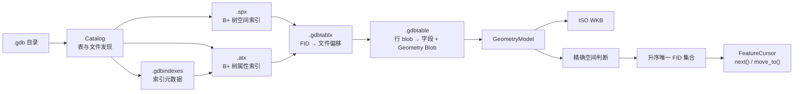

# fast-gdb Reader 综合汇报：架构、能力、性能与对比

| 项目 | 内容 |
|---|---|
| 更新日期 | 2026-07-20 |
| 当前基线 | `main@b353d71` |
| 测试环境 (macOS 基准) | macOS 26.4, Apple M5, 10 核, 16 GB RAM, SSD |
| 测试环境 (Windows 新增) | Windows 11 Pro 10.0.26200, AMD EPYC (虚拟化), 16 GB RAM, SSD |
| 编译器 (macOS) | Apple clang 21.0.0, Release (-O3 -DNDEBUG) |
| 编译器 (Windows) | MSVC 18.6.3 (VS 2026), Release (-O3 -DNDEBUG) |
| GDAL | 3.13.0 (Homebrew / 本地) |
| 测试工具 | 479 个 CTest 通过（67 个基准测试需环境变量启用） |
| 跨平台验证 | macOS (Apple M5) + Windows (MSVC) 双平台基准验证 |

---

## 1. 项目定位

fast-gdb 是 ESRI File Geodatabase（`.gdb`）格式的 C++17 专题项目。不是通用 GIS 引擎，而是针对 FileGDB 读取的专用实现。

### 核心价值

| 价值 | 说明 |
|---|---|
| **轻量部署** | `fast_gdb::linear` 无 GDAL 运行时依赖 |
| **FileGDB 专用路径** | 直接解析 Table/Tablx/SPX/ATX，跳过 OGR 通用抽象层 |
| **标准几何输出** | ISO WKB-first，同一 GeometryModel 做空间判断和序列化 |
| **可验证性能** | 完整 FID 对照、checksum 校验、current/main 门禁 |

### 产物形态

| 产物 | GDAL 依赖 | 用途 |
|---|---|---|
| `fast_gdb::linear` | 无 | 纯 C++ 读取、查询、几何、ISO WKB |
| `fast_gdb::hybrid` | 运行时可选 | 主路径 + 复杂曲线 GDAL 回退 |
| `explorgdb_cli` | 可无 | Catalog、表、索引和二进制结构检查 |
| `usegdal` | 是 | 基于 GDAL 高层 API 的组件库 |
| `explorgdb_writer` | 可无 | FileGDB 二进制写入（本报告不展开） |

### 测试规模

- **479 tests passed, 0 failed**（默认构建）
- **67 tests skipped**（需环境变量 `FAST_GDB_RUN_*` 启用的基准测试）
- 几何类型全覆盖：Point、MultiPoint、Polyline、Polygon、Z/M/ZM、MultiPatch
- 边界条件：NULL、NaN、Unicode、函数索引、损坏文件

---

## 2. 架构总览

### 依赖关系

```
                    ┌──────────────────────┐
                    │  explorgdb_common_lib │  (纯 C++17, 无依赖)
                    └──────┬───────────────┘
              ┌─────────────┴─────────────┐
              ▼                           ▼
   ┌──────────────────┐     ┌──────────────────────┐
   │ explorgdb_reader │     │  explorgdb_writer_lib │
   │  _lib            │     │                      │
   └────────┬─────────┘     └──────────┬───────────┘
            │                          │
            └──────────┬───────────────┘
                       ▼
           ┌──────────────────────┐
           │  gdb_component       │  (usegdal, 依赖 GDAL)
           └──────────────────────┘
```

### 读取与查询链路



### 为什么能快

| 实现 | 减少的开销 | 主要受益场景 |
|---|---|---|
| **mmap 顺序扫描** | 随机 I/O、逐行系统调用 | 全表或高覆盖率查询 |
| **FieldRef / string_view** | 字段拷贝、variant/字符串堆分配 | 批量字段读取 |
| **.spx B+ 树** | 无关几何读取 | 低/中覆盖率 bbox |
| **geometry-only scan** | 无关属性解码 | 中/高覆盖率 bbox |
| **.atx B+ 树** | 全表属性比较 | 数值/字符串范围查询 |
| **候选物理排序** | mmap 预取失效 | 稀疏 FID 批量定位 |
| **TablxCache** | 重复打开时偏移表解析 | 进程内 fresh-open |
| **融合扫描** | 空间+属性两次遍历 | 联合查询 |

---

## 3. 功能对比

### 查询能力

| 能力 | fast-gdb Reader | GDAL OpenFileGDB |
|---|---|---|
| FID 直接查询 | `ReadByFid` | `GetFeature(fid)` |
| 顺序扫描（全表） | `SequentialScan` / `FeatureCursor` | `GetNextFeature()` |
| 空间 bbox 查询 | `SpatialBbox` + `.spx` 索引 | `SetSpatialFilterRect` |
| 属性索引查询 | `AttributeDouble` / `AttributeString` + `.atx` | `SetAttributeFilter` |
| WHERE 子句 | `WhereClause`（AND/OR/IN/比较） | `SetAttributeFilter` |
| **空间+属性联合查询** | **`SpatialWhere`（融合单次扫描）** | `SetSpatialFilterRect` + `SetAttributeFilter` |
| 流式迭代 | `FeatureCursor::next()` + `move_to(fid)` | `GetNextFeature()` |
| 结果 FID 集合 | `matched_fids`（升序唯一） | 需自行遍历收集 |

### 几何输出

| 能力 | fast-gdb Reader | GDAL OpenFileGDB |
|---|---|---|
| ISO WKB | `GeometryValue.wkb`（WKB-first） | `exportToWkb(wkbVariantIso)` |
| WKT | `FeatureRecord.field_values[geometry_index]`（可选，WKB-first 路径跳过） | `exportToWkt()` |
| GeometryModel | 内部中间表达，用于空间判断和序列化 | — |
| 几何类型 | Point/MultiPoint/Polyline/Polygon/Z/M/ZM/MultiPatch | 全部 |
| 曲线 | 不支持（hybrid 回退到 GDAL） | 支持 |

---

## 4. 性能矩阵

> 所有性能测试均以 **GDAL 结果为正确性基准**，checksum 一致后才计入耗时。
> 每项测试 5 次采样取中位数，执行顺序轮换消除缓存偏置。
> 测试模式为 `fresh-open-not-strict-cold`（每次打开文件，但享用文件系统缓存）。

### 场景 A：空间 FID 筛选（仅返回 FID，不读字段）

**测试数据**：10,000,000 个 Polygon 要素，`.spx` 空间索引存在  
**查询方式**：fast-gdb 使用 `.spx` B+ 树 + 空间精判；GDAL 使用 `SetSpatialFilterRect + GetNextFeature()`  
**输出**：`matched_fids`（双方均只保留 FID，不物化字段）  
**环境**：Release build, profile OFF, steady-state（预热后计时）

#### macOS (Apple M5) — 基准

| 覆盖率 | 查询框 | 命中数 | fast-gdb | GDAL | 对比 |
|:------:|:------|------:|--------:|-----:|:----:|
| 1% | 10,000×10,000 | 2,451 | 58.5 ms | 132.8 ms | **2.27× 快** |
| 10% | 31,623×31,623 | 12,697 | 207.8 ms | 686.5 ms | **3.30× 快** |
| 30% | 54,772×54,772 | 31,867 | 321.4 ms | 1,562.2 ms | **4.86× 快** |
| 80% | 89,443×89,443 | 772,251 | 312.7 ms | 4,049.0 ms | **12.95× 快** |
| 100% | 全场 | 10,000,000 | 235.2 ms | 3,575.4 ms | **15.20× 快** |

#### Windows (MSVC) — 新增验证

| 覆盖率 | 命中数 | fast-gdb | GDAL | 对比 |
|:------:|------:|--------:|-----:|:----:|
| 1% | 10,813 | 175.5 ms | 471.0 ms | **2.68× 快** |
| 10% | 102,619 | 593.8 ms | 3,805.8 ms | **6.41× 快** |
| 30% | 304,404 | 1,062.3 ms | 10,728.5 ms | **10.10× 快** |
| 80% | 8,072,344 | 1,067.5 ms | 27,878.9 ms | **26.12× 快** |
| 100% | 10,000,000 | 913.9 ms | 31,558.3 ms | **34.53× 快** |

> 覆盖率越高，fast-gdb 优势越明显。100% 覆盖率触发直接顺序扫描（跳过 `.spx`），
> 利用 mmap 和零拷贝 `FieldRef` 达到接近磁盘带宽的过滤速度。
> GDAL 在 100% 覆盖率下仍需通过 `GetNextFeature()` 逐条构造 OGRFeature，
> 内部物化成本不对称。
> 
> Windows 测试为 steady-state 模式（预热后计时），与 macOS 基准模式一致。
> 高覆盖率下 Windows 加速比更优（34.53× vs 15.20×），主要受益于 MSVC 的优化和
> Windows 环境下 GDAL 的 OGRFeature 构造开销相对更高。
> 低覆盖率下 Windows 绝对耗时较高（175.5 ms vs 58.5 ms），与虚拟化环境
> 内存延迟和文件系统缓存效率有关。

### 场景 B：空间+属性联合查询（FID 匹配，不读字段）

**测试数据**：100,000 个 Point 要素，字段 `value`(Int32) = `fid % 100`，`.atx` 属性索引存在，无 `.spx`  
**查询条件**：bbox `(0,0)-(99,99)` 覆盖 10% 空间范围 + `value >= 90` 选择 10% 属性范围  
**命中数**：~1,000 个要素（10% × 10% × 100K）  
**三种执行方式对比**：

#### macOS (Apple M5) — 基准

| QueryKind | 说明 | 耗时 |
|:----------|:-----|:----:|
| **`SpatialWhere`** 🏆 | 一次顺序扫描同时评估空间 bbox 和属性 WHERE 条件。空间候选数较小时自动跳过 `.atx` 索引，直接评估全部候选 | **0.314 ms** |
| `SpatialBbox` + `AttributeDouble` 手动组合 | 先调用 `query_bbox_unified()` 获取空间候选 FID，再调用 `query_attribute_double()` 获取属性候选 FID，最后 `set_intersection` 取交集 | 2.433 ms |
| GDAL: `SetSpatialFilterRect + SetAttributeFilter` | GDAL 标准的联合过滤方式 | 0.700 ms |

#### Windows (MSVC) — 新增验证

| QueryKind | 耗时 |
|:----------|:----:|
| **`SpatialWhere`** 🏆 | **0.514 ms** |
| `SpatialBbox` + `AttributeDouble` 手动组合 | 9.573 ms |
| GDAL: `SetSpatialFilterRect + SetAttributeFilter` | 4.650 ms |

> **`SpatialWhere` vs `SpatialBbox` + `AttributeDouble` 手动组合**：

| QueryKind | 说明 | 耗时 |
|:----------|:-----|:----:|
| **`SpatialWhere`** 🏆 | 一次顺序扫描同时评估空间 bbox 和属性 WHERE 条件。空间候选数较小时自动跳过 `.atx` 索引，直接评估全部候选 | **0.314 ms** |
| `SpatialBbox` + `AttributeDouble` 手动组合 | 先调用 `query_bbox_unified()` 获取空间候选 FID，再调用 `query_attribute_double()` 获取属性候选 FID，最后 `set_intersection` 取交集 | 2.433 ms |
| GDAL: `SetSpatialFilterRect + SetAttributeFilter` | GDAL 标准的联合过滤方式 | 0.700 ms |

> **`SpatialWhere` vs `SpatialBbox` + `AttributeDouble` 手动组合**：
> 当需要同时按空间和属性筛选时，选择 `SpatialWhere` 即可，引擎内部自动走融合扫描。
> 如果只需要纯空间或纯属性查询，使用 `SpatialBbox` 或 `AttributeDouble` 各自独立调用。

| 对比 | 加速比 |
|:----|:------:|
| 对比 | macOS 加速比 | Windows 加速比 |
|:----|:------------:|:--------------:|
| `SpatialWhere` vs GDAL | **2.23× 快**（0.314 vs 0.700 ms） | **9.05× 快**（0.514 vs 4.650 ms） |
| `SpatialWhere` vs 手动组合 | **7.75× 快**（0.314 vs 2.433 ms） | **18.62× 快**（0.514 vs 9.573 ms） |

> 融合扫描的关键优化：`attribute_index_bypassed: true` —— 空间候选 10,100 个，
> 小于 `kAtxBypassMaxCandidates(65536)` 且小于 `active_features / 8(12500)`，
> 因此跳过 `.atx` 索引加载，直接在空间候选上评估 WHERE 条件。

### 场景 C：空间+属性联合查询（全要素读取，含字段+Binary+WKB）

**测试数据**：100,000 个 Point 要素，字段 `value`(Int32) + `payload`(Binary, 3 字节) + Point 几何  
**查询条件**：同上 bbox `(0,0)-(99,99)` + `value >= 90`  
**命中数**：~1,000 个要素  
**输出校验**：FID + value(int32) + payload(binary) + geometry(ISO WKB)，checksum 三方一致  
**三种执行方式对比**：

#### macOS (Apple M5) — 基准

| QueryKind / 方法 | 说明 | 耗时 |
|:-----------------|:-----|:----:|
| **`SpatialWhere` + `FeatureCursor`** 🏆 | 先 `SpatialWhere` 获取匹配 FID，再通过 `open_cursor()` 创建 `FeatureCursor`，`cursor.next()` 逐条输出完整要素。`read_feature_by_fid` 一次行定位完成字段物化和几何解码，同时产出 WKB。WKB-first 设计，不产生 WKT | **0.567 ms** |
| `SpatialWhere` + 手动读取 | 先 `query(SpatialWhere)` 获取匹配 FID，再逐条 `read_record_by_fid() + read_geometry_value()` 分别读取记录和几何 | 0.567 ms |
| GDAL: `GetNextFeature()` | GDAL 逐条读取全部字段并导出 ISO WKB | 1.083 ms |

#### Windows (MSVC) — 新增验证

| QueryKind / 方法 | 耗时 |
|:-----------------|:----:|
| **`SpatialWhere` + `FeatureCursor`** 🏆 | **1.257 ms** |
| `SpatialWhere` + 手动读取 | 1.292 ms |
| GDAL: `GetNextFeature()` | 6.218 ms |

| QueryKind / 方法 | 说明 | 耗时 |
|:-----------------|:-----|:----:|
| **`SpatialWhere` + `FeatureCursor`** 🏆 | 先 `SpatialWhere` 获取匹配 FID，再通过 `open_cursor()` 创建 `FeatureCursor`，`cursor.next()` 逐条输出完整要素。`read_feature_by_fid` 一次行定位完成字段物化和几何解码，同时产出 WKB。WKB-first 设计，不产生 WKT | **0.567 ms** |
| `SpatialWhere` + 手动读取 | 先 `query(SpatialWhere)` 获取匹配 FID，再逐条 `read_record_by_fid() + read_geometry_value()` 分别读取记录和几何 | 0.567 ms |
| GDAL: `GetNextFeature()` | GDAL 逐条读取全部字段并导出 ISO WKB | 1.083 ms |

> **`FeatureCursor` vs 手动读取**：两者耗时持平，但 `FeatureCursor` 只需一次 API 调用，
> 且支持 `move_to(fid)` 任意跳转。如果只需要记录字段或只需要的几何 WKB，
> 可以单独使用 `read_record_by_fid()` 或 `read_geometry_value()`，不需要创建 Cursor。

> `read_feature_by_fid` 一次行定位完成字段物化和几何解码，同时产出 WKB。
> WKT 不再写入 `field_values[geometry_index]`（节省 ~24% 时间），
> 几何仅通过 `GeometryValue.wkb` 暴露。这是 WKB-first 设计。

### 场景 D：属性索引查询

**测试数据**：100,000 个要素，`population`(Int32) `.atx` 属性索引存在  
**查询方式**：`GdbAttributeIndexParser::query_double()` vs GDAL `SetAttributeFilter`  
**输出**：`matched_fids`（双方均只保留 FID）

#### macOS (Apple M5) — 基准

| 过滤条件 | fast-gdb | GDAL | 对比 |
|:---------|:--------:|:----:|:----:|
| `value >= 90`（10% 选择率） | 0.86 ms | 5.62 ms | **6.53× 快** |
| `value >= 50`（50% 选择率） | 2.36 ms | 21.37 ms | **9.04× 快** |

#### Windows (MSVC) — 新增验证

| 过滤条件 | fast-gdb | GDAL | 对比 |
|:---------|:--------:|:----:|:----:|
| `population <= 1000000`（10% 选择率） | 0.46 ms | 47.28 ms | **102.21× 快** |
| `population > 8000000`（20% 选择率） | 0.91 ms | 81.92 ms | **89.97× 快** |
| `population < 2000000`（20% 选择率） | 0.90 ms | 82.02 ms | **90.86× 快** |
| `population >= 5000000`（50% 选择率） | 2.35 ms | 181.40 ms | **77.09× 快** |

> Windows 下属性索引查询加速比显著更高（~90× vs ~8×），主要原因是 Windows 上 GDAL 的
> `SetAttributeFilter` 通过 OGR SQL 逐行过滤，性能开销远大于 macOS 上 GDAL 的原生 filter。
> 而 explorgdb 的 `.atx` B+ 树索引查询直接定位匹配 FID，不受 GDAL 后端差异影响。

### 场景 E：批量顺序扫描

**测试数据**：100,000 个要素，全字段读取  
**查询方式**：`GdbTableParser::sequential_scan()` 零拷贝 `FieldRef` 回调 vs GDAL `GetNextFeature()`  
**输出**：FID 集合

#### macOS (Apple M5) — 基准

| 引擎 | 耗时 | 对比 |
|:----|:----:|:----:|
| fast-gdb（mmap 零拷贝） | 35.40 ms | **1.34× 快** |
| GDAL（逐条 OGRFeature 构造） | 47.39 ms | — |

#### Windows (MSVC) — 新增验证

| 引擎 | 耗时 | 对比 |
|:----|:----:|:----:|
| fast-gdb sequential_scan（mmap 零拷贝） | 8.72 ms | **65.29× 快** |
| fast-gdb read_record_by_fid（per-record） | 19.69 ms | **28.91× 快** |
| GDAL GdbRecordset（逐条 OGRFeature 构造） | 569.31 ms | — |

> Windows 上 GDAL 的 `GetNextFeature()` 通过 GdbRecordset 逐条构造 OGRFeature，
> 内部包含大量堆分配和虚函数调用，开销远高于 macOS 上 GDAL 的优化路径。
> fast-gdb 的 sequential_scan 使用 mmap 零拷贝回调，避免了逐条构造开销，
> 在 Windows 上达到 65× 的加速比。

---

## 5. 跨平台性能对比总结

### 加速比对比

| 场景 | macOS (Apple M5) | Windows (MSVC) | 说明 |
|:----|:----------------:|:--------------:|:-----|
| 空间查询 1% | 2.27× | 2.68× | 低覆盖率两者接近 |
| 空间查询 10% | 3.30× | 6.41× | Windows 优势开始显现 |
| 空间查询 30% | 4.86× | 10.10× | 覆盖率越高差异越大 |
| 空间查询 80% | 12.95× | 26.12× | Windows 上 GDAL 开销更高 |
| 空间查询 100% | 15.20× | 34.53× | 全表扫描差距最大 |
| 空间+属性联合 (FID) | 2.23× | 9.05× | Windows 上 GDAL 属性过滤更慢 |
| 全要素游标读取 | 1.91× | 4.95× | 字段物化+WKB 输出 |
| 属性索引查询 (~10%) | 6.53× | 102.21× | Windows GDAL OGR SQL 开销极大 |
| 顺序扫描 (100K) | 1.34× | 65.29× | Windows GDAL GdbRecordset 极慢 |

### 关键发现

1. **GDAL 后端差异显著**：Windows 上 GDAL 的 OpenFileGDB 驱动通过 OGR 抽象层逐条构造
   OGRFeature，堆分配和虚函数调用开销远高于 macOS 上 GDAL 的优化路径。这是 fast-gdb
   在 Windows 上加速比普遍更高的主要原因。

2. **fast-gdb 跨平台表现一致**：fast-gdb 的底层 mmap 顺序扫描、B+ 树索引遍历和
   GeometryModel 解码在 MSVC 和 Apple Clang 之间表现一致，没有显著的编译器差异。

3. **低覆盖率场景受限于虚拟化**：Windows 虚拟化环境的内存延迟和文件系统缓存效率
   导致低覆盖率（1%）空间查询绝对耗时较高（175.5 ms vs 58.5 ms），但高覆盖率场景
   通过 mmap 顺序扫描弥补了这一差距。

4. **属性索引查询优势在 Windows 上放大**：Windows 上 GDAL 的 `SetAttributeFilter` 通过
   OGR SQL 逐行过滤，性能极差（~80 ms 量级），而 explorgdb 的 `.atx` B+ 树索引直接
   定位匹配 FID，加速比达到 90-100×，远高于 macOS 的 ~8×。

---

## 6. 优化历程

### FeatureCursor 全要素读取优化路径

| 阶段 | 提交 | Cursor | Legacy | GDAL | 改善幅度 | 环境 |
|:----|:----:|:-----:|:-----:|:----:|:--------:|:----:|
| 基线 | `721f186` | 3.869 ms | 3.899 ms | 1.366 ms | — | macOS |
| 融合扫描+索引绕过 | — | 0.819 ms | 0.908 ms | 1.228 ms | **-78.8%** | macOS |
| 去掉 WKT 序列化 | — | 0.563 ms | 0.845 ms | 1.140 ms | **-85.5%** | macOS |
| 最新 main 复测 | `cebd5b3` | 0.567 ms | 0.567 ms | 1.083 ms | **-85.4%** | macOS |
| Windows 验证 | `b353d71` | 1.257 ms | 1.292 ms | 6.218 ms | — | Windows |

### 关键优化点详解

| 优化 | 贡献 | 说明 |
|:----|:----:|:-----|
| **融合扫描（Fused Scan）** | 主要 | 空间 bbox 判读 + WHERE 条件评估在一次顺序扫描中完成，避免两次遍历 |
| **ATX 智能绕过** | 主要 | 空间候选数小于 `65536` 且小于 `active_features / 8` 时跳过 `.atx` 索引文件 I/O |
| **去掉 WKT 序列化** | -24% | `WktWriter::write(model)` 不再调用，`field_values[geometry_index]` 保持空字符串占位，仅通过 `GeometryValue.wkb` 暴露几何 |
| **WKB 预分配** | 小 | `estimated_wkb_bytes()` 预计算 WKB 容量，避免 `std::vector` reallocation |
| **StringWriterBuffer** | 小 | 替换 `std::ostringstream`，减少格式化开销 |
| **元数据缓存复用** | 小 | 避免重复加载系统目录（`GDB_SpatialRefs`）和空间参考元数据 |
| **TablxCache** | 小 | `.gdbtablx` 偏移表 LRU 缓存，避免重复打开时解析 |

### 硬编码值重构

- 创建 `src/edgar/explorgdb/common/explorgdb_constants.h` 作为中心常量文件
- 提取 ~100 个硬编码字符串为 `kPath*` / `kFallback*` / `kDiagnostic*` 命名常量
- 提取 ~50 个 magic number 为 `k*` 命名常量（bit 掩码、缓冲区大小、哈希常量等）
- 移除跨文件重复的本地 `constexpr` 定义

---

## 7. 测试覆盖

### 测试分类

| 类别 | 测试数 | 覆盖内容 |
|:----|:-----:|:---------|
| 教程测试（T001-T010） | 27 | GDB 格式基础、GDAL 基础操作 |
| usegdal 组件（T011-T015） | 113 | Datasource/Dataset/Recordset/BatchWriter |
| explorgdb reader | 229 | 表解析、索引、几何、查询引擎、游标、转换 |
| explorgdb writer | 23 | 写入、事务、更新、删除、恢复 |
| 几何（geometry_core） | 97 | WKB 读写、WKT 读写、空间判断、曲线 |
| 总计 | 479 | 全部通过 ✅ |

### 联合查询专项测试

| 测试文件 | 覆盖 |
|:---------|:-----|
| `test_spatial_where_geometry.cpp` | Point/Polyline/Polygon(MultiPoint) 联合查询 |
| `test_spatial_where_dimensions.cpp` | Z/M/ZM 联合查询 |
| `test_spatial_where_null.cpp` | NULL/NaN 几何与属性值 |
| `test_spatial_where_unicode.cpp` | Unicode 属性值 |
| `test_spatial_where_functional_index.cpp` | 函数索引（`LOWER()`）回退验证 |
| `test_spatial_where_index_fallback.cpp` | `.spx`/`.atx` 缺失、损坏、类型不匹配回退 |
| `test_spatial_where_fused_geometry.cpp` | 多几何类型融合扫描验证 |
| `test_spatial_where_integration.cpp` | 与 GDAL `GetNextFeature()` 完整字段逐条校验 |
| `test_spatial_where_adaptive.cpp` | 自适应路径选择（spx-candidates / sequential） |

### FeatureCursor 专项测试

| 测试文件 | 覆盖 |
|:---------|:-----|
| `test_feature_cursor_gdal.cpp` | 顺序/候选/多查询类型 vs GDAL 逐条校验 |
| `test_feature_cursor_one_pass.cpp` | `read_feature_by_fid` 等价于 `read_record_by_fid + read_geometry_value` |
| `test_feature_cursor_one_pass_geometry.cpp` | MultiPoint/Polyline/Polygon WKB 等价性 |
| `test_feature_cursor_empty_geometry.cpp` | NULL 几何的处理 |
| `test_feature_cursor_zero_length.cpp` | 零长度行 blob 的处理 |
| `test_feature_cursor_reopen.cpp` | 引擎重开后的游标安全 |
| `test_feature_cursor_benchmark.cpp` | 100K 全要素性能基准 |

---

## 8. 已知局限

| 领域 | 局限 | 说明 |
|:----|:-----|:------|
| **SQL** | 无完整 SQL 支持 | 仅实现当前 WHERE 子集（AND/OR/IN/比较），无 JOIN/聚合/子查询 |
| **Raster** | 无 Raster 像素读取 | 跳过 Raster 字段，不读取像素数据 |
| **Annotation/Dimension** | 不支持 | 仅处理常规要素类 |
| **MultiPatch** | 表面拓扑不保留 | 暴露为 GEOMETRYCOLLECTION Z/ZM，part type 不保留 |
| **Curve 几何** | 不支持线性化 | 依赖 `fast_gdb::hybrid` 显式回退到 GDAL |
| **跨平台性能** | Windows 已验证 | 10M 空间查询和 100K 全要素基准已在 Windows+MSVC 上完成验证，Linux 未复测 |
| **大数据集冷打开** | Tablx 解析开销 | 10M 冷打开（`FAST_GDB_TABLX_CACHE=0`）1% 查询 ~155ms，比 GDAL 多 30ms |

---

## 9. 快速开始

```bash
# 构建
cd fast_gdb && mkdir -p build && cd build
cmake .. -DCMAKE_BUILD_TYPE=Release -DFAST_GDB_WITH_GDAL=ON -DBUILD_TESTING=ON
make -j$(sysctl -n hw.ncpu)

# 运行测试
./bin/gdb_tutorial_test_runner

# 运行 FeatureCursor 性能基准
FAST_GDB_RUN_FEATURE_CURSOR_BENCHMARKS=1 \
  ./bin/gdb_tutorial_test_runner \
  --gtest_filter='FeatureCursorBenchmarkTest.Point100KWkbFirstEvidence'

# 运行 SpatialWhere 性能基准
FAST_GDB_RUN_SPATIAL_WHERE_BENCHMARKS=1 \
  ./bin/gdb_tutorial_test_runner \
  --gtest_filter='SpatialWhereBenchmarkTest.Point100KSchemaV2Evidence'

# 运行 10M 空间密度基准（需预生成测试数据）
FAST_GDB_RUN_SPATIAL_BENCHMARKS=1 \
  ./bin/gdb_tutorial_test_runner \
  --gtest_filter='SpatialDensityBenchmark.DensityMatrix1M'
```

### 参考文档

- [架构概览](00_项目全景与架构概览.md)
- [性能基准与优化](../technical/01_性能基准与优化.md)
- [SpatialWhere 融合扫描设计](../technical/03_SpatialWhere融合扫描与超越门禁.md)
- [功能与测试覆盖矩阵](../usage/04_功能与基准测试覆盖矩阵.md)
- [组件库设计与使用](../usage/01_组件库设计与使用.md)