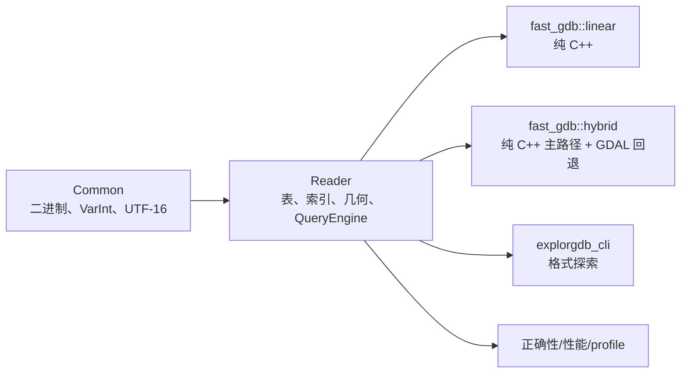
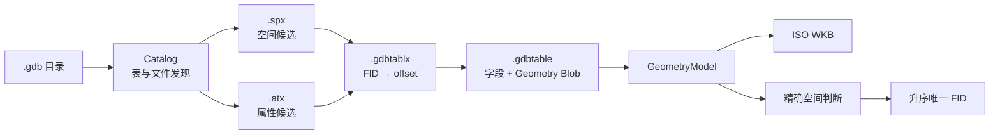

# fast-gdb Reader 专项汇报

| 项目 | 内容 |
|---|---|
| 更新日期 | 2026-07-17 |
| 汇报基线 | `main@5647c6a` |
| 验收环境 | macOS arm64、Release、GDAL ON/OFF |
| 汇报范围 | **仅 Reader：架构、功能、正确性、性能和局限** |
| 当前结论 | **常规 FileGDB 批量读取、索引查询和 ISO WKB 输出已可用** |

## 1. 为什么使用 fast-gdb Reader

fast-gdb Reader 不是通用 GIS 引擎，而是针对 FileGDB 读取的专用 C++ 实现。它的价值集中在四点：

| 价值 | fast-gdb Reader | 带来的收益 |
|---|---|---|
| 轻量部署 | `fast_gdb::linear` 无 GDAL 运行时依赖 | 更小的依赖面和部署复杂度 |
| FileGDB 专用路径 | 直接解析 Table/Tablx/SPX/ATX | 减少通用 OGR 对象构造和虚调用开销 |
| 标准几何输出 | ISO WKB-first，同一模型做空间判断 | 减少 WKT 二次解析和多链路语义偏差 |
| 可验证性能 | 完整 FID 对照、无效几何计数、current/main 门禁 | 性能数字以结果正确为前提 |

### 已证明的优势

| 场景 | fast-gdb | GDAL | 对比 |
|---|---:|---:|---:|
| Polygon 10M 空间筛选并返回 FID，1% | 58.5 ms | 132.8 ms | **2.27× 快** |
| Polygon 10M 空间筛选并返回 FID，30% | 321.4 ms | 1,562.2 ms | **4.86× 快** |
| Polygon 10M 空间筛选并返回 FID，100% | 235.2 ms | 3,575.4 ms | **15.20× 快** |
| 100K 属性范围查询 | 0.86–2.36 ms | 5.62–21.37 ms | **6.53–9.04× 快** |
| 100K 零拷贝顺序扫描 | 35.40 ms | 47.39 ms | **1.34× 快** |

> Polygon 10M 数字是 **FID 集合筛选基准**。fast-gdb 返回 `matched_fids`；GDAL 通过 `GetNextFeature()` 构造命中的完整 `OGRFeature`后只保留 FID。两侧输出的 FID 语义一致，但内部物化成本不对称；该数字不能证明 fast-gdb 读取完整对象快 15.20×。

## 2. Reader 架构

### 2.1 产物形态

| 产物 | GDAL 依赖 | 用途 |
|---|:---:|---|
| `fast_gdb::linear` | 无 | 常规几何、批量读取、索引查询、ISO WKB |
| `fast_gdb::hybrid` | 有 | fast-gdb 主路径，复杂曲线/拓扑可观测回退 |
| `explorgdb_cli` | 可无 | Catalog、表、索引和二进制结构检查 |

### 2.2 读取与查询链路

### 2.3 为什么能快

| 实现 | 减少的开销 | 主要受益场景 |
|---|---|---|
| mmap 与顺序扫描 | 随机 I/O、逐行系统调用 | 全表或高覆盖率查询 |
| `FieldRef` / `string_view` | 字段拷贝、variant/字符串堆分配 | 批量字段读取 |
| `.spx` B+ 树 | 无关几何读取 | 低/中覆盖率 bbox |
| geometry-only scan | 无关属性解码 | 中/高覆盖率 bbox |
| `.atx` B+ 树 | 全表属性比较 | 数值/字符串范围查询 |
| 候选物理排序 | mmap 预取失效 | 稀疏 FID 批量定位 |
| TablxCache | 重复打开时偏移表解析 | 进程内 fresh-open |

## 3. Reader 功能实现

### 3.1 格式与记录

| 能力 | 状态 | 说明 |
|---|:---:|---|
| `.gdbtable` / `.gdbtablx` | ✅ | schema、FID 定位、记录解析、顺序扫描 |
| `.gdbindexes` / `.spx` / `.atx` | ✅ | 索引元数据、空间与属性候选 |
| 字段类型 | ✅ | 17 类物理字段、nullable bitmap、DateTimeWithOffset |
| FID 读取 | ✅ | 通过 Tablx 偏移定位 |
| 零拷贝扫描 | ✅ | `FieldRef` / `string_view` |
| 损坏数据 | ✅ | 返回错误/明确状态，不越界推测 |

### 3.2 几何与输出

| 能力 | 状态 | 边界 |
|---|:---:|---|
| Point/MultiPoint/Polyline/Polygon | ✅ | 支持 Z/M/ZM |
| Polygon 外环/洞/多面/岛中岛 | ✅ | 环顺序和方向无关 |
| 自交/退化/重复/相切环 | ✅ | 明确拓扑状态，不静默修复 |
| CircularArc/Bezier/EllipticArc | ⚠️ | 纯 C++ 折线化或 Hybrid 回退 |
| ISO WKB-first | ✅ | 正式几何输出 |
| WKT | ✅ | 兼容/调试输出 |
| MultiPatch | ⚠️ | 有限坐标/WKT，无完整表面拓扑 |

### 3.3 查询

| 能力 | 状态 | 执行路径/边界 |
|---|:---:|---|
| Read by FID | ✅ | Tablx 定位 |
| 顺序扫描 | ✅ | mmap 主路径，Windows 有 fd 回退 |
| `GetNextFeature` 式完整对象 Cursor | ❌ | 当前只有 `read_by_fid()` 和回调式 `scan()`；已列入计划 21 |
| bbox 空间查询 | ✅ | `.spx` 候选或 geometry-only scan + 精确判断 |
| 属性索引查询 | ✅ | `.atx`，数值/字符串六种比较 |
| WHERE 子集 | ✅ | 比较、`AND`、`OR`、`IN`、括号；当前顺序扫描 |
| 空间+属性联合查询 | ❌ | 当前需调用方对 FID 求交集；见 [计划 21](../planning/21_空间属性联合查询实现计划.md) |
| 完整 SQL/JOIN/聚合/重投影 | ❌ | 不在当前 Reader 范围 |

## 4. Reader 性能证据

### 4.1 Polygon 10M 空间 FID 集合筛选

macOS Apple Silicon、GDAL 3.13.0、Release/profile-off、steady-state、5 次中位数，完整 FID 集与 GDAL 一致。fast-gdb 仅输出 FID，不在该基准中物化全部属性和 WKB。

| bbox 覆盖率 | fast-gdb | GDAL | fast/GDAL | fast-gdb 加速比 |
|---:|---:|---:|---:|---:|
| 1% | **58.5 ms** | 132.8 ms | 0.440 | **2.27×** |
| 10% | **207.8 ms** | 686.5 ms | 0.303 | **3.30×** |
| 30% | **321.4 ms** | 1,562.2 ms | 0.206 | **4.86×** |
| 80% | **312.7 ms** | 4,049.0 ms | 0.077 | **12.95×** |
| 100% | **235.2 ms** | 3,575.4 ms | 0.066 | **15.20×** |

```mermaid
xychart-beta
    title "Polygon 10M 空间 FID 筛选中位耗时（ms）"
    x-axis ["1%", "10%", "30%", "80%", "100%"]
    y-axis "ms" 0 --> 4200
    bar [58.5, 207.8, 321.4, 312.7, 235.2]
    bar [132.8, 686.5, 1562.2, 4049.0, 3575.4]
```

图中第一组为 fast-gdb，第二组为 GDAL。该表只用于“空间筛选并获得完整 FID 集合”的选型，不作为完整对象读取结论。

### 4.2 完整对象端到端基准：待补充

为回答“空间查询后把数据全部取出时谁更快”，需要新增两侧输出对称的端到端基准。当前尚无可用数字，不从 FID 基准推算。

| 基准要求 | fast-gdb | GDAL |
|---|---|---|
| 相同查询 | `query_bbox_unified()` | `SetSpatialFilterRect()` |
| 完整属性 | 按命中 FID 读取全部字段 | `GetNextFeature()` 读取全部字段 |
| 几何输出 | `read_geometry_value()` 生成 ISO WKB | OGRGeometry 导出 ISO WKB |
| 结果消费 | FID + 全字段 + WKB 写入同一流式 checksum sink | 同样写入 checksum sink |
| 正确性 | count、FID、NULL、字段值、WKB 长度和 checksum | 作为等价对照 |
| 计时 | open + filter + 完整对象读取 + WKB + sink | 完全对称 |

为避免 10M 完整对象同时常驻内存，基准应该逐要素流式消费，但每个命中对象必须完成属性解码和 WKB 生成。至少测量 1%、30%、100% 三档，5 次采样，同时记录 median、p95、吞吐量、输出字节数和 RSS。

### 4.3 缓存与打开成本

Polygon 10M，1% bbox：

| 模式 | fast-gdb | GDAL | 结论 |
|---|---:|---:|---|
| steady-state | 58.5 ms | 132.8 ms | fast-gdb 2.27× 快 |
| fresh-open + TablxCache | 92.8 ms | 126.3 ms | fast-gdb 1.36× 快 |
| `TablxCache=0` 冷打开 | 154.9 ms | 124.5 ms | fast-gdb 慢 30.4 ms |

**结论**：fast-gdb 的优势会受打开方式影响。fresh-open 不等于 strict-cold，严格冷打开的小窗口场景不是当前优势项。

### 4.4 属性查询

100K 数值范围查询，macOS 26.4、Apple Clang 21.0.0、GDAL 3.13.0：

| 数据 | fast-gdb `.atx` | GDAL | fast-gdb 加速比 | 正确性 |
|---|---:|---:|---:|:---:|
| 4 个数值范围条件 | **0.86–2.36 ms** | 5.62–21.37 ms | **6.53–9.04×** | count 一致 |

2026-06-16 历史合成基线曾记录 13.2–20.8×；由于环境不同，本报告使用近期 **6.53–9.04×** 作为更保守的参考。

### 4.5 顺序读取对比

| 数据/场景 | fast-gdb | GDAL | 结论 |
|---|---:|---:|---|
| 100K 零拷贝顺序扫描，近期复测 | 35.40 ms | 47.39 ms | fast-gdb 1.34× 快 |
| 真实 Point 100K 常规读取 | 25.03 ms | 12.29 ms | GDAL 2.04× 快 |
| 真实 Point 1M 常规读取 | 241.68 ms | 121.83 ms | GDAL 1.98× 快 |
| 真实 Polyline 10K | 3.72 ms | 2.33 ms | GDAL 1.60× 快 |
| 真实 Polygon 10K | 3.76 ms | 3.32 ms | GDAL 1.13× 快 |

**结论**：fast-gdb 的零拷贝专用扫描有优势；常规逐要素真实数据读取不一定快于 GDAL。选型必须匹配实际读取路径。

### 4.6 10M current/main 回归门禁

fresh-open、非 strict-cold；Point、MultiPoint、Polyline 各 10M：

| 几何 | 覆盖率 | 场景数 | FID 对照 | `invalid_geometries` | current/main |
|---|---|---:|:---:|---:|---:|
| Point | 1/10/30/80/100% | 5 | ✅ | 0 | 通过 |
| MultiPoint | 1/10/30/80/100% | 5 | ✅ | 0 | 通过 |
| Polyline | 1/10/30/80/100% | 5 | ✅ | 0 | 通过 |
| **合计** | — | **15/15** | **全部一致** | **0** | **最大回退 2.393%** |

7 个目标场景各 profile 3 次，共 **21/21 PASS**。

## 5. 什么情况下应该用

| 场景 | 建议 | 理由 |
|---|:---:|---|
| 无 GDAL 运行时的 C++ 部署 | **使用 linear** | 专用 FileGDB Reader，依赖小 |
| 批量顺序扫描 | **优先评估** | 零拷贝路径已有优势证据 |
| 中/高覆盖率空间查询，仅需 FID | **优先使用** | Polygon 10M FID 筛选已测 4.86–15.20× |
| 空间查询后读取全属性和 WKB | **等待端到端基准** | 现有 FID 基准不能代替完整对象结论 |
| `.atx` 字段范围查询 | **优先使用** | 100K 近期复测 6.53–9.04× |
| 需要 ISO WKB 且避免 WKT 中转 | **使用 linear** | WKB-first 主路径 |
| 常规数据为主，但需复杂几何兜底 | **使用 hybrid** | 主路径保持 fast-gdb，按需回退 GDAL |
| 严格冷打开小窗口 | **先 A/B 实测** | 1% 冷打开当前慢于 GDAL |
| 逐要素通用读取 | **先 A/B 实测** | 真实数据中 GDAL 可能更快 |
| 完整 SQL/JOIN/重投影/Raster | **使用 GDAL/数据库** | 不在 fast-gdb Reader 范围 |

## 6. 未实现与短板

| 优先级 | 缺口 | 影响/计划 |
|:---:|---|---|
| P1 | 空间+属性联合查询 | 当前调用方求 FID 交集；按 [计划 21](../planning/21_空间属性联合查询实现计划.md) 实施 |
| P1 | `FeatureCursor::next()` 流式完整对象读取 | 统一顺序/FID/空间/属性/联合查询的逐条消费接口；按计划 21 实施 |
| P1 | 空间查询完整对象基准 | 补齐全字段 + ISO WKB + 流式 sink 的 fast-gdb/GDAL 对称测量 |
| P1 | Reader profile 分段粒度不足 | 补齐 open/候选/FID/blob/decode/predicate/结果耗时 |
| P1 | 严格冷打开小窗口 | Tablx 打开成本仍可优化 |
| P2 | MultiPatch 完整表面拓扑 | 当前只有限读取或 Hybrid 降级 |
| P2 | 原生 curve WKB | 当前曲线纯 C++ 输出为折线化 ISO WKB |
| Deferred | 50M/35GB/5 亿对象 | 不能从 10M 线性外推 |
| Deferred | Raster/Annotation/Dimension/完整 SQL | 不在当前 Reader 产品范围 |

## 7. 下一步

1. 新增空间查询完整对象端到端基准，先补齐 fast-gdb/GDAL 输出对称性。
2. 实现空间+属性联合查询，建立 GDAL 完整 FID 等价和性能基线。
3. 拆分 Reader profile 阶段，定位冷打开和候选读取热点。
4. 以实际业务 GDB 运行 linear/hybrid/GDAL A/B，根据读取模式选型。
5. 同步 README 和功能覆盖矩阵的 Reader 当前结论。

## 8. 证据入口

- [项目介绍与当前状态](01_fast-gdb项目介绍与当前状态.md)
- [空间查询公平基准](../evidence/spatial-query-baseline-2026-07-14.md)
- [Reader 10M fresh-open 证据](../evidence/reader-fresh-open-followup-static-2026-07-17.md)
- [最终等价与发布验收](../evidence/13_fast-gdb最终等价与发布验收报告.md)
- [性能基准与优化](../technical/01_性能基准与优化.md)
- [功能与基准测试覆盖矩阵](../usage/04_功能与基准测试覆盖矩阵.md)
- [空间+属性联合查询实现计划](../planning/21_空间属性联合查询实现计划.md)
