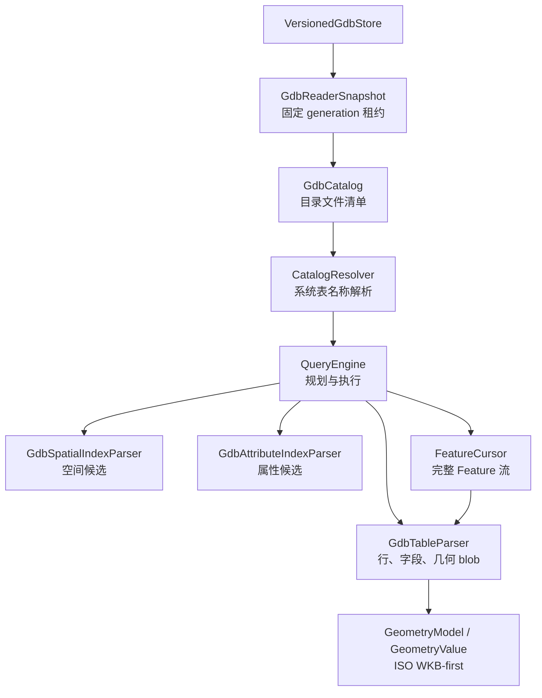
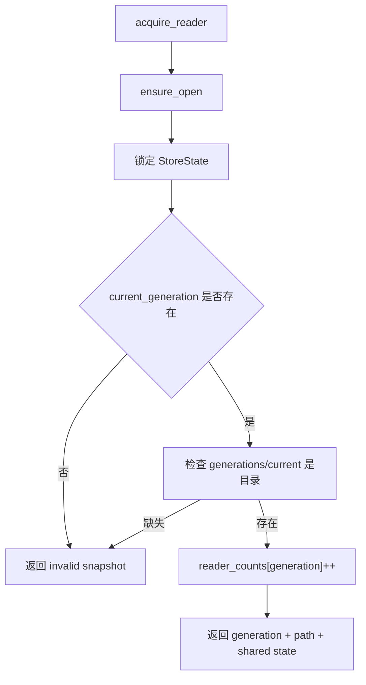
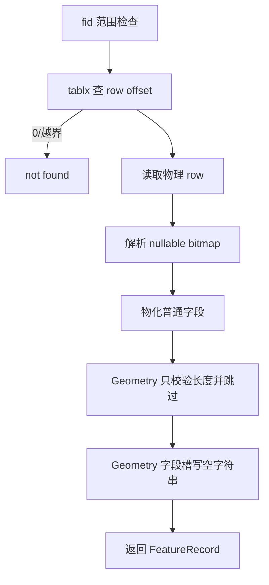
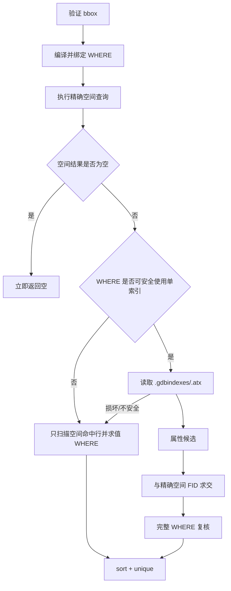
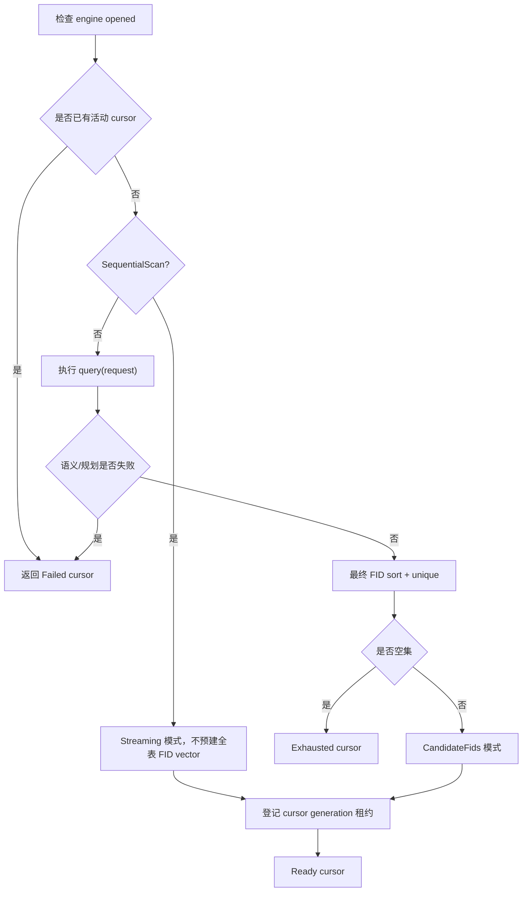
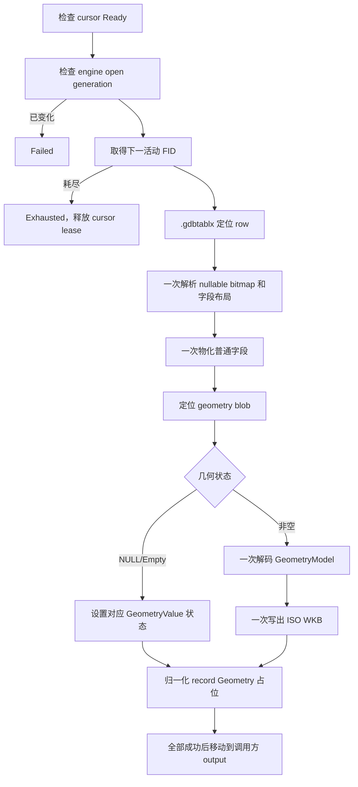
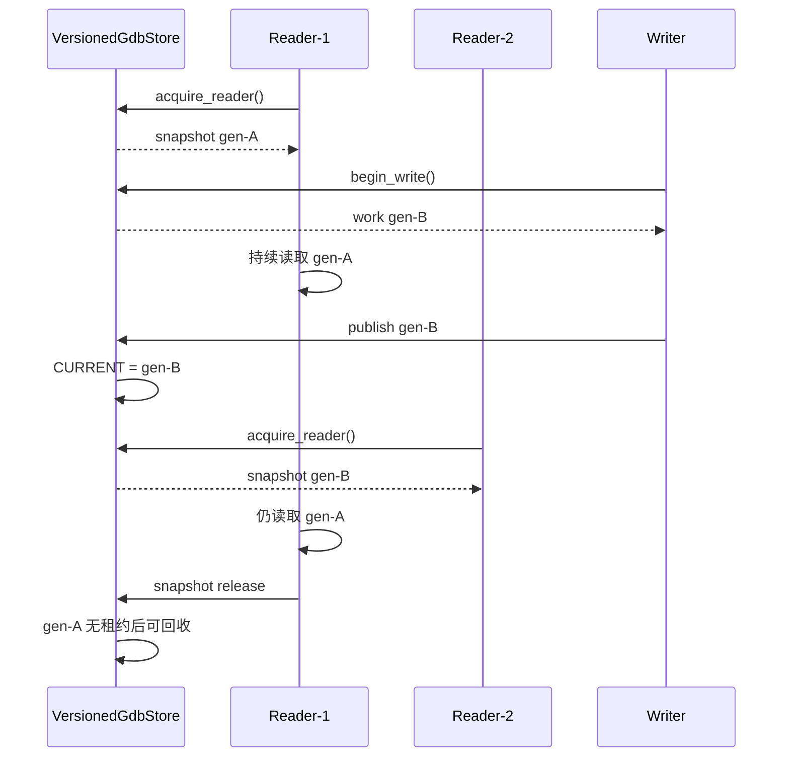

# Reader 读取流程专题

- **适用分支**：`agent/versioned-gdb-store`
- **适用 API**：`GdbReaderSnapshot`、`GdbCatalog`、`CatalogResolver`、`QueryEngine`、`FeatureCursor`、`GdbTableParser`、`GeometryValue`
- **目标读者**：需要接入 Reader、定位查询错误、分析性能或审核生命周期的开发人员
- **当前输出契约**：普通字段 + 独立 `GeometryValue`，正式几何输出为 ISO WKB-first

本文从一个业务读取请求进入系统开始，完整说明 Reader 如何选择稳定 generation、扫描 FileGDB 目录、解析系统表、定位业务图层、打开表与索引、执行 FID/空间/属性/WHERE 查询、流式输出完整 Feature，并最终释放 Reader generation 租约。

本文是 Reader 流程的权威专题。源码级的简化流程图仍可参考：

- `src/edgar/explorgdb/reader/QUERY_FLOW.md`
- `src/edgar/explorgdb/reader/query_engine.h`
- `src/edgar/explorgdb/reader/gdb_table.h`

---

## 1. Reader 解决的问题

Reader 的职责不是“打开一个可能被修改的目录并尽量读取”，而是：

1. 绑定一个稳定、不可变的 FileGDB generation；
2. 建立目录文件清单和系统表名称映射；
3. 将业务图层名解析为 `.gdbtable/.gdbtablx/.spx/.atx` 文件；
4. 根据查询类型选择顺序扫描、FID 定位、空间索引、属性索引或组合路径；
5. 对索引候选执行最终记录、WHERE 和精确几何复核；
6. 以 WKB-first 方式返回完整 Feature；
7. 在所有 QueryEngine、cursor、fd 和 mmap 关闭前保持 generation 租约。

核心不变量：

```text
一个 Reader 请求只能读取一个 generation。
Reader 存活期间，该 generation 的文件不会被 Writer 修改或删除。
```

在 VersionedGdbStore 模型下，Reader 不直接读取 store root，也不自行解析 `CURRENT`。它读取 `GdbReaderSnapshot::path()` 指向的具体 `.gdb` generation。

---

## 2. Reader 总体分层



各对象的责任如下：

| 对象 | 责任 | 不负责 |
|---|---|---|
| `GdbReaderSnapshot` | 固定 generation 路径并持有租约 | 解析 FileGDB 内容 |
| `GdbCatalog` | 枚举目录文件、读取 magic/timestamps、按 ID 查文件 | 解析业务图层名称 |
| `CatalogResolver` | 读取 `GDB_SystemCatalog`，名称映射到表 ID 和文件路径 | 执行查询 |
| `QueryEngine` | 打开表、规划查询、索引与回退、管理单活动 cursor | generation 生命周期 |
| `GdbTableParser` | `.gdbtable/.gdbtablx`、字段布局、FID、记录、几何 blob | 选择业务查询计划 |
| `.spx/.atx` parser | 生成候选 FID | 直接决定最终结果 |
| `FeatureCursor` | 流式返回完整字段和 `GeometryValue` | 自动切换 generation |

---

## 3. 最小完整读取示例

```cpp
#include <versioned_gdb_store.h>
#include <catalog_resolver.h>
#include <gdb_catalog.h>
#include <query_engine.h>

using explorgdb::CatalogResolver;
using explorgdb::FeatureCursor;
using explorgdb::GdbCatalog;
using explorgdb::QueryEngine;
using explorgdb::QueryFeature;
using explorgdb::QueryKind;
using explorgdb::QueryRequest;
using explorgdb::writer::GdbReaderSnapshot;
using explorgdb::writer::VersionedGdbStore;

bool read_cities() {
    VersionedGdbStore store("/data/cities-store");
    if (!store.open()) {
        log(store.last_error());
        return false;
    }

    GdbReaderSnapshot snapshot = store.acquire_reader();
    if (!snapshot.valid()) {
        log(store.last_error());
        return false;
    }

    GdbCatalog catalog;
    if (!catalog.scan(snapshot.path().string()) || !catalog.read_magic()) {
        log("catalog open failed");
        return false;
    }

    CatalogResolver resolver(catalog);
    if (!resolver.load()) {
        log("system catalog load failed");
        return false;
    }

    auto resolved = resolver.resolve("cities");
    if (!resolved) {
        log("layer not found");
        return false;
    }

    QueryEngine engine(catalog, *resolved);
    if (!engine.open()) {
        log("query engine open failed");
        return false;
    }

    QueryRequest request;
    request.kind = QueryKind::SpatialWhere;
    request.xmin = 103.8;
    request.ymin = 30.3;
    request.xmax = 104.4;
    request.ymax = 30.9;
    request.where_clause = "population >= 1000000";

    FeatureCursor cursor = engine.open_cursor(request);
    QueryFeature feature;
    while (cursor.next(feature)) {
        consume(feature.fid,
                feature.record.field_values,
                feature.geometry.wkb);
    }

    if (!cursor.done()) {
        log(cursor.error());
        return false;
    }

    // 销毁顺序：cursor -> engine -> resolver/catalog -> snapshot。
    return true;
}
```

必须注意：

- `snapshot` 必须比 `catalog`、`engine`、`cursor`、所有文件句柄和 mmap 活得更久；
- `QueryEngine` 引用 `GdbCatalog`，因此 catalog 必须比 engine 和 cursor 活得更久；
- 一个 `QueryEngine` 同时只允许一个活动 `FeatureCursor`；
- cursor 返回 `false` 后必须通过 `done()` 区分正常 EOF 与失败。

推荐使用嵌套作用域明确销毁顺序：

```cpp
GdbReaderSnapshot snapshot = store.acquire_reader();
{
    GdbCatalog catalog;
    // ...
    {
        QueryEngine engine(catalog, *resolved);
        // ...
        FeatureCursor cursor = engine.open_cursor(request);
        // ...
    } // cursor、engine 已关闭
} // catalog 已关闭
// 现在 snapshot 才可 refresh 或析构。
```

---

## 4. 阶段一：获取 generation 快照

### 4.1 调用入口

```cpp
GdbReaderSnapshot snapshot = store.acquire_reader();
```

内部过程：



快照包含：

- generation 名，例如 `gen-1753150000000-4.gdb`；
- 实际读取目录，例如 `/data/cities-store/generations/gen-...gdb`；
- 指向进程内共享 `StoreState` 的所有权；
- 该 generation 的 Reader 租约计数。

### 4.2 为什么不能直接读取 CURRENT

错误方式：

```cpp
std::ifstream current("/data/cities-store/CURRENT");
// 自行拼接路径并打开 QueryEngine
```

问题：

1. 没有增加 Reader 租约，旧 generation 可能被回收；
2. `CURRENT` 读取与路径打开之间存在切换窗口；
3. 绕过了 store root 规范化和恢复状态；
4. 无法保证 refresh 和旧版本清理的正确性。

因此，所有生产 Reader 必须经 `acquire_reader()`。

### 4.3 快照释放

`GdbReaderSnapshot` 析构时：

1. 在 store mutex 下减少该 generation 的 `reader_counts`；
2. 计数归零时删除计数项；
3. 调用旧 generation 清理；
4. 仅删除“不是 CURRENT、没有租约、且不存在 durability uncertain”的 generation；
5. 清理失败写入 store `last_error`，不会静默忽略。

---

## 5. 阶段二：目录扫描 GdbCatalog

### 5.1 scan()

```cpp
GdbCatalog catalog;
if (!catalog.scan(snapshot.path().string())) {
    // 目录不存在、不可枚举或没有合法 FileGDB 文件条目
}
```

`scan()` 的主要工作：

1. 遍历 generation `.gdb` 目录；
2. 匹配 `aXXXXXXXX.<ext>` 文件；
3. 从 `aXXXXXXXX` 提取 numeric table ID；
4. 保存文件名、扩展名和大小；
5. 建立后续 `.gdbtable/.gdbtablx/.spx/.gdbindexes/.atx` 查找基础；
6. 为本次扫描创建新的索引元数据缓存快照。

目录扫描后的典型映射：

```text
a00000001.gdbtable  -> table id 1
 a00000001.gdbtablx -> table id 1 的 FID 偏移索引
 a00000008.gdbtable -> 第一个用户表
 a00000008.spx      -> 用户表空间索引
 a00000008.Name.atx -> 用户表属性索引
```

### 5.2 magic

```cpp
if (!catalog.read_magic()) {
    // 不是可识别的 FileGDB 目录或头部损坏
}
```

`read_magic()` 读取目录中的 `gdb` 文件头。它用于确认目录级 FileGDB 标识，而不是替代表和记录级校验。

### 5.3 timestamps

```cpp
catalog.read_timestamps();
```

`timestamps` 当前主要保留原始数据。普通查询不是必须读取它；校验工具或格式研究可单独使用。

### 5.4 文件查找

常用接口：

```cpp
catalog.find_table(id);
catalog.find_tablx(id);
catalog.find_spx(id);
catalog.find_indexes(id);
catalog.find_atx(id, index_name);
catalog.find_all_atx(id);
```

这些接口只在本次 catalog 快照中查找文件，不重新扫描目录。

### 5.5 `.gdbindexes` 缓存

`read_index_metadata(id, entries)` 会解析并缓存某表的索引定义：

- 缓存绑定当前 `scan()` 快照；
- catalog 复制对象共享不可变快照缓存；
- 某一副本重新 `scan()` 后使用新的缓存状态；
- 缓存用于 WHERE/属性索引规划，不改变最终复核规则。

---

## 6. 阶段三：系统表解析 CatalogResolver

### 6.1 load()

```cpp
CatalogResolver resolver(catalog);
if (!resolver.load()) {
    // GDB_SystemCatalog 无法读取
}
```

Resolver 读取 `GDB_SystemCatalog`，构建大小写不敏感的名称索引。

其目标是将：

```text
"cities"
```

解析为：

```text
ResolvedTable {
    id,
    name,
    table_path,
    tablx_path,
    has_spatial_refs
}
```

### 6.2 resolve()

```cpp
auto resolved = resolver.resolve("Cities");
```

解析名称时大小写不敏感，但返回的是系统表中记录的规范名称和具体文件路径。

失败条件包括：

- Resolver 尚未成功 load；
- 系统目录没有该名称；
- 表 ID 对应的 `.gdbtable` 或 `.gdbtablx` 缺失；
- 系统目录本身损坏。

### 6.3 ResolvedTable 生命周期

`QueryEngine` 构造时复制 `ResolvedTable`，但引用外部 `GdbCatalog`：

```cpp
QueryEngine engine(catalog, *resolved);
```

因此：

- `resolved` 原变量可以在 engine 构造后销毁；
- `catalog` 不能在 engine 和 cursor 之前销毁。

---

## 7. 阶段四：QueryEngine::open()

`QueryEngine` 是单个业务表上的查询入口。

```cpp
QueryEngine engine(catalog, *resolved);
if (!engine.open()) {
    // 表、tablx、字段或能力初始化失败
}
```

打开过程概念上包括：

1. 使用 `ResolvedTable::table_path` 创建 `GdbTableParser`；
2. 打开 `.gdbtable`；
3. 加载 `.gdbtablx`；
4. 解析表头和字段描述符；
5. 确定几何字段、nullable bitmap 和字段布局；
6. 初始化能力报告；
7. 延迟初始化 `.spx`，避免不需要空间查询时提前解析；
8. 增加 engine open generation，使旧 cursor 在 reopen 后失效。

### 7.1 GdbTableParser 的数据入口

`.gdbtablx` 提供：

```text
FID -> .gdbtable 物理记录偏移
```

其中：

- `feature_count()` 是物理槽数量，也是 FID 排他上界；
- `active_feature_count()` 是非零偏移记录数量；
- `has_feature(fid)` 检查该槽是否为活动记录；
- 偏移为零表示删除槽或不存在记录。

### 7.2 mmap 与 fd 路径

Parser 根据平台和文件情况使用映射或文件读取路径：

- POSIX 可使用 mmap；
- Windows 使用 sliding map；
- 稀疏候选可将 FID 转换为物理偏移并合并相邻读取范围；
- 返回的 `FieldRef` 和 geometry blob 指针只在当前映射/回调有效期内有效。

调用方不能长期保存 `FieldRef` 指针，必须在回调内复制需要的数据。

---

## 8. QueryKind 与入口选择

```cpp
enum class QueryKind {
    ReadByFid,
    SequentialScan,
    SpatialBbox,
    AttributeDouble,
    AttributeString,
    WhereClause,
    SpatialWhere
};
```

| QueryKind | 主要输入 | 主要执行路径 | 最终语义 |
|---|---|---|---|
| `ReadByFid` | `fid` | `.gdbtablx` 定位 | 单条普通字段 |
| `SequentialScan` | 无 | 零拷贝顺序扫描 | 全部活动 FID |
| `SpatialBbox` | bbox | `.spx` 或几何扫描 + 精确判断 | 与 bbox 精确相交 |
| `AttributeDouble` | index/value/op | `.atx` | 属性比较候选并复核 |
| `AttributeString` | index/value/op | `.atx` | 字符串比较候选并复核 |
| `WhereClause` | WHERE | 编译表达式 + 扫描/安全索引 | 完整 WHERE 语义 |
| `SpatialWhere` | bbox + WHERE | 空间精确结果与属性条件组合 | 空间相交且 WHERE 命中 |

`query()` 返回 FID 集和诊断；`open_cursor()` 在同一查询计划基础上返回完整 Feature 流。

---

## 9. FID-only 查询流程

### 9.1 ReadByFid

```cpp
QueryRequest request;
request.kind = QueryKind::ReadByFid;
request.fid = 42;
QueryResult result = engine.query(request);
```

流程：



重要契约：

- `FeatureRecord::field_values` 与字段描述符顺序一致；
- Geometry 槽为 `std::string{}`，只是占位；
- 空字符串不表示 NULL、Empty 或无几何字段；
- 需要几何必须调用 `read_geometry_value()` 或使用 cursor。

### 9.2 SequentialScan

```cpp
QueryRequest request;
request.kind = QueryKind::SequentialScan;
QueryResult result = engine.query(request);
```

FID-only `query()` 会枚举活动 FID；直接底层扫描接口为：

```cpp
uint64_t count = engine.scan(
    [](uint32_t fid, const FieldRef* fields, int field_count) {
        // FieldRef 只在回调内有效
        return true; // false 可提前停止
    });
```

顺序扫描优势：

- 按物理记录顺序读取；
- 避免每条 FID 重新定位；
- 使用 `FieldRef` 零拷贝暴露字段；
- 适合全表过滤、校验、计数和批处理。

### 9.3 SpatialBbox

空间查询分两层：候选与精确判断。

```text
.spx / geometry scan 产生候选
        ↓
读取真实 geometry blob
        ↓
GeometryModel 精确 bbox predicate
        ↓
最终 FID
```

`.spx` 永远不是最终结果。它只允许漏斗式缩小候选，不允许跳过精确几何复核。

空间执行策略可能包括：

- `.spx` B+ 树导航；
- `.spx` 缺失或损坏时几何全扫；
- 高覆盖率时绕过索引；
- 稀疏候选物理范围合并；
- bbox 快速拒绝；
- 线段/Polygon/曲线线性模型精确相交。

诊断字段见 `SpatialQueryMetrics`：

- `candidate_count`；
- `bbox_rejected`；
- `exact_tested`；
- `invalid_geometries`；
- `spx_bypassed`；
- `geometry_only_scan`；
- 候选、blob、bbox、exact 和 total 时间。

### 9.4 AttributeDouble / AttributeString

属性索引路径：

```text
index_name
  -> .gdbindexes 元数据
  -> 定位 .atx
  -> B+ 树导航/叶链扫描
  -> 候选 FID
  -> sort + unique
  -> 记录级条件复核
```

`AttrOp` 表示比较操作。索引解析必须验证：

- 文件大小；
- page 边界；
- page capacity；
- 叶链无环；
- entry count；
- FID 非零/合法；
- key 编码适合当前比较。

损坏索引不能产生部分成功结果，应回退或失败关闭。

### 9.5 WhereClause

WHERE 支持既定子集：

- 比较；
- `AND`；
- `OR`；
- `IN`；
- 括号；
- 大小写不敏感字段名；
- SQL 字符串中的 `''` 转义。

流程：

```text
文本 tokenize
 -> parse AST
 -> 绑定字段描述符
 -> 判断是否存在安全索引计划
 -> 扫描或索引候选
 -> 对候选执行完整表达式求值
```

任何索引快速路径都必须做完整 WHERE 复核。

### 9.6 SpatialWhere

最终不变量：

```text
结果 = 精确空间命中 FID ∩ 完整 WHERE 命中 FID
```

典型流程：



优化路径可能采用融合扫描：同一候选物理行一次解析，同时完成精确几何与 WHERE 求值，避免重复读取。

`CombinedQueryMetrics` 记录：

- 空间候选和精确命中；
- 属性候选和复核数量；
- 最终命中；
- `.atx` page 数、访问页和扫描 entry；
- metadata/file-load/navigation/scan/order/recheck 时间；
- 是否使用空间/属性索引；
- 是否绕过属性索引；
- 是否使用融合扫描。

---

## 10. open_cursor() 规划流程

`open_cursor()` 将 FID 查询计划转换为完整 Feature 流。

```cpp
FeatureCursor cursor = engine.open_cursor(request);
```

流程：



两种 cursor 模式：

### 10.1 Sequential streaming

- 不预先创建全部 FID vector；
- 顺序检查 live slot；
- 逐条调用 one-pass 完整 Feature 读取；
- 内存占用不随全表 FID 数线性增加。

### 10.2 CandidateFids

- 保存已经完成语义过滤的最终 FID vector；
- FID 按升序、去重；
- `next()` 按 vector 定位完整 Feature；
- 适合空间、属性和 WHERE 选择性查询。

---

## 11. FeatureCursor::next() 完整对象流程

```cpp
QueryFeature feature;
while (cursor.next(feature)) {
    // 完整字段 + GeometryValue
}
```

one-pass 流程：



### 11.1 原子输出语义

`next(output)` 先在内部临时对象中完成所有读取和转换，只有全部成功后才覆盖 `output`。

因此失败时调用方不会收到：

- 新 FID + 旧字段；
- 新字段 + 半截 WKB；
- 已更新 record 但 geometry 失败的混合对象。

### 11.2 GeometryValue

`GeometryValue` 独立承载：

- ISO WKB；
- Z/M 维度；
- backend；
- status；
- 是否来自曲线；
- 是否已线性化；
- diagnostic。

调用方不得从 `record.field_values` 的 Geometry 槽判断几何状态。

### 11.3 WKT 按需生成

```cpp
auto wkt = feature.geometry.to_wkt();
```

该调用：

- 只解析已经得到的 ISO WKB；
- 不重新读取 `.gdbtable`；
- 不调用 GDAL；
- 不缓存结果；
- 非法 WKB 返回 `std::nullopt`；
- 合法 EMPTY WKB 返回 `... EMPTY`；
- 无 WKB 的 NULL geometry 返回 `std::nullopt`。

---

## 12. FeatureCursor 状态机

```text
Created
  -> Ready
      -> next success -> Ready
      -> no more data -> Exhausted
      -> read/generation failure -> Failed
  -> moved -> MovedFrom
```

| 状态 | `next()` | `move_to()` | `done()` | `error()` |
|---|---|---|---:|---|
| Ready | 读取下一条 | 可重定位 | false | 空 |
| Exhausted | false | 可重新定位/reacquire | true | 空 |
| Failed | false | false | false | 首次错误 |
| MovedFrom | false | false | true | 空 |

### 12.1 正确 EOF 判断

```cpp
if (!cursor.next(feature)) {
    if (cursor.done()) {
        // 正常结束
    } else {
        // 读取失败
        log(cursor.error());
    }
}
```

不要把一次 `false` 自动解释为 EOF。

### 12.2 move-only

`FeatureCursor` 不可复制，只可移动。移动后：

- 新对象拥有 cursor 租约；
- 旧对象进入安全 MovedFrom 状态；
- 迟到析构不会错误释放新对象的 cursor generation。

---

## 13. move_to(fid) 流程

语义：下一次成功 `next()` 返回当前查询结果中第一条 `FID >= target` 的 Feature。

```cpp
cursor.move_to(500);
```

规则：

- `move_to(0)` 等价 rewind；
- 可向前、向后或任意跳转；
- 删除槽会被跳过；
- 不满足过滤条件的 FID 会被跳过；
- target 后无结果是正常 Exhausted；
- Exhausted cursor 可以通过 move_to 重新定位；
- engine reopen 后旧 cursor 失败，不允许复用旧计划。

候选模式通常使用有序 FID vector 的 lower_bound；顺序模式重新设置扫描位置并继续检查 live slot。

---

## 14. QueryEngine 单活动 cursor 约束

`QueryEngine` 内部维护：

- `open_generation`；
- `next_cursor_generation`；
- `active_cursor_generation`。

一个 engine 上活动 cursor 存在期间，以下入口应被拒绝：

- 再次 `open_cursor()`；
- `open()`/reopen；
- `query()`；
- `read_by_fid()`；
- `scan()`；
- 直接空间查询入口。

原因：这些操作可能改变 parser、索引状态、映射或查询计划，使活动 cursor 的指针和状态失效。

若业务需要并发读取，应创建多个独立 `QueryEngine`，它们可以共享同一个 `GdbReaderSnapshot` 和 generation 路径，但每个 engine 管理自己的 parser/cursor 状态。

```text
一个 snapshot
  ├─ QueryEngine A -> cursor A
  ├─ QueryEngine B -> cursor B
  └─ QueryEngine C -> FID-only query
```

同一个 `QueryEngine` 不声明线程安全。

---

## 15. 多 Reader 与 Writer 发布协作



Reader 不需要暂停或重新打开来配合发布。

### 15.1 refresh()

只有空闲 Reader 才能 refresh：

```cpp
// 必须先销毁 cursor、engine、parser、fd 和 mmap。
if (!snapshot.refresh()) {
    log(store.last_error());
}
```

内部动作：

1. 在 store mutex 下读取进程内 `current_generation`；
2. 若未变化，直接成功；
3. 验证新 generation 目录存在；
4. 新 generation 租约 `++`；
5. 旧 generation 租约 `--`；
6. 更新 snapshot 的 generation 和 path；
7. 尝试回收旧 generation。

为什么必须先关闭派生对象：refresh 只更新 snapshot 记录，无法替调用方关闭已经从旧 path 打开的 QueryEngine、文件描述符和 mmap。

---

## 16. 错误处理与诊断

### 16.1 分层判断

| 层 | 典型失败 | 读取位置 |
|---|---|---|
| Store | 无 CURRENT、generation 缺失 | `store.last_error()` |
| Snapshot | refresh 失败 | `store.last_error()` |
| Catalog | scan/magic 失败 | bool + 日志上下文 |
| Resolver | 系统目录或图层缺失 | bool/optional |
| Engine | open/查询规划失败 | `QueryResult::fallback_reason`、execution path |
| Cursor | 读取或 generation 失效 | `cursor.error()` |
| Geometry | 非法或不支持 | `GeometryValue::status/diagnostic` |

### 16.2 QueryResult 诊断

```cpp
QueryResult result = engine.query(request);
log(result.execution_path);
log(result.fallback_reason);
```

`execution_path` 用于说明实际选择的 planner 路径，例如索引、扫描、融合或回退。不要仅根据请求类型推断实际路径。

### 16.3 fail closed

下列情况不得返回部分候选作为最终结果：

- `.spx` 页面损坏；
- `.atx` 页链循环；
- 记录长度越界；
- nullable bitmap 不合法；
- geometry blob 截断；
- WHERE 编译或字段绑定失败；
- FID 映射不一致。

允许的行为是明确失败，或切换到仍能保证最终语义的规范扫描回退。

---

## 17. 性能路径与度量

### 17.1 默认关闭 Feature 计时

```cpp
request.profile_feature_reads = false;
```

默认关闭是为了避免 `steady_clock` 进入热路径。

启用后 `FeatureCursorMetrics` 累计：

- `row_lookup_ms`；
- `field_materialization_ms`；
- `geometry_decode_ms`；
- `wkb_write_ms`；
- `feature_count`。

### 17.2 选择正确入口

| 需求 | 推荐入口 |
|---|---|
| 单条普通字段 | `read_by_fid()` |
| 单条完整字段和几何 | cursor 或 `read_feature_by_fid()` |
| 全表统计/校验 | `scan()` / Sequential cursor |
| 只需要 FID | `query()` |
| 需要完整 Feature | `open_cursor()` |
| 大量空间候选 | `SpatialBbox`/`SpatialWhere` |
| 只需几何 blob 检查 | geometry scan API |

避免为了得到 FID 而物化所有字段和 WKB，也避免为了完整 Feature 先 `query()` 后逐条重复 `read_record + read_geometry`。

### 17.3 one-pass 的价值

`read_feature_by_fid()`：

- row 只定位一次；
- nullable bitmap 只解析一次；
-普通字段只物化一次；
- geometry blob 只定位一次；
- `GeometryModel` 只解码一次；
- ISO WKB 只写一次。

这比“先 record、再 geometry、再 WKT”的多次访问路径更稳定。

---

## 18. 常见错误用法

### 错误 1：snapshot 先析构

```cpp
QueryEngine make_engine() {
    auto snapshot = store.acquire_reader();
    GdbCatalog catalog;
    // 返回 engine，但 snapshot/catalog 已析构
}
```

后果：engine 引用失效，generation 租约提前释放。

### 错误 2：保存 FieldRef

```cpp
const FieldRef* saved = fields; // 错误
```

`FieldRef` 只在当前回调和映射窗口内有效。

### 错误 3：把 Geometry 占位当成 NULL

```cpp
if (record.field_values[geometry_index] == std::string{}) {
    // 无法判断 NULL/Empty/无字段
}
```

应读取 `GeometryValue`。

### 错误 4：索引候选直接返回

`.spx/.atx` 候选必须接受最终精确几何或 WHERE 复核。

### 错误 5：活动 cursor 期间复用 engine

应为并发操作创建另一个 `QueryEngine`。

### 错误 6：refresh 后继续使用旧 engine

refresh 前必须销毁所有从旧 snapshot path 派生的对象，refresh 后重新建 catalog/resolver/engine。

---

## 19. 推荐的 Reader 封装结构

```cpp
class ManagedLayerReader {
public:
    bool open(VersionedGdbStore& store, const std::string& layer) {
        snapshot_ = store.acquire_reader();
        if (!snapshot_.valid()) return false;

        if (!catalog_.scan(snapshot_.path().string()) ||
            !catalog_.read_magic()) {
            return false;
        }

        resolver_ = std::make_unique<CatalogResolver>(catalog_);
        if (!resolver_->load()) return false;

        auto resolved = resolver_->resolve(layer);
        if (!resolved) return false;

        engine_ = std::make_unique<QueryEngine>(catalog_, *resolved);
        return engine_->open();
    }

    void close() {
        engine_.reset();
        resolver_.reset();
        // catalog_ 随对象保留但不再有打开 parser。
        snapshot_ = GdbReaderSnapshot{};
    }

private:
    GdbReaderSnapshot snapshot_;
    GdbCatalog catalog_;
    std::unique_ptr<CatalogResolver> resolver_;
    std::unique_ptr<QueryEngine> engine_;
};
```

封装时成员声明顺序和显式 close 顺序都应体现：engine 先于 snapshot 销毁。

---

## 20. Reader 测试矩阵

### 20.1 generation 生命周期

- acquire 后 generation/path 稳定；
- Writer 发布期间旧 Reader 持续读取；
- 新 Reader 获取新 generation；
- refresh 只在关闭派生资源后执行；
- 最后一个旧快照释放后旧 generation 可回收。

### 20.2 Catalog/Resolver

- magic 正常和损坏；
- 系统表缺失；
- 名称大小写；
- `.gdbtable/.gdbtablx` 配对缺失；
- index metadata 缓存快照。

### 20.3 记录与字段

- 所有字段类型；
- NULL bitmap；
- zero-length 合法 row；
- deleted slot；
- ObjectID-only；
- Binary/XML/GUID/GlobalID/Int64/DateTimeWithOffset；
- Geometry 占位契约。

### 20.4 几何

- Point/MultiPoint/Polyline/Polygon；
- Z/M/ZM；
- NULL/Empty；
- Polygon 洞和多面；
- 曲线线性化；
- 非法 blob fail closed；
- WKB 与 GDAL/真实数据对照。

### 20.5 查询

- 每个 QueryKind；
- `.spx` 有效/缺失/损坏；
- `.atx` 有效/缺失/损坏；
- WHERE 解析与转义；
- SpatialWhere 索引、绕过、融合和回退；
- 最终 FID 排序与去重。

### 20.6 Cursor

- 单活动 cursor；
- move-only；
- EOF/Failed 区分；
- `move_to()` 前进/后退/rewind；
- engine reopen 失效；
- one-pass output 原子性；
- 100K/10M 内存和性能。

---

## 21. 故障排查顺序

读取失败时按以下顺序定位：

1. `snapshot.valid()` 与 `snapshot.path()`；
2. generation 目录是否存在；
3. `catalog.scan()`；
4. `catalog.read_magic()`；
5. `resolver.load()`；
6. `resolver.resolve(layer)`；
7. `engine.open()`；
8. `QueryResult::execution_path/fallback_reason`；
9. `cursor.done()/error()`；
10. `GeometryValue::status/diagnostic`；
11. `.spx/.atx` 是否只是触发了合法回退；
12. 是否违反对象生命周期或单活动 cursor 约束。

不要一开始就把错误归因于索引或 geometry。目录快照、系统表解析和 tablx 定位是更前置的依赖。

---

## 22. Reader 能力边界

### 已提供

- 不可变 generation 快照读取；
- 多个独立 QueryEngine 并发；
- FID、顺序、空间、属性、WHERE 和 SpatialWhere；
- WKB-first 完整 FeatureCursor；
- 精确空间复核；
- `.spx/.atx` 候选优化与损坏回退；
- 显式 refresh；
- 记录、查询、cursor 和 geometry 诊断。

### 不提供

- 同一 QueryEngine 多线程并发；
- 同一 engine 多活动 cursor；
- 自动跨 generation 切换；
- 完整 SQL、JOIN、GROUP BY 或聚合；
- Raster 像素读取；
- Annotation/Dimension 专用语义；
- 完整 MultiPatch 表面拓扑；
- 在绕过 `GdbReaderSnapshot` 时保证 generation 生命周期；
- 对正在外部修改的普通 GDB 目录提供一致性快照。

---

## 23. 主要源码索引

| 流程 | 文件 |
|---|---|
| generation 租约 | `versioned_gdb_reader_snapshot.cpp` |
| 目录扫描 | `gdb_catalog.h/.cpp` |
| 系统表名称解析 | `catalog_resolver.h/.cpp` |
| 查询公共接口 | `query_engine.h/.cpp` |
| 空间 planner | `query_engine_geometry.cpp` |
| SpatialWhere | `query_engine_combined.cpp` |
| WHERE | `query_where_internal.h/.cpp` |
| Cursor | `feature_cursor.cpp` |
| 表和 tablx | `gdb_table*.cpp`、`gdb_tablx.*` |
| one-pass Feature | `gdb_table_feature.cpp` |
| record-only | `gdb_table_record.cpp` |
| 空间索引 | `gdb_spatial_index.*` |
| 属性索引 | `gdb_attribute_index.*`、`gdb_indexes.*` |
| 几何模型 | `gdb_geometry_model.*` |
| ISO WKB | `wkb_writer.cpp` |
| 按需 WKT | `wkb_reader.cpp` |

---

## 24. 最终接入原则

生产 Reader 必须同时满足：

```text
通过 VersionedGdbStore 获取 snapshot
+ 从 snapshot.path() 建立全部 Reader 对象
+ snapshot 覆盖所有 fd/mmap/cursor 生命周期
+ 每个 QueryEngine 只有一个活动 cursor
+ 索引候选始终最终复核
+ 完整 Feature 使用 WKB-first GeometryValue
+ refresh 前关闭旧 generation 的全部派生资源
```

只要其中任何一项被绕过，就不能再声明具备 VersionedGdbStore 的连续可见性和不可变 generation 保证。
