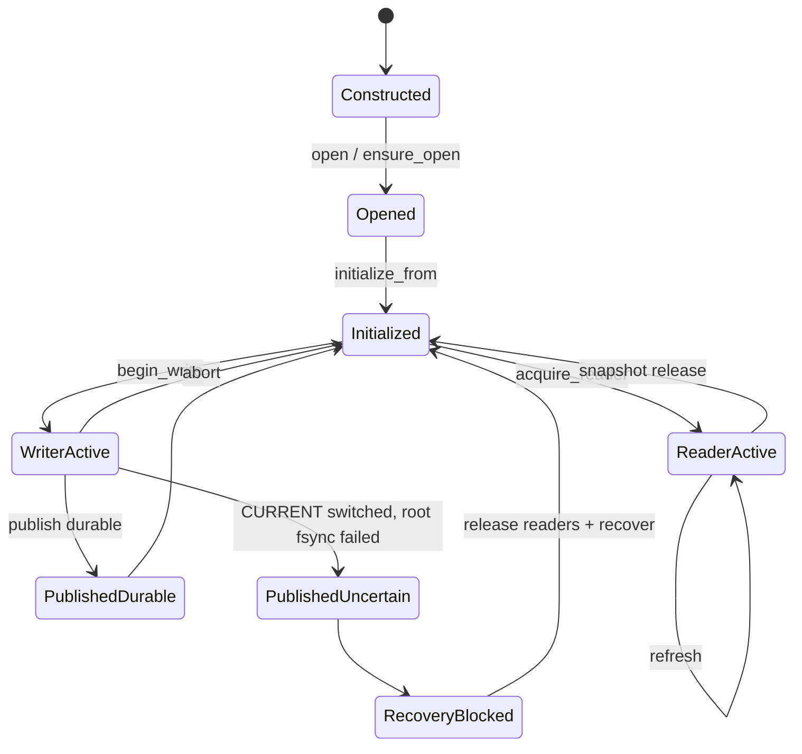
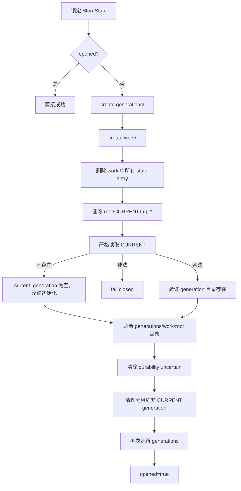
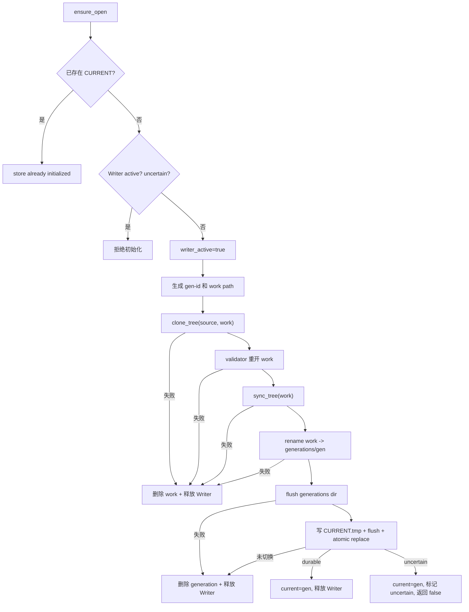
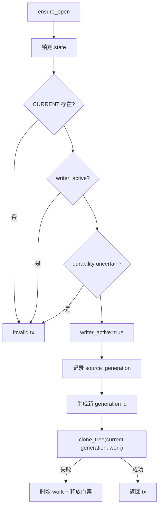
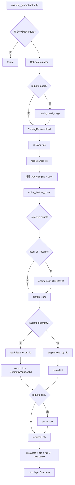
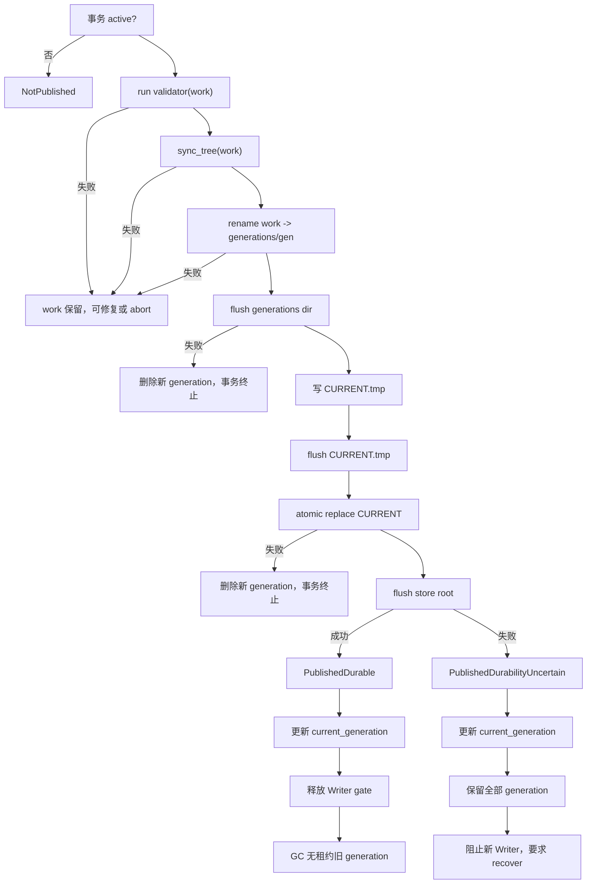
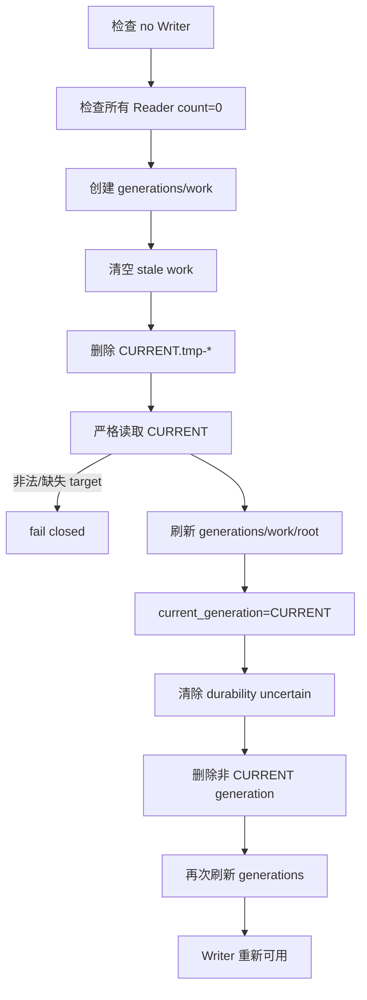

# Writer 写入与版本发布流程专题

- **适用分支**：`agent/versioned-gdb-store`
- **唯一公共 Writer API**：`VersionedGdbStore`、`GdbWriteTransaction`、`GenerationValidator`
- **目标读者**：需要接入写入、发布、恢复、容量规划或审核崩溃一致性的开发人员
- **架构决策**：`docs/adr/ADR-007-versioned-gdb-store.md`

本文详细说明 fast-gdb 当前唯一 Writer 模型：调用方不再直接替换一个固定 source GDB 目录，而是在 VersionedGdbStore 中创建私有 working generation，完成编辑后由 validator 使用新的 Reader 对象重开校验，再将候选提升为不可变 generation，并通过原子替换 `CURRENT` 清单发布。

本文重点解释“版本管理和发布协议”。公共 API 不提供字段级 Append/Update/Delete DSL。调用方可使用 GDAL、内部编辑模块或业务自有工具修改 `GdbWriteTransaction::working_path()`，但所有发布必须回到 VersionedGdbStore。

---

## 1. Writer 解决的问题

旧目录替换模型：

```text
source.gdb
  -> rename source to backup
  -> rename staging to source
  -> remove backup
```

存在两个根本问题：

1. 两次目录重命名之间，新 Reader 可能观察不到 `source.gdb`；
2. Reader 可能仍 mmap 旧 source 中的文件，Writer 无法安全修改或替换这些文件。

VersionedGdbStore 将问题改写为：

```text
Reader 永远读取一个不可变 generation。
Writer 永远修改一个私有 working GDB。
发布只切换一个很小的 CURRENT manifest。
```

核心效果：

- 旧 Reader 持续读取旧 generation；
- Writer 不触碰旧 Reader 正在 mmap 的文件；
- 发布后新 Reader 获取新版；
- 旧 generation 在租约归零后回收；
- 任何切换前失败都不影响当前版本；
- 切换后的持久性不确定状态有明确恢复协议。

---

## 2. 仓库物理布局

```text
<store-root>/
├── CURRENT
├── generations/
│   ├── gen-<timestamp>-<sequence>.gdb/
│   └── gen-<timestamp>-<sequence>.gdb/
└── work/
    └── work-gen-<timestamp>-<sequence>.gdb/
```

### 2.1 CURRENT

`CURRENT` 是严格单行 UTF-8 文本：

```text
gen-1753150000000-4.gdb\n
```

限制：

- 文件大小必须大于 0 且不超过 512 字节；
- 必须以换行结束；
- 只能有一行；
- generation 名必须以 `gen-` 开头并以 `.gdb` 结束；
- 不允许路径分隔符或路径穿越；
- 指向的目录必须真实存在于 `generations/`。

清单非法时 fail closed，不扫描目录猜测“最新” generation。

### 2.2 generations

`generations/` 只存放已经发布或已经完成提升步骤的完整 FileGDB。

不变量：

```text
一旦进入 generations/，文件不得再被 Writer 原地修改。
```

允许的操作仅有：

- Reader 打开；
- `CURRENT` 指向；
- 无租约且非 CURRENT 时由 GC 删除。

### 2.3 work

`work/` 存放未发布私有副本：

- begin_write 创建；
- 调用方在其中编辑；
- publish 时重命名到 generations；
- abort 或未提交析构时删除；
- open/recover 清理崩溃残留。

work 内容不对 Reader 可见。

---

## 3. 公共对象与责任

| 对象 | 责任 | 生命周期终点 |
|---|---|---|
| `VersionedGdbStore` | 规范化 root、共享状态、初始化、Reader/Writer 入口、recover | 调用方控制 |
| `GdbReaderSnapshot` | 固定 generation 并持有 Reader 租约 | 析构或 move assignment |
| `GdbWriteTransaction` | 独占 Writer 门禁、持有 working、publish/abort | publish、abort 或析构 |
| `GenerationValidator` | 使用新对象重开候选并返回明确成功/失败 | 每次 initialize/publish 调用 |

### 3.1 StoreState

同一进程中，相同 canonical store root 的所有 `VersionedGdbStore` 实例共享一个内部状态：

- root、`CURRENT`、`generations`、`work` 路径；
- mutex；
- `opened`；
- `writer_active`；
- `current_generation`；
- `current_durability_uncertain`；
- generation -> Reader count；
- `last_error`。

这保证两个不同 C++ store 对象不能各自启动一个 Writer。

---

## 4. Store root 规范化与单 Writer 门禁

构造：

```cpp
VersionedGdbStore store("/data/../data/cities-store");
```

内部会：

1. 优先 `weakly_canonical(root)`；
2. 失败时使用 absolute + lexical normalization；
3. 使用规范路径作为进程级 registry key；
4. Windows 对 key 做 ASCII 大小写折叠；
5. 符号链接别名尽量合并到同一真实 root；
6. registry 保存 `weak_ptr<StoreState>`，最后一个实例释放后状态可回收。

目的：防止下列路径绕过 Writer 门禁：

```text
/data/store
/data/link-to-store
/data/../data/store
C:\Data\Store
c:\data\store
```

该门禁只在同一进程有效。它不是跨进程文件锁。

---

## 5. 总体生命周期



业务通常执行：

```text
open
 -> 首次 initialize_from
 -> 多次 acquire_reader
 -> begin_write
 -> 修改 working_path
 -> 关闭编辑器句柄
 -> publish
 -> 新 Reader 获取新 generation
```

---

## 6. 最小完整 Writer 示例

```cpp
#include <versioned_gdb_store.h>
#include <versioned_gdb_validator.h>

using namespace explorgdb::writer;

bool publish_cities() {
    QueryEngineGenerationValidationOptions options;

    GdbLayerValidationRule cities;
    cities.layer_name = "cities";
    cities.expected_active_records = 1001;
    cities.scan_all_records = true;
    cities.sample_fids = {0, 500, 1000};
    cities.validate_sample_geometry = true;
    cities.require_spatial_index = true;
    cities.required_attribute_indexes = {"name_idx"};
    options.layers.push_back(std::move(cities));

    GenerationValidator validator =
        make_query_engine_generation_validator(std::move(options));

    VersionedGdbStore store("/data/cities-store");
    if (!store.open()) {
        log(store.last_error());
        return false;
    }

    if (store.current_generation().empty()) {
        if (!store.initialize_from("/imports/cities.gdb", validator)) {
            log(store.last_error());
            return false;
        }
    }

    GdbWriteTransaction tx = store.begin_write();
    if (!tx.valid()) {
        log(store.last_error());
        return false;
    }

    {
        // 使用 GDAL 或业务编辑器，只打开 tx.working_path()。
        BusinessEditor editor(tx.working_path());
        if (!editor.open() || !editor.apply_changes() || !editor.close()) {
            tx.abort();
            return false;
        }
    } // 所有 fd、dataset、layer、mmap 已关闭

    if (!tx.publish(validator)) {
        if (tx.published()) {
            // CURRENT 已切换；禁止 abort 或 publish 重试。
            log(tx.last_error());
            stop_new_writers();
            close_all_reader_snapshots();
            if (!store.recover()) {
                log(store.last_error());
            }
        } else {
            log(tx.last_error());
            tx.abort();
        }
        return false;
    }

    return true;
}
```

---

## 7. open() 详细流程

```cpp
if (!store.open()) {
    log(store.last_error());
}
```

`open()` 并不只是创建目录。它执行一次恢复和一致性检查。



### 7.1 open 的破坏性动作

open 会删除：

- `work/` 中所有残留条目；
- `CURRENT.tmp-*`；
- 无租约、非 CURRENT 的 generation。

因此：

- 同一 store 不能在另一个进程中同时使用该协议；
- 跨进程 Reader 租约不存在时，另一个进程持有旧 generation 会被误判为可删除；
- 上层必须保证同一 repository 只有一个管理进程。

### 7.2 未初始化 store

若 `CURRENT` 不存在：

- open 可以成功；
- `current_generation()` 返回空；
- `acquire_reader()` 和 `begin_write()` 会失败；
- 只能调用 `initialize_from()`。

---

## 8. initialize_from() 首次初始化

```cpp
store.initialize_from(source_gdb, validator);
```

用途：将一个已经存在、完整、可读取的 FileGDB 导入空 store。

流程：



### 8.1 source 不被修改

`initialize_from()` 只读取 source，然后 clone/copy 到 work。输入目录不会被重命名或删除。

### 8.2 初始化也必须 validator

即使 source 由可信系统生成，也必须通过 validator。初始化后的第一个 generation 和后续发布 generation 应遵守同一可重开契约。

### 8.3 初始化返回 false 但已切换

当前公共 `initialize_from()` 只返回 bool，没有事务对象供调用方检查 publish state。若最终 root 目录持久化失败：

- 进程内 `current_generation` 已更新；
- store 进入 `current_durability_uncertain`；
- `last_error()` 明确要求 recover；
- 下一次 Writer 被禁止。

调用方应在初始化 false 后检查 `current_generation()` 和错误文本，并按不确定状态处理。

---

## 9. begin_write() 详细流程

```cpp
GdbWriteTransaction tx = store.begin_write();
```

前置条件：

- store 已 open；
- CURRENT 存在；
- 没有其他 Writer；
- 不处于 durability uncertain。

流程：



事务记录：

- `source_generation()`：事务开始时的 CURRENT；
- `generation()`：未来候选 generation 名；
- `working_path()`：唯一允许编辑的目录；
- `clone_strategy()`；
- `publish_state()`；
- `last_error()`。

---

## 10. working GDB 创建策略

### 10.1 macOS

每个普通文件优先：

```cpp
clonefile(source, destination, 0)
```

适用于支持 clonefile 的本地文件系统，例如 APFS。成功时数据块按 CoW 共享，只有后续修改的块产生额外空间。

### 10.2 Linux

每个普通文件优先：

```cpp
ioctl(destination_fd, FICLONE, source_fd)
```

是否成功取决于文件系统、挂载和内核支持。

### 10.3 Windows 和回退

Windows 当前直接使用完整复制。macOS/Linux 某文件原生 clone 失败时也回退：

```cpp
std::filesystem::copy_file(..., copy_options::none)
```

### 10.4 事务级 strategy

- 所有文件均成功原生 clone：`CopyOnWrite`；
- 任一文件走完整复制：`FullCopy`。

这只是观测信息。业务逻辑不得因为 `CopyOnWrite` 而假设空间一定充足。

### 10.5 权限修正

复制后 working 文件权限为：

```text
source permissions | owner_read | owner_write
```

即使已发布 generation 文件被设置为只读，working 副本仍允许当前 owner 编辑。

### 10.6 安全检查

clone_tree 拒绝：

- source 不是可读取目录；
- destination 与 source 相同；
- destination 位于 source 内部；
- symlink；
- socket、device、FIFO 等特殊文件；
- relative path 包含 `..`；
- 条目逃逸 source root。

目的：确保 generation 是一个自包含、不可变的目录树。

---

## 11. 修改 working_path() 的契约

公共 API 不关心调用方使用何种编辑器，但必须满足：

```text
编辑器只打开 tx.working_path()
编辑器不打开 generations/ 中的 source generation 进行写操作
发布前关闭全部编辑器对象、文件句柄、dataset、layer 和 mmap
```

允许的业务实现：

- GDAL OpenFileGDB 更新 working；
- 内部二进制 Writer；
- 外部进程生成完整 working 内容，但必须在 publish 前退出并关闭句柄；
- 全量重建工作目录中的 FileGDB；
- 在 working 中更新索引。

不允许：

- 修改 `tx.source_generation()` 对应目录；
- 修改 CURRENT；
- 将 working 替换为 symlink；
- 在 publish 期间继续写文件；
- publish 后继续持有 writable handle。

### 11.1 为什么 publish 前必须关闭句柄

validator 必须看到最终稳定字节；`sync_tree()` 必须能刷新所有文件；Windows rename/flush 也可能受共享模式影响。

若编辑器仍有缓存未 flush：

- validator 可能读取旧数据；
- 文件 fsync 不能替代应用层缓冲提交；
- 提升后 generation 可能仍被继续修改，破坏不可变性。

---

## 12. validator 配置

```cpp
struct GdbLayerValidationRule {
    std::string layer_name;
    std::optional<uint64_t> expected_active_records;
    bool scan_all_records = true;
    std::vector<uint32_t> sample_fids;
    bool validate_sample_geometry = true;
    bool require_spatial_index = false;
    std::vector<std::string> required_attribute_indexes;
};
```

### 12.1 layer_name

必须非空，并且能从 `GDB_SystemCatalog` 解析。

### 12.2 expected_active_records

调用方知道精确预期数量时必须填写。

适用：

- 全量生成；
- 已知 append/delete 数量；
- 可从业务事务计算最终计数。

不知道时可 `std::nullopt`，但会降低内容等价保证。

### 12.3 scan_all_records

启用后：

```text
sequential scan count == active_feature_count
```

它能发现部分 tablx/记录布局不一致，但不逐字段比较业务值。

### 12.4 sample_fids

建议至少覆盖：

- 最小 FID；
- 中间 FID；
- 最大 FID；
- 本次修改的 FID；
- 几何或属性边界记录；
- 稀疏 FID 场景中的活动记录。

### 12.5 validate_sample_geometry

- `true`：走 `read_feature_by_fid()`，校验字段、FID 和 GeometryValue；
- `false`：只用 `read_by_fid()` 校验记录与 FID，不解码几何。

### 12.6 require_spatial_index

要求：

- `.spx` 文件存在；
- 文件非空；
- `GdbSpatialIndexParser::parse()` 完整成功。

### 12.7 required_attribute_indexes

每个名称要求：

- 名称非空；
- 存在于 `.gdbindexes` 元数据；
- `.atx` 文件存在且非空；
- `GdbAttributeIndexParser::parse()` 完整成功。

---

## 13. validator 真实执行流程



关键性质：

- validator 创建新的 catalog/resolver/engine；
- 不复用 Writer 对象、路径缓存、fd 或 mmap；
- 验证的是关闭后可以重新打开的磁盘状态；
- validator 抛异常会转换为失败结果；
- 空 validator 直接失败，发布不允许跳过校验。

### 13.1 validator 不是业务全等价证明

默认 validator 不会自动比较每个字段的期望值。业务若要求全量等价，应：

- 自定义 `GenerationValidator`；
- 对关键图层做 checksum；
- 对修改 FID 做逐字段期望比较；
- 做空间/属性查询 smoke；
- 检查 schema、SRS、domain 和 extent；
- 必要时通过 GDAL/ArcGIS Pro 交叉验证。

---

## 14. publish() 总流程

```cpp
bool ok = tx.publish(validator);
```

固定顺序：



---

## 15. sync_tree() 持久化步骤

`sync_tree(work)`：

1. 递归枚举 candidate；
2. 再次拒绝 symlink 和特殊文件；
3. 对每个普通文件执行 flush；
4. POSIX 对每个子目录执行 fsync；
5. 最后刷新 candidate root 目录。

平台行为：

### POSIX

普通文件：

```cpp
open(path, O_RDONLY)
fsync(fd)
```

目录：

```cpp
open(path, O_RDONLY | O_DIRECTORY)
fsync(fd)
```

### Windows

普通文件：

```cpp
CreateFileW(..., GENERIC_WRITE, shared read/write/delete)
FlushFileBuffers(handle)
```

Windows 当前 `flush_directory()` 返回成功，因为通用 Win32 目录持久化语义与 POSIX 不完全一致。正式验收必须通过故障注入和重启测试验证实际边界。

### 15.1 应用缓冲与 fsync 的区别

`sync_tree()` 只能刷新操作系统可见的文件内容。调用方必须先让 GDAL/编辑器完成 Close/FlushCache/析构，使应用层缓冲进入文件系统。

---

## 16. generation 提升

```cpp
rename(working_path, generations/generation)
```

提升成功后：

- working 路径消失；
- candidate 进入 generation 命名空间；
- 仍未发布，因为 CURRENT 尚未切换；
- Writer 不得再打开它进行修改。

随后必须刷新 `generations/` 目录，确保新目录项持久。

若该目录刷新失败：

- 删除新 generation；
- 事务标记 completed；
- 释放 Writer gate；
- 返回失败；
- CURRENT 仍指向旧版。

这里可以安全删除新版，因为 CURRENT 尚未切换。

---

## 17. CURRENT 原子切换

### 17.1 临时清单

生成：

```text
CURRENT.tmp-<unique-token>
```

写入：

```text
<generation>\n
```

然后：

1. `ofstream.flush()`；
2. 关闭 stream；
3. 对临时文件执行 fsync/FlushFileBuffers；
4. 原子替换正式 CURRENT。

### 17.2 POSIX

```cpp
rename(temp, CURRENT)
```

要求 temp 与 CURRENT 位于同一文件系统和目录。

### 17.3 Windows

```cpp
MoveFileExW(temp, CURRENT,
            MOVEFILE_REPLACE_EXISTING |
            MOVEFILE_WRITE_THROUGH)
```

### 17.4 最终 root 持久化

原子替换后 POSIX 还需：

```cpp
fsync(store_root_directory)
```

用于持久化目录项切换。

关键边界：

```text
atomic replace 之前失败：CURRENT 未切换。
atomic replace 成功后：当前进程已经观察到新版，不能删除新版“回滚”。
```

---

## 18. GdbPublishState 语义

```cpp
enum class GdbPublishState {
    NotPublished,
    PublishedDurable,
    PublishedDurabilityUncertain,
};
```

| publish 返回 | state | CURRENT | 新 generation | 后续动作 |
|---:|---|---|---|---|
| false | `NotPublished` | 旧版 | work 或未发布候选 | 修复后重试 validator/publish，或 abort |
| true | `PublishedDurable` | 新版 | 已发布且 durable | 可继续服务和后续 Writer |
| false | `PublishedDurabilityUncertain` | 当前进程视为新版 | 必须保留 | 禁止重试/abort；关闭 Reader 后 recover |

### 18.1 为什么 false 不等于未提交

当 CURRENT 原子替换成功但 root fsync 失败：

- 新 Reader 在当前进程中会获取新版；
- 若此时把新 generation 删除，会让 CURRENT 悬空；
- 若立刻删除旧 generation，崩溃后文件系统可能恢复旧 CURRENT，但旧目录已不存在。

因此必须同时查看：

```cpp
if (!tx.publish(validator)) {
    if (tx.published()) {
        // 已切换但持久性不确定
    } else {
        // 未发布
    }
}
```

---

## 19. 发布失败矩阵

| 失败点 | CURRENT | work/candidate | Writer gate | 是否可重试 |
|---|---|---|---|---|
| validator | 旧版 | work 保留 | 仍由 tx 持有 | 修复 work 后可再次 publish |
| sync_tree | 旧版 | work 保留 | 仍由 tx 持有 | 修复原因后可再次 publish |
| work->generation rename | 旧版 | 通常 work 保留 | 仍由 tx 持有 | 视错误处理 |
| generations fsync | 旧版 | 尝试删除 generation | 已释放，tx terminal | 新建事务 |
| CURRENT temp 创建/flush | 旧版 | 删除 generation | 已释放，tx terminal | 新建事务 |
| atomic replace | 旧版 | 删除 generation | 已释放，tx terminal | 新建事务 |
| root fsync | 新版已可见 | 新旧全部保留 | 已释放但 store 阻止新 Writer | recover 后新建事务 |
| 旧 generation GC | 新版 durable | 新版有效，旧版可能残留 | 已释放 | 服务可继续，记录清理错误 |

### 19.1 validator 失败时 work 保留

调用方可以：

- 检查 working 内容；
- 修复记录或索引；
- 关闭句柄；
- 对同一 tx 再次调用 publish；
- 或调用 abort 删除 work。

### 19.2 CURRENT 未切换后的 terminal 失败

部分发布阶段失败会将事务设为 terminal 并释放 Writer gate，因为 candidate 已从 work 移动、又执行了清理。此时应创建新事务，不要复用旧 tx。

---

## 20. abort() 与析构

```cpp
if (!tx.abort()) {
    log(tx.last_error());
}
```

abort：

1. 删除 `working_path()`；
2. 标记 `completed=true`；
3. 释放 Writer gate；
4. 清除成功路径错误；
5. 删除失败时返回明确错误。

析构：

```cpp
GdbWriteTransaction::~GdbWriteTransaction() {
    if (valid()) abort();
}
```

因此未提交事务具备 RAII 清理。

### 20.1 abort 不适用于已发布状态

`completed_` 后 abort 返回 true，但不会回滚 CURRENT。特别是 `PublishedDurabilityUncertain` 已经切换，不能通过 abort 撤销。

### 20.2 move 语义

事务 move 后：

- 新对象继承 Writer gate、working、状态和错误；
- 旧对象被标记 completed；
- move assignment 会先 abort 当前对象仍持有的未完成事务；
- 任意时刻只有一个对象负责释放门禁。

---

## 21. Reader 租约与旧 generation GC

内部计数：

```text
reader_counts[generation] = 活动 GdbReaderSnapshot 数量
```

GC 删除条件：

```text
generation != current_generation
AND reader_count == 0
AND current_durability_uncertain == false
```

触发点：

- publish durable 后；
- snapshot 析构；
- snapshot refresh；
- open/recover。

### 21.1 长 Reader 的代价

Reader 长期持有旧 snapshot 时：

- 旧 generation 不会删除；
- 磁盘可能同时存在多代完整 GDB；
- 每次 Writer 仍基于当前 generation 创建新 work；
- 容量规划必须考虑最长 Reader 生命周期。

### 21.2 GC 失败

若删除旧 generation 失败：

- 新 CURRENT 仍有效；
- store `last_error` 记录失败；
- 不把已发布事务伪装为未发布；
- 后续 recover/open 可再次尝试。

---

## 22. durability uncertain 状态

触发条件：

```text
CURRENT atomic replace 已成功
但 store root 最终目录持久化失败
```

系统动作：

- `current_generation` 更新为新版；
- `current_durability_uncertain=true`；
- 新旧 generation 全部保留；
- Reader 释放不触发 generation GC；
- `begin_write()` 拒绝；
- publish 事务 terminal；
- 错误要求 `recover()`。

调用方 runbook：

```text
1. 不重试 publish
2. 不调用 abort 期待回滚
3. 停止创建新 Writer
4. 允许已有 Reader 正常结束，或按业务关闭
5. 关闭全部 GdbReaderSnapshot
6. 调用 store.recover()
7. recover 成功后恢复 Writer 服务
```

---

## 23. recover() 详细流程

```cpp
if (!store.recover()) {
    log(store.last_error());
}
```

前置条件：

- 没有 Writer active；
- 所有 Reader snapshot count 都为零。

流程与 open 的恢复主体相同：



### 23.1 recover 不做什么

- 不按 mtime 选择 generation；
- 不从多个候选中猜测最新；
- 不自动修复损坏 CURRENT；
- 不比较两个 generation 的业务内容；
- 不跨进程协调 Reader；
- 不把 work 自动发布。

### 23.2 CURRENT 指向缺失目录

recover 直接失败。人工处理必须基于可审计证据明确选择 generation，并重新建立合法 CURRENT；不能让库猜测。

---

## 24. 并发模型

### 24.1 支持

```text
同一进程
  多个 store 实例
  多个 Reader snapshot
  多个独立 QueryEngine
  一个 Writer transaction
```

Reader 和 Writer 可重叠，因为操作不同目录。

### 24.2 不支持

- 两个 Writer；
- 跨进程 Writer；
- 另一个进程绕过 store 修改 CURRENT/generations/work；
- 多进程 Reader 租约；
- 在 network filesystem 上依赖本地 rename/fsync 假设。

### 24.3 第二 Writer 行为

不会等待或排队，立即返回 invalid transaction：

```cpp
GdbWriteTransaction tx2 = store.begin_write();
if (!tx2.valid()) {
    // another Writer owns this repository
}
```

上层若需要队列，应在业务层实现。

---

## 25. 容量规划

最坏空间需求不是“只保留当前 GDB”。需要考虑：

```text
CURRENT generation
+ 所有长 Reader 持有的旧 generation
+ 当前 working generation
+ CoW 修改产生的新块或完整复制
+ 文件系统元数据和临时 CURRENT
```

### 25.1 FullCopy 最坏情况

若当前 GDB 大小为 `S`：

- 当前 generation：`S`；
- working：约 `S`；
- 一个旧 Reader generation：约 `S_old`；
- 发布后 GC 前：可能同时约 `2S + S_old`。

### 25.2 CoW 不是空间预留

clone 初始成本低，但：

- 大量更新可能复制大量数据块；
- 索引重建可能生成接近完整文件的新块；
- 文件系统快照/压缩/配额会影响真实空间；
- ENOSPC 可能在编辑或 sync 阶段出现。

### 25.3 空间不足保证

clone/copy/edit/validator/sync 在 CURRENT 切换前失败时，当前 generation 不受影响。

库当前不提供：

- 预留空间；
- quota；
- admission control；
- 预计增量大小；
- 自动清理仍有 Reader 租约的版本。

---

## 26. 文件系统要求

必须是具备可靠本地持久化语义的文件系统：

- 同目录原子 rename/replace；
- 普通文件 flush；
- POSIX 目录 fsync；
- 文件创建和目录项持久化可预测；
- 不会在服务端异步重新排序到破坏协议。

不应直接声明支持：

- S3；
- 对象存储 FUSE；
- 最终一致网络目录；
- 缺乏可靠 rename 的共享盘；
- 多主机同时挂载写入。

对象存储需要不同协议：对象版本、条件写 manifest、租约/选主和独立 GC。

---

## 27. 错误来源和读取方式

| 对象 | 错误接口 | 说明 |
|---|---|---|
| Store | `last_error()` | open/init/acquire/begin/recover/GC |
| Transaction | `last_error()` | validator/sync/promotion/CURRENT/abort |
| Validator | `GenerationValidationResult::message` | layer 级失败 |

错误原则：

- 首个关键失败应保留上下文；
- 清理失败追加到原错误；
- 不能把 cleanup 错误覆盖原发布失败；
- 发布状态必须与错误文本一起记录；
- 日志应包含 root、source generation、candidate generation、working path、clone strategy 和 publish state。

推荐日志字段：

```text
store_root
source_generation
target_generation
working_path
clone_strategy
publish_state
published
error
```

---

## 28. 推荐业务封装

```cpp
struct PublishOutcome {
    bool operation_ok = false;
    bool current_switched = false;
    GdbPublishState state = GdbPublishState::NotPublished;
    std::string error;
};

PublishOutcome publish_generation(
    VersionedGdbStore& store,
    const GenerationValidator& validator,
    const std::function<bool(const std::filesystem::path&)>& edit) {

    GdbWriteTransaction tx = store.begin_write();
    if (!tx.valid()) {
        return {false, false, GdbPublishState::NotPublished,
                store.last_error()};
    }

    if (!edit(tx.working_path())) {
        const bool aborted = tx.abort();
        return {false, false, GdbPublishState::NotPublished,
                aborted ? "edit failed" : tx.last_error()};
    }

    const bool ok = tx.publish(validator);
    PublishOutcome outcome;
    outcome.operation_ok = ok;
    outcome.current_switched = tx.published();
    outcome.state = tx.publish_state();
    outcome.error = tx.last_error();
    return outcome;
}
```

上层必须把 `current_switched` 独立于 `operation_ok` 处理。

---

## 29. 运维启动流程

服务启动：

```text
1. 创建 VersionedGdbStore
2. store.open()
3. 若 current_generation 为空：进入显式初始化流程
4. 若 open 失败：停止 Writer 和 Reader 服务，记录 CURRENT/root 状态
5. open 成功后才接受 acquire_reader/begin_write
```

禁止在 open 失败后绕过 store 直接打开某个 generation 继续写。

Reader 只读降级是否允许，应由业务单独决定，并且不能修改 store。

---

## 30. 运维发布流程

```text
1. 构造本次业务 validator 规则
2. begin_write
3. 记录 source_generation、target_generation、clone_strategy
4. 使用编辑器修改 working_path
5. 完成应用级 flush/close
6. 执行业务预检查
7. publish
8. 按 publish_state 分类
9. durable：开放新 Reader，观察指标
10. not published：abort 或修复 work
11. uncertain：停止 Writer，释放 Reader，recover
```

发布不能只记录一个 bool。

---

## 31. 运维恢复流程

遇到：

- `recover() is required after an uncertain CURRENT switch`；
- CURRENT 临时文件残留；
- GC 失败；
- 服务异常退出后重启；

执行：

```text
1. 阻止新的 acquire/begin_write（业务入口下线）
2. 等待或关闭全部 Reader snapshot
3. 确认没有 Writer
4. 调用 recover
5. recover 失败时保存目录列表、CURRENT 原始字节和错误
6. 不手工删除 CURRENT 指向 generation
7. 人工修复必须先确定清单与目录的一致版本
8. recover 成功后重新开放服务
```

---

## 32. 常见错误用法

### 错误 1：直接修改 CURRENT generation

```cpp
open_update(store.root() / "generations" / store.current_generation());
```

破坏不可变性和 Reader mmap 安全。

### 错误 2：publish 前编辑器未析构

validator 与 fsync 可能看不到最终数据，Windows 还可能无法完成文件操作。

### 错误 3：publish false 后无条件 abort

若 `published()==true`，CURRENT 已切换，abort 不能回滚且可能误导业务状态。

### 错误 4：自己读取/写入 CURRENT

绕过严格格式、原子切换和恢复协议。

### 错误 5：两个进程同时 open 同一 store

进程内 Reader 租约和 Writer 门禁无法协调，open/recover 可能删除另一个进程仍在使用的 generation/work。

### 错误 6：把 CoW 当作容量保证

大规模修改仍可能接近完整复制空间。

### 错误 7：validator 只返回 success

```cpp
[](const fs::path&) { return GenerationValidationResult::success(); }
```

这仅满足 API 形式，不满足发布正确性。生产必须重开实际数据和索引。

---

## 33. 测试矩阵

### 33.1 Store 与路径

- root 不存在；
- 相对/绝对/`..` 路径；
- symlink alias；
- Windows 大小写 alias；
- 同 root 多 store 实例；
- 不同 root 独立 Writer。

### 33.2 初始化

- 正常 FullCopy；
- 正常 CoW；
- source 不存在；
- source 含 symlink/特殊文件；
- validator 失败；
- sync 失败；
- CURRENT 切换失败；
- root durability uncertain。

### 33.3 并发可见性

- 多 Reader 持有旧 generation；
- Writer 发布；
- 旧 Reader 连续读取；
- 新 Reader 获取新版；
- refresh 切换；
- 最后租约释放后 GC。

### 33.4 Writer gate

- 同一 store 第二 Writer；
- 不同 store 对象；
- symlink alias；
- Windows 大小写；
- tx move；
- tx 析构；
- abort 清理失败。

### 33.5 Validator

- layer 缺失；
- count mismatch；
- scan mismatch；
- sample FID 缺失；
- record.fid mismatch；
- invalid geometry；
- `.spx` 缺失/损坏；
- `.gdbindexes` 损坏；
- `.atx` 缺失/损坏；
- validator exception。

### 33.6 持久化故障注入

逐阶段注入：

- working file flush；
- working directory fsync；
- promotion rename；
- generations fsync；
- CURRENT temp create/write/flush；
- atomic replace；
- root fsync；
- old generation delete；
- post-delete generations fsync。

每个点必须验证 CURRENT、目录集合、published/state 和 recover 行为。

### 33.7 容量

- clone 期间 ENOSPC；
- 编辑期间 ENOSPC；
- 索引重建 ENOSPC；
- sync 期间错误；
- 长 Reader 导致多代保留。

### 33.8 三平台

- macOS APFS clonefile；
- macOS 非 clone 回退；
- Linux reflink；
- Linux ext4 等非 reflink 回退；
- Windows FullCopy；
- Windows `MoveFileExW`；
- 权限、Unicode 路径和长路径。

---

## 34. 验收证据要求

一个生产级验收至少包含：

1. 绑定 commit SHA；
2. 操作系统和文件系统；
3. GDB 数据规模和图层结构；
4. clone strategy；
5. 完整 CMake/CTest；
6. installed package consumer；
7. Reader/Writer 并发合同；
8. rollback 与 uncertain recover；
9. ENOSPC；
10. crash phase fault injection；
11. 真实 FileGDB 记录/FID/几何/索引 validator；
12. 日志和 artifact 可审计。

当前代码状态为 Implemented，但跨平台正式证据未闭环。

---

## 35. Writer 能力边界

### 已提供

- 不可变 generation；
- Reader snapshot lease；
- 进程内单 Writer gate；
- macOS clonefile；
- Linux FICLONE；
- FullCopy 回退；
- mandatory reopen validator；
- 原子 CURRENT；
- durable/not-published/uncertain 状态；
- abort/RAII；
- recover；
- 无租约旧 generation GC；
- symlink/特殊文件拒绝。

### 不提供

- 字段级 Append/Update/Delete 公共 API；
- schema migration；
- FID 空洞复用；
- 原生曲线或 MultiPatch 写入；
- 多 Writer；
- Writer 排队；
- 跨进程锁或 Reader 租约；
- 跨主机一致性；
- savepoint；
- 嵌套事务；
- 跨 GDB 或分布式事务；
- S3/对象存储；
- 网络文件系统保证；
- 自动容量预留；
- 自动选择损坏仓库中的“最新” generation。

---

## 36. 主要源码索引

| 流程 | 文件 |
|---|---|
| 公共 API | `include/fast_gdb/writer/versioned_gdb_store.h` |
| validator API | `include/fast_gdb/writer/versioned_gdb_validator.h` |
| store open/init/begin | `versioned_gdb_store.cpp` |
| transaction publish/abort | `versioned_gdb_write_transaction.cpp` |
| Reader snapshot/refresh | `versioned_gdb_reader_snapshot.cpp` |
| clone/FullCopy | `versioned_gdb_store_clone.cpp` |
| flush/CURRENT/platform | `versioned_gdb_store_platform.cpp` |
| recover/GC | `versioned_gdb_store_recovery.cpp` |
| internal shared state | `versioned_gdb_store_internal.h` |
| QueryEngine validator | `versioned_gdb_validator.cpp` |
| 测试 | `tests/edgar/explorgdb/writer/test_versioned_gdb_store.cpp` |

---

## 37. 最终接入原则

生产 Writer 必须同时满足：

```text
所有访问通过 VersionedGdbStore
+ 同一仓库只有一个管理进程
+ Writer 只修改 working_path
+ 发布前关闭全部编辑器/fd/mmap
+ 每次 publish 使用真实 reopen validator
+ 结合 bool、published 和 publish_state 判断结果
+ uncertain 时保留新旧版本并 recover
+ Reader snapshot 归零前不删除旧 generation
+ 本地文件系统具备可靠 rename/flush 语义
+ 容量覆盖 FullCopy 和长 Reader 最坏情况
```

绕过其中任何一项，都不能再声明具备 ADR-007 的 Reader 连续可见性、不可变 generation 或崩溃一致性保证。
