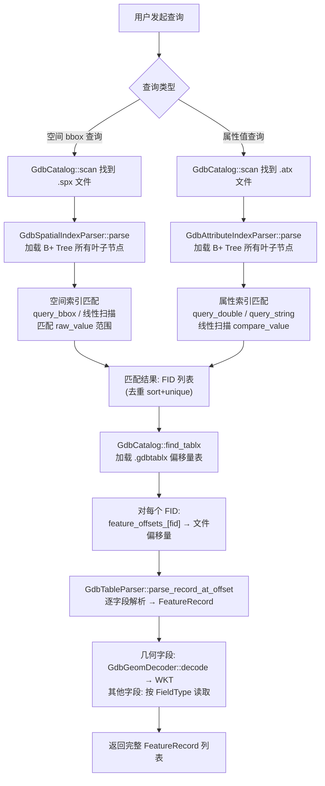
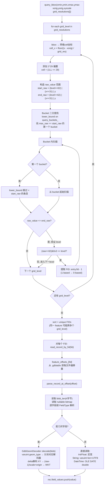
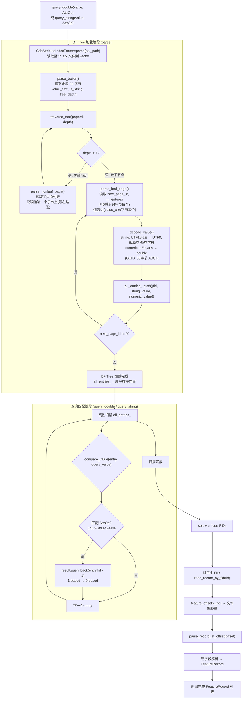

# GDB 索引查询流程图

本文档描述 explorgdb 项目中范围查询和属性查询的完整执行流程。

## 图 1：高层概览 — 通用查询架构



## 图 2：空间索引深入流程



## 图 3：属性索引深入流程



## 关键数据流

```
.spx / .atx 文件
    ↓ parse()
B+ Tree 叶子节点 → 扁平向量 (all_entries_)
    ↓ query_bbox() / query_double()
匹配 FID 列表 (1-based)
    ↓ FID - 1 (转 0-based)
匹配 FID 列表 (0-based)
    ↓ sort + unique (去重)
最终 FID 列表
    ↓ feature_offsets_[fid] (来自 .gdbtablx)
文件偏移量列表
    ↓ parse_record_at_offset()
FeatureRecord 列表 (含所有字段值)
```

## 相关源码文件

| 组件 | 文件路径 |
|------|----------|
| CLI 入口 | `explorgdb_cli.cpp` |
| 目录扫描 | `gdb_catalog.cpp`, `gdb_catalog.h` |
| 表解析 | `gdb_table.cpp`, `gdb_table.h` |
| 偏移量表 | `gdb_tablx.cpp`, `gdb_tablx.h` |
| 空间索引 | `gdb_spatial_index.cpp`, `gdb_spatial_index.h` |
| 属性索引 | `gdb_attribute_index.cpp`, `gdb_attribute_index.h` |
| 索引元数据 | `gdb_indexes.cpp`, `gdb_indexes.h` |
| 几何解码 | `gdb_geometry.cpp`, `gdb_geometry.h` |
| 类型定义 | `explorgdb_types.h` |
| 二进制读取 | `binary_reader.cpp`, `binary_reader.h` |
