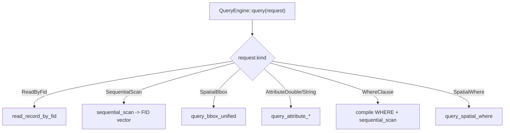
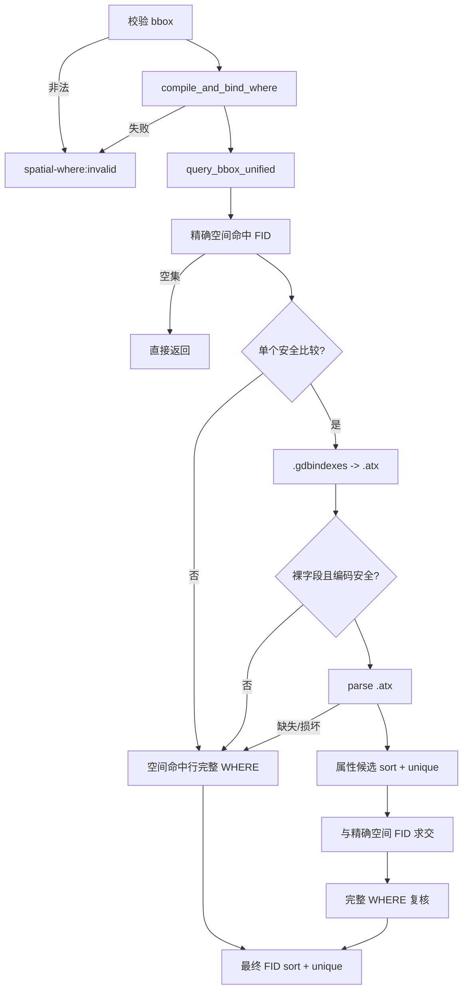
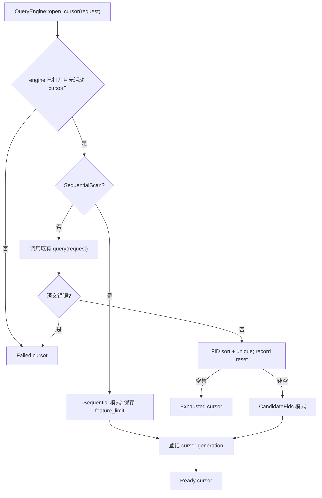
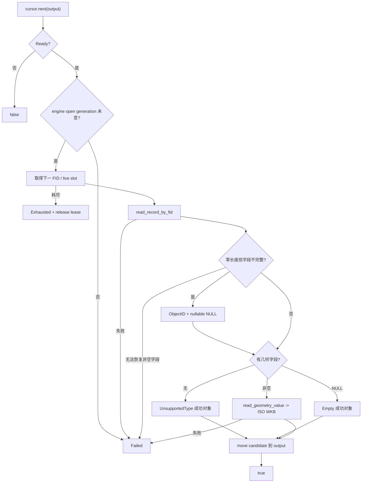
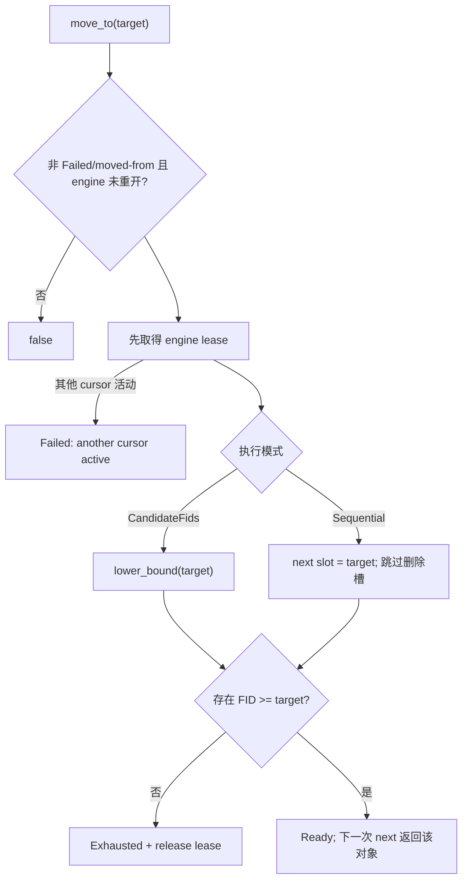

# Reader 查询与完整 Feature 流程

当前分支同时提供：

- `QueryEngine::query()`：FID-only 查询；
- `QueryEngine::open_cursor()`：完整 Feature 流式迭代；
- `FeatureCursor::move_to(fid)`：按零基 FID 前后和跳跃定位。

状态：**Code review ready / Formal acceptance blocked**。

## 1. FID-only 查询分派



`query()` 保持既有返回 FID 集语义。`SpatialWhere` 追加在枚举末尾。

## 2. SpatialWhere



不变量：

```text
最终结果 = 精确空间相交 FID ∩ 完整 WHERE 命中 FID
```

`.spx/.atx` 都不能代替最终判断。损坏索引必须 fail closed。

## 3. open_cursor 规划



候选模式只保存最终 FID vector。SequentialScan 不先生成全表 FID。

## 4. next() 完整对象



输出只在完整读取成功后覆盖；失败不会留下半更新对象。

## 5. move_to(fid)

语义：下一次 `next()` 返回当前查询结果中第一个 `FID >= target` 的对象。



行为：

- 支持向前、向后和任意跳跃；
- `move_to(0)` rewind；
- 删除 FID 或不满足过滤的 FID 跳到下一个结果；
- target 后无结果是正常 EOF；
- Exhausted cursor 可 reacquire；
- engine 重开后旧 cursor Failed；
- 其他 cursor 活动时先拒绝 lease，不访问 parser/tablx。

## 6. 状态与生命周期

| 状态 | `next()` | `move_to()` | `done()` | `error()` |
|---|---|---|---:|---|
| Ready | 读取下一条 | 可重新定位 | false | 空 |
| Exhausted | false | 可尝试 reacquire | true | 空 |
| Failed | false | false | false | 首次错误 |
| MovedFrom | false | false | true | 空 |

规则：

- FeatureCursor move-only；
- QueryEngine 不可复制、可移动构造但不可移动赋值；cursor 依赖的控制块和 table 对象位于稳定堆地址，移动后的源 engine 安全不可用；
- QueryEngine、Catalog、ResolvedTable 必须比 cursor 活得更久；
- 同一 engine 同时一个活动 cursor；
- cursor generation 防迟到析构；
- open generation 防 engine reopen 后旧计划复用；
- 活动 cursor 期间 engine 的 open/query/read/scan/直接空间读入口拒绝；
- 不声明同一 QueryEngine 线程安全。

## 7. WHERE 与索引安全

WHERE 支持比较、AND、OR、IN 和括号。字段名大小写不敏感，字符串支持 `''` 转义。

当前 `.atx` 快速路径边界：

- 字符串仅安全 `=`、`>=`；
- 非 BMP 回退；
- `!=` 回退；
- 函数索引回退；
- 不明确数值物理类型回退；
- 任意文件、页面、页链、计数或 FID 损坏均 parse=false。

## 8. 主要源码

| 组件 | 文件 |
|---|---|
| 公开接口和 engine 状态 | `query_engine.h` |
| 查询分派和 engine guard | `query_engine.cpp` |
| FeatureCursor PImpl | `feature_cursor.cpp` |
| 联合查询 | `query_engine_combined.cpp` |
| 空间 planner | `query_engine_geometry.cpp` |
| WHERE | `query_where_internal.h/.cpp` |
| 属性索引 | `gdb_indexes.*`、`gdb_attribute_index.*` |
| 完整记录 | `gdb_table.cpp` |
| GeometryValue | `gdb_table_geometry.cpp` |

## 9. 测试入口

| 能力 | 测试 |
|---|---|
| cursor 公开合同 | `FeatureCursorApiTest.*` |
| 顺序、候选、move、GDAL 对等 | `FeatureCursorGdalTest.*` |
| NULL geometry | `FeatureCursorEmptyGeometryTest.*` |
| ObjectID-only | `FeatureCursorZeroLengthTest.*` |
| reopen/reacquire | `FeatureCursorReopenTest.*` |
| full-feature 100K | `FeatureCursorBenchmarkTest.*` |
| 联合查询 | `SpatialWhere*Test.*` |
| package consumer | `tests/package_consumer/main.cpp` |

代码审核指南：`docs/usage/10_空间属性联合查询代码审核指南.md`。
