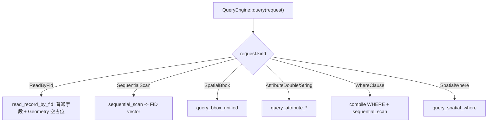
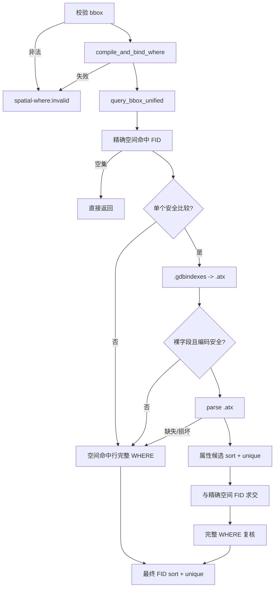
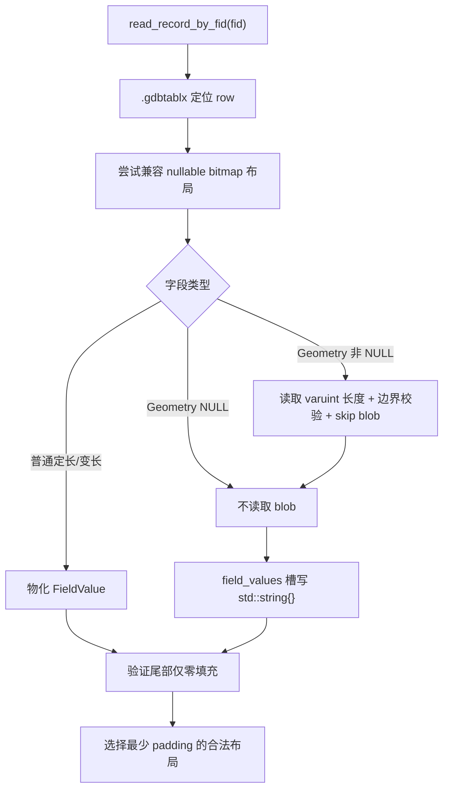
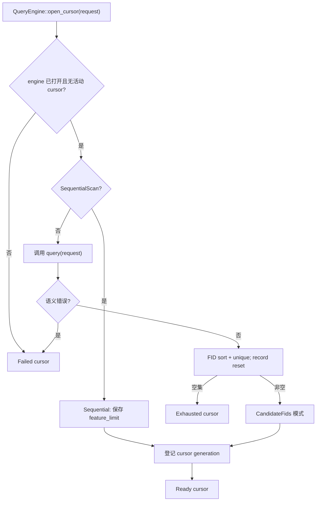
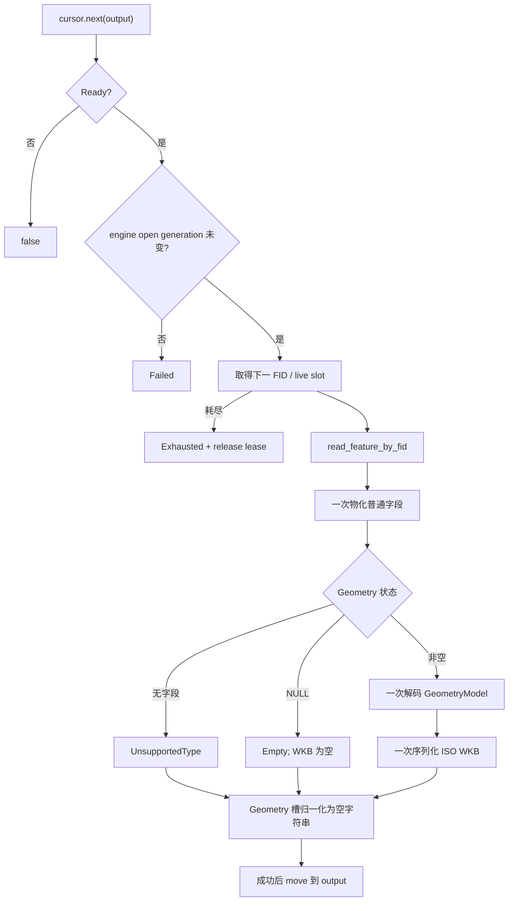
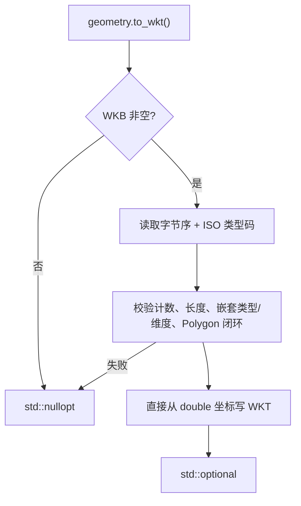

# Reader 查询、WKB-first 完整 Feature 与按需 WKT 流程

当前分支提供：

- `QueryEngine::query()`：FID-only 查询；
- `QueryEngine::open_cursor()`：WKB-first 完整 Feature 流式迭代；
- `FeatureCursor::move_to(fid)`：按零基 FID 前后和跳跃定位；
- `GeometryValue::to_wkt()`：从已读取 ISO WKB 显式转换 WKT。

状态：**代码实现完成；正式构建/性能验收受 Actions runner 基础设施阻塞**。

## 1. FID-only 查询分派



`query()` 保持既有 FID 集语义。`ReadByFid` 返回的 record 不包含几何文本或 WKB；
Geometry 槽是字段顺序占位。

## 2. SpatialWhere



不变量：

```text
最终结果 = 精确空间相交 FID ∩ 完整 WHERE 命中 FID
```

`.spx/.atx` 只缩小候选，不能替代最终语义判断；损坏索引 fail closed。

## 3. record-only 路径



该路径不创建 `GdbGeomDecoder`，不生成 `GeometryModel`、WKT 或 WKB。Geometry 空字符串
只保持字段数量和描述符顺序；调用方需要几何时另行调用 `read_geometry_value()`。

## 4. open_cursor 规划



候选模式只保存最终 FID vector；SequentialScan 不预先物化全表 FID。

## 5. next() WKB-first 完整对象



输出只在完整读取成功后覆盖；失败不会留下半更新对象。默认路径没有 WKT writer。

## 6. 按需 WKT



转换不重新读取 `.gdbtable`，不调用 GDAL，也不缓存结果。NULL 几何因没有 WKB 返回
`std::nullopt`；合法 WKB Empty 返回 `... EMPTY`。

## 7. move_to(fid)

下一次 `next()` 返回当前查询结果中第一个 `FID >= target` 的对象。

- 支持向前、向后和任意跳跃；
- `move_to(0)` rewind；
- 删除 FID 或不满足过滤的 FID 跳到下一个结果；
- target 后无结果是正常 EOF；
- Exhausted cursor 可 reacquire；
- engine 重开后旧 cursor Failed；
- 其他 cursor 活动时先拒绝 lease，不访问 parser/tablx。

## 8. 状态与生命周期

| 状态 | `next()` | `move_to()` | `done()` | `error()` |
|---|---|---|---:|---|
| Ready | 读取下一条 | 可重新定位 | false | 空 |
| Exhausted | false | 可尝试 reacquire | true | 空 |
| Failed | false | false | false | 首次错误 |
| MovedFrom | false | false | true | 空 |

规则：

- FeatureCursor move-only；
- QueryEngine 不可复制、可移动构造但不可移动赋值；
- QueryEngine、Catalog、ResolvedTable 必须比 cursor 活得更久；
- 同一 engine 同时一个活动 cursor；
- cursor generation 防迟到析构；
- open generation 防 engine reopen 后旧计划复用；
- 活动 cursor 期间 engine 的 open/query/read/scan/直接空间读入口拒绝；
- 不声明同一 QueryEngine 线程安全。

## 9. WHERE 与索引安全

WHERE 支持比较、AND、OR、IN 和括号。字段名大小写不敏感，字符串支持 `''` 转义。

当前 `.atx` 快速路径边界：

- 字符串仅安全 `=`、`>=`；
- 非 BMP、`!=`、函数索引和不明确数值物理类型回退；
- 任意文件、页面、页链、计数或 FID 损坏均 parse=false。

## 10. 主要源码

| 组件 | 文件 |
|---|---|
| 公开接口和状态 | `query_engine.h`、`geometry_model.h` |
| 查询分派和 guard | `query_engine.cpp` |
| FeatureCursor PImpl | `feature_cursor.cpp` |
| 联合查询 | `query_engine_combined.cpp` |
| 空间 planner | `query_engine_geometry.cpp` |
| WHERE | `query_where_internal.h/.cpp` |
| 属性索引 | `gdb_indexes.*`、`gdb_attribute_index.*` |
| record WKB-first 读取 | `gdb_table_record.cpp` |
| one-pass 读取和契约包装 | `gdb_table_feature.cpp`、`gdb_table_feature_contract.cpp` |
| 几何 WKB 输出 | `wkb_writer.cpp` |
| 按需 WKT | `wkb_reader.cpp` |

## 11. 测试入口

| 能力 | 测试 |
|---|---|
| WKB→WKT 纯 C++ | `GeometryValueToWkt.*` |
| record/one-pass 占位 | `FeatureCursorOnePassTest.*` |
| cursor 公开合同 | `FeatureCursorApiTest.*` |
| 顺序、候选、move、GDAL 对等 | `FeatureCursorGdalTest.*` |
| NULL geometry | `FeatureCursorEmptyGeometryTest.*` |
| reopen/reacquire | `FeatureCursorReopenTest.*` |
| WKB-first 100K 基准 | `FeatureCursorBenchmarkTest.*` |
| 联合查询 | `SpatialWhere*Test.*` |
| package consumer | `tests/package_consumer/main.cpp` |

代码审核指南：`docs/quality/10_空间属性联合查询代码审核指南.md`。
