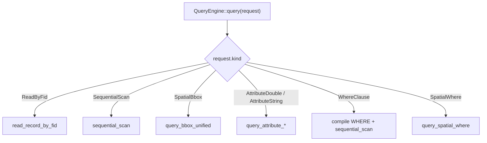
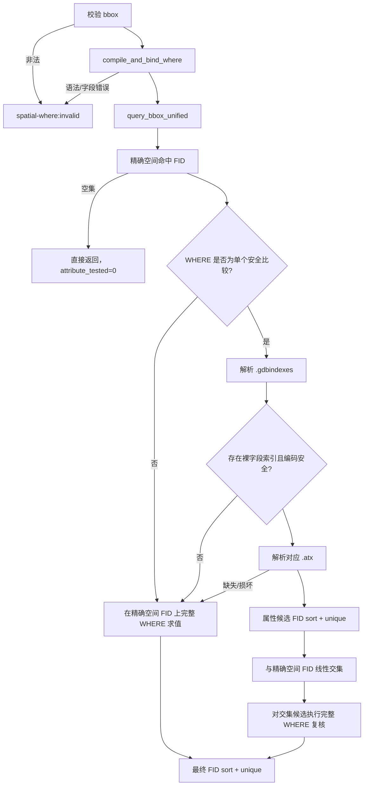
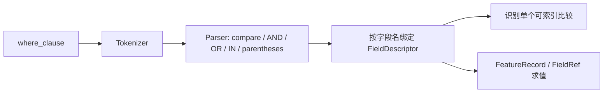
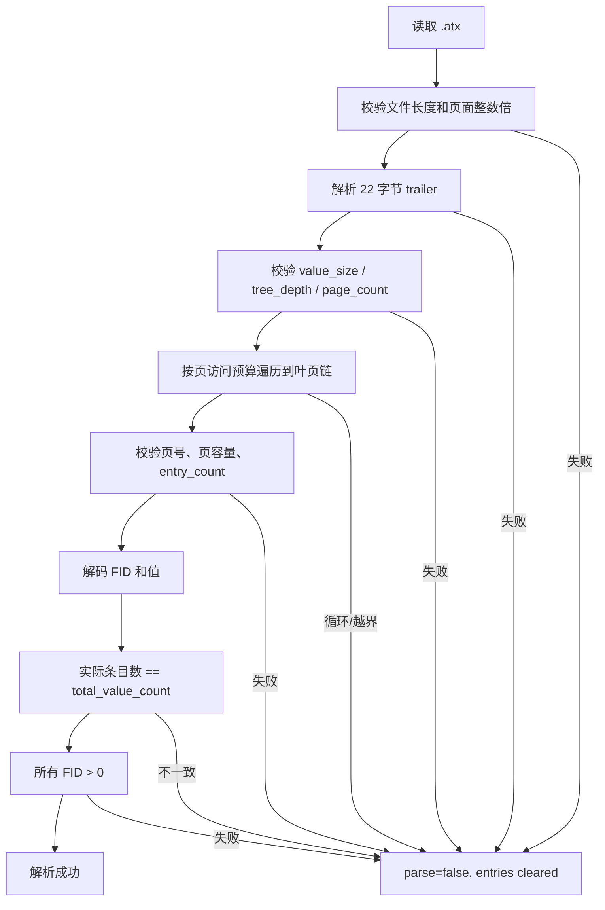
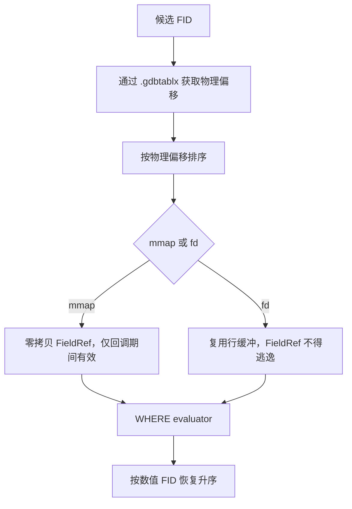

# Reader 查询执行流程

本文描述 `explorgdb::QueryEngine` 的 FID、顺序、空间、属性、WHERE 和空间+属性联合查询。当前分支新增 `QueryKind::SpatialWhere`，状态为 **Code review ready / Formal acceptance blocked**。

## 1. 查询分派



`SpatialWhere` 追加在枚举末尾，不改变既有 QueryKind 顺序。

## 2. SpatialWhere 高层流程



执行路径：

- `spatial-where:spx+atx`：空间和属性索引都参与候选缩小；
- `spatial-where:spatial-candidates`：空间索引参与，但属性索引缺失、损坏、不安全或表达式不可索引；
- `spatial-where:sequential`：空间查询使用顺序精确路径；属性索引仍可能参与候选缩小；
- `spatial-where:invalid`：bbox 或 WHERE 非法。

## 3. 正确性不变量

联合查询必须满足：

```text
最终结果
= 精确空间相交 FID
∩ 完整 WHERE 命中 FID
```

不可破坏的不变量：

1. `.spx` 只提供空间候选，不能代替精确几何判断；
2. `.atx` 只提供属性候选，不能代替完整 WHERE；
3. 最终 FID 必须零基、升序、唯一；
4. 损坏索引必须 fail closed，不能解释为合法零命中；
5. 非 BMP、`!=`、函数索引和无法证明物理类型的编码必须回退；
6. 空间空集不打开 `.atx`；
7. fallback_reason、execution_path 和 metrics 必须一致。

## 4. WHERE 编译与求值

WHERE 实现在内部模块：

```text
query_where_internal.h
query_where_internal.cpp
```

流程：



语义边界：

- 字段名大小写不敏感；
- 字符串使用 SQL 单引号和 `''` 转义；
- NULL 不满足普通比较；
- 非有限数值字面量、错误语法和未知字段返回明确错误；
- 当前不是完整 SQL，不支持 JOIN、聚合或函数表达式求值。

## 5. 字段到 `.atx` 的映射

```text
WHERE 字段
  -> Catalog 找到表的 .gdbindexes
  -> GdbIndexesParser 读取原始索引表达式
  -> field_name_from_expression() 关联字段
  -> is_direct_field_expression() 判断是否裸字段
  -> IndexEntry.name
  -> Catalog::find_atx(table_id, index_name)
```

`LOWER(name)` 等函数索引可以关联字段，但不能用于当前大小写敏感直接比较快速路径。未知函数同样回退。

## 6. `.atx` fail-closed 解析



页链访问预算以物理页数为上限，防止 `next_page_id` 自环或循环链无限遍历。页偏移使用 64 位中间计算，避免 32 位平台乘法溢出。

合法零命中和解析失败的区别：

- 结构完整、查询无匹配：索引候选为空，允许短路；
- 文件缺失或结构损坏：禁止使用 `.atx`，回退完整 WHERE。

## 7. 属性候选安全边界

当前只对可证明候选完备的情况使用 `.atx`：

- 数值：当前安全的直接编码和有限比较；
- 字符串：当前仅 `=`、`>=`，且查询值可由当前 BMP UTF-16 decoder 安全表示；
- `!=`：回退，避免 NaN 比较造成候选不完备；
- 非 BMP：回退，当前 decoder 不组合 surrogate pair；
- 函数索引：回退；
- Int16、Float32、Int64 等无法仅凭 trailer 唯一确定语义的情况：回退。

即使使用 `.atx`，交集候选仍执行完整 WHERE 复核。

## 8. 稀疏候选字段扫描

`GdbTableParser::scan_field_candidates()` 只读取 WHERE 所需字段：



若稀疏扫描无法安全完成，`QueryEngine` 使用 `read_record_by_fid()` 逐行回退。字段跳过逻辑复用既有物理布局规则，能够穿过 Geometry、Raster、UUID、Binary 和 DateTimeWithOffset 等非目标字段。

## 9. 空间查询复用

`SpatialWhere` 不重新实现几何判断，而是调用 `query_bbox_unified()`。因此 Point、Polyline、Polygon 含洞、MultiPoint 和 Z/M/ZM 的联合入口应与既有空间查询保持一致。

空间指标复制到联合指标：

- `spatial_candidate_count`：空间候选数；
- `spatial_match_count`：精确空间命中数；
- `used_spatial_index`：只有真实 `.spx` 候选路径才为 true；
- `spatial_ms`：整个精确空间阶段耗时。

## 10. 测试对照

| 执行链 | 测试入口 |
|---|---|
| WHERE parser/evaluator | `QueryWhereInternalTest.*` |
| `.atx` fail-closed | `AttributeIndexSafetyTest.*`、`SpatialWhereIndexFallbackTest.*` |
| `.spx + .atx` | `SpatialWhereIntegrationTest.IndexedSingleComparisonMatchesGdalFullFidVector` |
| 复合 WHERE 回退 | `CompoundWhereEvaluatesOnlyExactSpatialMatches` |
| 几何组合 | `SpatialWhereGeometryTest.*` |
| Z/M/ZM | `SpatialWhereDimensionTest.*` |
| NULL / `!=` | `SpatialWhereNullTest.*` |
| Unicode | `SpatialWhereUnicodeTest.*` |
| 函数索引 | `SpatialWhereFunctionalIndexTest.*` |
| package consumer | `tests/package_consumer/main.cpp` |
| 100K benchmark | `SpatialWhereBenchmarkTest.Point100KSchemaV2Evidence` |

所有 GDAL 等价测试应比较完整、排序、去重后的零基 FID 向量，而不是只比较数量。

## 11. 主要源码文件

| 组件 | 文件 |
|---|---|
| 查询公共接口 | `query_engine.h` |
| 查询分派与既有查询 | `query_engine.cpp` |
| 联合查询 | `query_engine_combined.cpp` |
| WHERE 内部模块 | `query_where_internal.h/.cpp` |
| Catalog | `gdb_catalog.h/.cpp` |
| 索引元数据 | `gdb_indexes.h/.cpp` |
| 属性索引 | `gdb_attribute_index.h/.cpp` |
| 空间索引 | `gdb_spatial_index.h/.cpp` |
| 候选字段扫描 | `gdb_table_field_scan.cpp` |
| 表解析 | `gdb_table.h/.cpp` |
| 精确几何 | `query_engine_geometry.cpp`、GeometryModel/Predicate 相关文件 |

代码审核指南见 `docs/usage/10_空间属性联合查询代码审核指南.md`。